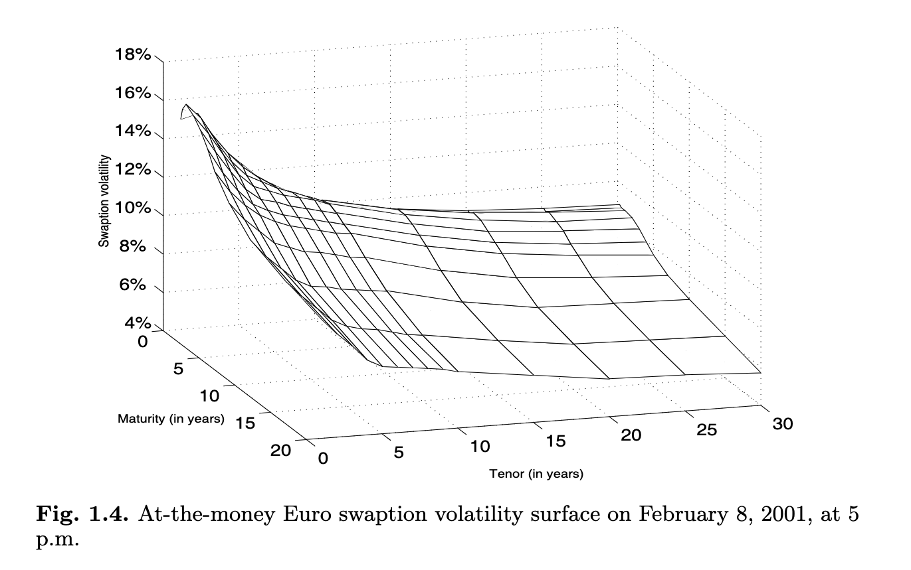

# Continuous-Time Finance
 

## Lecture notes
 

### *Fayçal Drissi*
[website](https://www.faycaldrissi.com/)

 

####  *Saïd Business School, University of Oxford*

#### Trinity Term 2025 

---

      

<h1>
Why Continuous-Time Finance ? </h1>

---

# Continuous-Time Finance

* Events in the real world happen in discrete-time

* Quickly changing chains of events may be described in term of a continuous mechanism (as in Physics)

* **Example**: stock prices evolve almost continuously. 
  * Think of limit order books where orders are sent at the milisecond frequency.

---

# Why Continuous-Time Finance ?

* **Definition** A derivative is a contract whose value is dependent upon one or more underlying assets

* Continuous-time models are significantly more tractable when it comes to describe the behaviour of risk and returns of complex financial derivatives

* Beyond tractability, continuous-time models models are sometimes essential for understanding the risks of complex financial instruments

---

# Why Continuous-Time Finance ?

* Continuous-time models are widely employed by trading desks at investment banks and hedge funds to price, hedge, and manage portfolios, in markets where trillions of dollars in derivatives are traded daily

{style="transform: translate(40%, 0%); width: 470px"}

---

# Some history

* Mathematical Finance is a (young) science at the frontier between probability theory,
economics, and computer science (Despite its short history, Quantitative Finance has Nobel Prize laureates (Merton, Scholes))
* $1900$: The real father of (modern) Quantitative Finance is a French man called Bachelier
* Mid-$1950$s: Savage (the famous statistician) introduced economists to Bachelier’s work
  * Samuelson read the PhD thesis of Bachelier. He did research to price warrants (with Sprenkle and Bones)
* $1970$: Merton was a PhD student of Samuelson in 1970 and he discussed warrants with Black and Scholes at MIT
  * Merton introduced **replication**

---

# Some history

* 1980s: Cox-Ross-Rubinstein, Vasicek, Cox-Ingersoll-Ross models.
* 1999: Harrison, Kreps, and Pliska showed the link between the absence of arbitrage opportunity and martingales. 
* 1990s and 2000s: quantitative finance is ruled by mathematicians and probabilists
* The $2007-2008$ crisis: credit derivatives cannot be managed as equity derivatives  or fixed income derivatives. The famous *copula model* to price and hedge Collateralized Debt Obligations (CDOs) has have been used so blindly
  * highlighted the danger of the risk-neutral pricing/hedging models when used in highly incomplete markets
  * the financial mathematics community has played a  part in the catastrophe
* After the crisis: risk management, super-hedging, market microstructure, optimal market making, etc..

---

# Goals of this course

* Introduce the mathematical tools used in continuous-time models in finance

* Introduce the main models used in the industry

* Applications for pricing derivatives on Equity and Interest rates

---

# How

* Foundations
  * (Basic) review of probabilioty theory
  * Introduction to stochastic calculus
 
* Introduction of the main pricing principles
  * Martingales, Ito processes, Risk-neutral pricing, etc.

* We start with simple models, and we add complexity

---

# Course outline
### Session $1$: Binomial model for option pricing
### Session $2$: Pricing Principles and the Absence of Arbitrage
### Session $3$: Introduction to Stochastic Processes
### Session $4$: The Black-Scholes Model
### Session $5$: Risk-Neutral Pricing in Continuous-Time
### Session $6$: Pricing in practice
### Session $7$: Interest Rates Models
### Session $8$: Forward measures and Interest Rates Derivatives

---

# Format

* Each lecture will consist of a set of slides shared before the class

* Exercises will be solved during class: bring pen and paper (or iPad and pencil)

* Problem sets will be regularly distributed and selected problems solved in class

* Check Canvas for info, slides, exercises and solutions!

* Office hours on demand: faycal.drissi@gmail.com

---

# Assessment

* Final $2-$hours examination at the end of the term

* 4 questions

* Preparation: exercises during class, problem sets, and past exams

---
layout: intro
---
## Session $1$:  Binomial Model and Option Pricing
 
 

*Fayçal Drissi*

*Saïd Business School, University of Oxford*

--- 

# Risk and Return

* Assume there are two states of the world.

* Every day, there is either a sunny or a rainy day with probability $p=1/2$ and $1-p=1/2$.

* There is an ice-cream company (IC) whose stock price is trading at $50$ and an umbrella company (U) whose stock price is also trading at $50$.

* If it is a sunny day the IC company’s stock increases to $100$ otherwise it drops to zero. The U company has opposite dynamics.

{style="transform: translate(10%, -5%); width: 700px"}

--- 

# Risk and Return
   

* If you have $1$ GBP to invest, how much would you put on IC and/or U ?

{style="transform: translate(10%, -5%); width: 700px"}

--- 

# Risk and Return
   

* Suppose now that the probability of raining is p = 9/10. How would you change your strategy?

{style="transform: translate(10%, -5%); width: 700px"}

--- 

# Risk and Return
   

* Assume that there is a bond in this economy that pays an interest of $r$. 
* Risk premium: how much "above" $r$ would you expect to make on your investment strategy?

{style="transform: translate(10%, -5%); width: 700px"}

---

      

<h1>
Binomial Setup </h1>

---

## First example: a simple economy with three assets

* Two dates: $t$ and $t+1$

* Two assets are traded at prices $S^1_t$ and $S^2_t$ at time $t$

* At $t+1$, there are two states of nature that occur with probability $p$ and $1-p$

{style="transform: translate(10%, -0%); width: 700px"}

* Asset $1$ pays $S^1(t+1) = 1$ in state one and $S^1(t+1) = 1$ in state two. 
  * We denote the payoff (1, 1)

* Asset $2$ has payoff $(0, 3)$

---

## First example: a simple economy with three assets

* Assume we know $S^1_t$ and $S^2_t$
* **Problem**: There is a third asset with payoff $(2, 3)$. 
  * Calculate the price $S^3_t$ at time $t$

{style="transform: translate(0%, 0%); width: 900px"}

---

## First example: a simple economy with three assets

{style="transform: translate(20%, -5%); width: 600px"}

* **Solution**: replication and no-arbitrage
  * We set a portfolio with value $\Pi(t)$ at time $t$ consisting of $\alpha_1$ units of Asset $1$ and $\alpha_2$ of Asset $2$
  * We set the portfolio weights  $\alpha_1$ and $\alpha_2$ such that the portfolio **replicates** Asset $3$ at time $t+1$
    $$\Pi(t+1) = \alpha_1\,S^1(t+1)+\alpha_2\,S^2(t+1)$$
  * By **no-arbitrage**, we should have
  $$\Pi(t) = S_3(t)$$
  * Why ?

---

## First example: a simple economy with three assets

* **Replication argument**
  * We set $\alpha_1$ and $\alpha_2$ such that 
  $$
  \begin{cases}
  \Pi(t+1) = 2 = \alpha_1 \times 1 + \alpha_2 \times 0 \quad \text{in state one}   \\
  \Pi(t+1) = 3 = \alpha_1 \times 1 + \alpha_2 \times 3 \quad \text{in state two}
  \end{cases}
  $$
  {style="transform: translate(30%, 0%); width: 500px"}
  * We find that 
  $$\alpha_1 = 2 \quad \text{and} \quad \alpha_2 = 1/3$$
  * By **no-abitrage**: 
  $$S_3(t) = 2\,S_1(t)+S_2(t)/3$$

---

      

<h1>
Pricing Options in a Binomial Setup </h1>

---

## The market

* One stock (say Microsoft)
* Starting time $t$, ending time $T$
* Two states of the world with probabilities $p$ and $1 − p$
* Starting value of the stock price: $S$
* In the *up state*, with probability $p$, the price becomes $u\,S$ where $u$ is a constant
* In the *down state*, with probability $1-p$, the price becomes $d\,S$ where $d$ is a constant
* There is a **bond** that pays a constant **interest rate $r$**.

{style="transform: translate(10%, 20%); width: 700px"}

---

## The call option

* **Definition**: A European Call option with strike price $K$ and maturity $T$ is the **right** to buy, at time $T$, the underlying stock for the price $K$. 
* What is the mathematical formula for the payoff of the option as a function of $S(T)$ ?

---

## The call option

* **Definition**: A European Call option with strike price $K$ and maturity $T$ is the **right** to buy, at time $T$, the underlying stock for the price $K$. 
* What is the mathematical formula for the payoff of the option as a function of $S(T)$ ?
* The payoff at time $T$ is $\max\{S(T) - K, 0 \}$. 
* In the *up state*, the payoff of the call is 
$$
C^u = \max\{u\, S - K, 0\}
$$
* In the *down state*, the payoff of the call is 
$$
C^d = \max\{d\, S - K, 0\}
$$

---

## The call option

* Let $C(t)$ be the price of the option at time $t$ 

* The payoff of a long position in a call option with strike $K=100$ and when $C(t)=10$

{style="transform: translate(40%, 0%); width: 500px"}

* When do we buy a call option ?

---

## The put option

* **Definition**: A European Put option with strike price $K$ and maturity $T$ is the right to sell, at time $T$, the underlying stock for the price $K$. What is the payoff of a put option at time $T$.

---

## The put option

* **Definition**: A European Put option with strike price $K$ and maturity $T$ is the right to sell, at time $T$, the underlying stock for the price $K$. What is the payoff of a put option ?
* The payoff at time $T$ is $\max\{K - S_T, 0\}$
* The payoff of a long position in a put option with strike $K=100$ (when do we buy a put ?)

{style="transform: translate(40%, 0%); width: 500px"}

---

## The call option

* How do we price the call in our binomial model, i.e., how do we find $C(t)$ ?

{style="transform: translate(10%, 0%); width: 700px"}

---

## The call option

* To price the call, we replicate its payoff with the bond and the underlying asset S

* At time $t$, we set a portfolio $\Pi(t)$ with $B$ pounds in the bond and $\Delta$ units of the asset $S$, such that 
$$
\Pi^u(t+1) = C^u \text{  and  } \Pi^d(t+1) = C^d
$$

{style="transform: translate(0%, 20%); width: 800px"}

---

## The call option

* The price of the portfolio at time $t$ is
$$
\Pi(t) = B + \Delta\,S.
$$

* We choose $\Delta$ and $B$ such that
$$
\begin{cases}
\Pi^u(t+1) = B\, (1+ r) + \Delta\,u\,S = C^u \\
\Pi^d(t+1) = B\, (1+ r) + \Delta\,d\,S = C^d
\end{cases}
$$

---

## The call option

* The price of the portfolio at time $t$ is
$$
\Pi(t) = B + \Delta\,S.
$$

* We choose $\Delta$ and $B$ such that
$$
\begin{cases}
\Pi^u(t+1) = B\, (1+ r) + \Delta\,u\,S = C^u \\
\Pi^d(t+1) = B\, (1+ r) + \Delta\,d\,S = C^d
\end{cases}
$$

* In matrix form we solve the system
$$
{\left[\begin{array}{ll}
u S & 1+r \\
d S & 1+r
\end{array}\right]\left[\begin{array}{c}
\Delta \\
B
\end{array}\right]=\left[\begin{array}{c}
C^u \\
C^d
\end{array}\right]}
$$

* Therefore
$$
{\left[\begin{array}{c}
\Delta \\
B
\end{array}\right]=\frac{1}{(1+r)(u S-d S)}\left[\begin{array}{cc}
1+r & -(1+r) \\
-d S & u S
\end{array}\right]\left[\begin{array}{c}
C^u \\
C^d
\end{array}\right]}
$$

---

## The call option

* We find
$$
\Delta=\frac{C^u-C^d}{u S-d S}, \quad \text { and } \quad B=\frac{-d C^u+u C^d}{(1+r)(u-d)}
$$

* By **no-abitrage**, the portfolio at time $t$ has the same value as the call and we write ($R=1+r$)
$$
C(t) = \Delta S+B  =\frac{C^u-C^d}{u S-d S} S+\frac{-d C^u+u C^d}{R(u-d)} =\frac{1}{R}\left[\frac{R-d}{u-d} C^u+\frac{u-R}{u-d} C^d\right] .
$$

---

## Example of option strategies: a covered call option

* In a covered call strategy, an investor buys the stock and sells a call option on the stock
* The payoff is
$$
- \max\{S_T - K\} + (S_T - S_0)
$$
{style="transform: translate(55%, 0%); width: 400px"}
* You are a banker and you want to buy a covered call option from your broker. Assume  that all payments are at time $T$, what's the price according to our binomial model ?

---

## Example of option strategies: a covered call option

* In the case of covered call, the payoffs in the up and down states are
$$ 
\begin{cases}
\tilde C^u = \max\{u\,S-K, 0\} + u\,S - S_0= C^u + u\,S - S_0 \\
\tilde C^d = \max\{d\,S-K, 0\} + d\,S - S_0= C^d + d\,S - S_0,
\end{cases}
$$

* The price is 
$$
\begin{split}
P(t)& =\frac{1}{R}\left[\frac{R-d}{u-d} \tilde C^u+\frac{u-R}{u-d}  \tilde C^d\right]\\
& =\frac{1}{R}\left[\frac{R-d}{u-d} C^u+\frac{u-R}{u-d}  C^d - \frac{R-d+u-R}{u-d}S_0 + \frac{(R-d)u+(u-R)d}{u-d}S \right]\\
& =  S - S_0/R +  \frac{1}{R}\left[\frac{R-d}{u-d} C^u+\frac{u-R}{u-d}  C^d \right]
\end{split}
$$
* We can price any strategy that combines stocks and call/puts in the binomial model: Straddle, Call spread, Put spread, Protective Collar ...

---

      

<h1>
Risk-Neutral Valuation </h1>

---

## Risk-Neutral Valuation - Call option

* We found that the call option price is
$$
C(t) =\frac{1}{R}\left[\frac{R-d}{u-d} C^u+\frac{u-R}{u-d} C^d\right] .
$$

* **Remark:** the price $C(t)$ of the option does not depend on the binomial probability $p.$ 

* Why?

---

## Risk-Neutral Valuation - Call option

* We found that the call option price is
$$
C(t) =\frac{1}{R}\left[\frac{R-d}{u-d} C^u+\frac{u-R}{u-d} C^d\right] .
$$

* **Remark:** the price $C(t)$ of the option does not depend on the binomial probability $p.$ 

* Why?

 intuitively: 
  * the option price is pinned down by replication — matching payoffs exactly across states — not by how likely  those states are
  * the option price then depends only on the cost of replicating its payoff using the underlying asset and the bond

---

## Risk-Neutral Valuation - Call option

* We found that the call option price is
$$
C(t) =\frac{1}{R}\left[\frac{R-d}{u-d} C^u+\frac{u-R}{u-d} C^d\right] .
$$

* Define a new probability measure $\tilde{\mathbb P}$ that assigns $\tilde p$ to the *up state* and $1-\tilde p$ to the *down state*
$$
\tilde p = \frac{R-d}{u-d}
$$
* The price of the option is
$$
C(t) =\frac{1}{R}\left[\tilde p C^u+(1-\tilde p) C^d\right]
$$

{style="transform: translate(30%, 0%); width: 500px"}

---

## Risk-Neutral Valuation - Call option

{style="transform: translate(14%, 0%); width: 600px"}

* Necessary condition for absence of arbitrage is $\tilde p \in (0, 1)$, which implies 
$$d < 1 + r < u$$

* In this case, the price of the option is the **discounted expectation** under the new **risk-adjusted probability measure**

$$
C(t) =\frac{1}{R}\left[\tilde p C^u+(1-\tilde p) C^d\right] = \frac{1}{1+r}\tilde{\mathbb E}[C(t+1)]
$$

---

## Risk-Neutral Valuation: intuition

* Prices of assets depend on their risk
* Investors demand more profit for bearing more risk (risk-averse): think of utility
* Today's price of a claim realised in a future date, written on a risky asset, will generally differ from its expected value: investors ask for a premium.
* Using actual real-world probabilities, every security would require a different adjustment (as they differ in riskiness)

---

## Risk-Neutral Valuation: intuition

* There is another way to do this adjustment
  * Instead of calculating expectation and then adjusting for an investor's risk preference
  * We adjust, once and for all, the probabilities of future outcomes such that they incorporate all investors' risk premia
  * We take expectation under this new probability distribution, the risk-neutral measure
* Once the risk-neutral probability is found, assets can be priced by simply taking the present value of expected payoff

---

## Risk-Neutral Valuation: Exercise

* **Exercise 1**: Under the risk-neutral measure, calculate the discounted expected value of the stock price, i.e.,
$$
\frac{1}{1+r}\,\tilde{\mathbb E}[S(t+1)]
$$

* What is the price of a European call with strike $K=0$ ?

* Would the price change if the probability $p$ or $u,d$ change ?

---

## Risk-Neutral Valuation: Exercises

* Recall that the risk-neutral binomial probability is
$$
\tilde p = \frac{R-d}{u-d}
$$
* Then
$$
\frac{1}{1+r}\,\tilde{\mathbb E}[S(t+1)] = \frac{1}{1+r}(\tilde p\,u\,S + (1-\tilde p)\,d\,S ) = S
$$
* When $K=0$, $C^u = u\,S$ and $C^d = d\,S$, So
$$
C(t) =\frac{1}{R}\left[\frac{R-d}{u-d} C^u+\frac{u-R}{u-d} C^d\right] = S.
$$

---

## Risk-Neutral Valuation: Exercises

* Assume now that there are three dates ${0, 1, 2}$ and consider the following binomiam tree (where $u=1/d$)

{style="transform: translate(20%, 0%); width: 600px"}

* **Exercise $2$**: Compute recursively the price of the European call option with strike $K$ and maturity $T = 2$

---

## Risk-Neutral Valuation: Exercises

- At $t=2$, the call option payoff is:
$$
\text{Payoff} = (S_2 - K)^+ = \max(S_2 - K, 0)
$$
  
{style="transform: translate(20%, 0%); width: 600px"}

---

## Risk-Neutral Valuation: Exercises

- At $t=1$, the option value is the **discounted expected value** under risk-neutral probabilities. Define the risk-neutral probability:
$$
\tilde{p} = \frac{R - d}{u - d}
$$

{style="transform: translate(20%, 0%); width: 600px"}

---

## Risk-Neutral Valuation: Exercises

- At $t=0$, the option value is the **discounted expected value** under risk-neutral probabilities. 

     
{style="transform: translate(20%, 0%); width: 600px"}

---

      

<h1>
Probability basics </h1>

---

## Probability basics: random variables and sample space

{style="transform: translate(20%, 0%); width: 600px"}

* At time $0$, $S_1$ and $S_2$, the stock prices at times $1$ and $2$, are **random variables**.

* To describe the random behaviour of $S_2$, we use the **sample space**

$$
\Omega = \{\text{LL},\text{LH},\text{HL},\text{HH}\}
$$
of all outcomes $\omega\in\Omega$ that can be realised

---

## Probability basics: sigma algebra

<!--* Let $\mathcal F$ be the family of all subsets of $\Omega$-->
* A sigma-algebra formalises the idea of "what you can know" about uncertain outcomes, making sure that your knowledge is stable under logical combinations

* **Definition of sigma algebra**: a sigma algebra $\mathcal G$ <!-- \subset \mathcal F$--> is a family of subsets of $\Omega$ such that:
  * $\emptyset \subset \mathcal G$
  * If $A \in \mathcal G$ then $A^C \subset \mathcal G$
  * If $(A_i)_{i} \in \mathcal G$ is a countable sequence in $\mathcal G$, then $\bigcup_i A_i \in \mathcal G$

* Think of a sigma-algebra as the list of all questions you are allowed to ask about the outcome of some experiment, given your information

* To be coherent (mathematically nice), this list must be closed under basic operations: unions, intersections, and complements.

* The couple $(\Omega, \mathcal G)$ is called a measurable space.

---

## Probability basics: filtration

{style="transform: translate(30%, 0%); width: 500px"}

* The information available to the trader at time $0$ can be modeled by the information set 
$$\mathcal G_0 = \{\emptyset, \Omega\}$$

* At time $1$, we can observe the outcome of time $1$. The information set gets larger: it is a sigma algebra generated by the price movement
$$
\mathcal G_1 = \{\emptyset, \Omega, \{HL, HH\}, \{LL, LH\} \}
$$

* At time $2$, we can observe more outcomes in more detail 
$\mathcal G_2 =\mathcal P(\Omega)$ (power set), i.e., it is the set of all subsets of $\Omega$, including $\Omega$ and the empty set.

---

## Probability basics: filtration

{style="transform: translate(30%, 0%); width: 500px"}

* The trader's information set is growing over time

$$\mathcal G_0 \subset \mathcal G_1 \subset \mathcal G_2$$

* **Definition :** A filtration is a sequence $(\mathcal G_i)_i$ of sigma algebras over $\Omega$ such that for all $i$
  $$
  \mathcal G_i \subset \mathcal G_{i+1}
  $$

* A filtration formalises the flow of information over time — it captures what is knowable at each date, with knowledge only increasing

---

## Some probability basics: probability measure

* **Purpose**: assign probability to events in a consistent way
* **Definition**: a probability measure on $(\Omega, \mathcal G)$ is a function $\mathbb P: \mathcal G \mapsto [0, 1]$ such that 
  * $\mathbb P[\Omega] = 1$
  * (sigma additivity) For any disjoint sequence $(A_i)_i \subset \mathcal G$ such that $A_i \cap A_j = \emptyset$ :
  $$
  \mathbb P[\bigcup_i A_i] = \sum_i \mathbb P[ A_i]
  $$
* **Definition**: $(\Omega, \mathcal G, \mathbb P)$ is a probability space.

---

## Some probability basics: random variables

* **Definition**: Let $X : \Omega \mapsto R$ be a function. The sigma algebra 
$$\sigma(X) = \{X^{-1}(B) \text{ for all } B \subset \mathbb R  \}$$
is called the sigma algebra generated by $X$.

* The sigma-algebra generated by a random variable is the collection of events you can describe *if the only thing you know* is the value of that random variable

* **Definition**: $X$ is a random variable on $(\Omega, \mathcal G)$ if it is measurable with respect to $\mathcal G$, i.e., if 
$$\sigma(X) \subset \mathcal G$$

---

## Some probability basics: random variables

* **Example** 
  * $\sigma(S_1) = \mathcal G_1$
  * $S_1$ is $\mathcal G_1$ measurable
  * $S_2$ is not $\mathcal G_1$ measurable

{style="transform: translate(10%, 0%); width: 700px"}

---

      

<h1>
American/European options </h1>

---

## American options in the three-dates binomial model

* **Definition:** an *American* option can be exercised at any point in time during the life of the option

* **Definition:** a *Bermudean* option can be exercised at specific pre-arranged times

---

## American options in the three-dates binomial model

* **Definition:** an *American* option can be exercised at any point in time during the life of the option
* **Definition:** a *Bermudean* option can be exercised at specific pre-arranged times

* To decide whether to exercise, at each time $t$, the holder of an american option compares 
  * the value of exercising the option at time $t$
  * and the value of keeping the option 

---

## American options in the three-dates binomial model

* **Definition:** an *American* option can be exercised at any point in time during the life of the option
* **Definition:** a *Bermudean* option can be exercised at specific pre-arranged times

* To decide whether to exercise, at each time $t$, the holder of an american option compares 
  * the value of exercising the option at time $t$
  * and the value of keeping the option 

* So the price of the american option at each time $t$ is 
$$
\max\{\text{exercise value at t, option value between t and T}\}
$$

* We can price american options recursively

---

## American options in the three-dates binomial model

* Let $V(S_t)$ be the payoff of an option which is exercised at time $t$
  * For instance, for an american call option, $V(S_t) = \max\{S_t-K, 0\}$

* Assume a three-dates binomial model 

{style="transform: translate(0%, 0%); width: 800px"}

---

## American options in the three-dates binomial model

We work backward:
  * At time $t=2$, the payoff is simply $V(S_2)$ for both American and European options. We know the payoffs for each possible value of the stock at time $t=2$

{style="transform: translate(0%, 0%); width: 800px"}

---

## American options in the three-dates binomial model

We work backward:
  * At time $t=1$, the payoff of the American option is the maximum between the exercise value $V(S_1)$, and the discounted expected future payoff (at time $t=2$)

{style="transform: translate(0%, 0%); width: 800px"}

---

## American options in the three-dates binomial model

We work backward:
  * At time $t=0$, the payoff of the American option is the maximum between the exercise value $V(S_0)$, and the discounted expected future payoff (at time $t=1$)

{style="transform: translate(5%, 11%); width: 800px"}

---
layout: end
---
Thank you !

[faycaldrissi.com](https://www.faycaldrissi.com/)

---
layout: intro
---
## Session $2$:  Pricing Principles and the Absence of Arbitrage
 
 

*Fayçal Drissi*

*Saïd Business School, University of Oxford*

---

      

<h1>
American options </h1>

---

# Model independent properties

$$
C^A(t, S; K, T) \quad ? \quad  C^E(t, S; K, T)
$$

---

# Model independent properties

The price of American option is always larger that of a European option with same strike $K$ and maturity $T$:
$$
C^A(t, S; K, T) \ge C^E(t, S; K, T)
$$

- At each point in time, the American option holder can:
  - **Exercise now**, and receive the immediate payoff
  - **Continue holding**, and receive the value of the option going forward

- The **European value** is the **Continuation Value only**.

👉 **Conclusion**:
$$
\text{American Option Price} \geq \text{European Option Price}
$$
the American holder always has **more flexibility**, never less.

---

# Model independent properties

- If $K_1 < K_2$ 
$$
C(t, S; K_1, T) \quad ? \quad C(t, S; K_2, T)
$$

---

# Model independent properties

Call Option: Strike monotonicity
$$
C(t, S; K_1, T) \ge C(t, S; K_2, T)
$$

- A right to buy at a cheaper price is more valuable
- Formally, if $K_1 < K_2$, then:
  - $S_T - K_1 > S_T - K_2$ whenever $S_T > K_2$.
  - The payoff of the lower strike dominates the higher:
    $$
    (S_T - K_1)^+ \geq (S_T - K_2)^+
    $$
- Taking expectations under the risk-neutral measure:
  $$
  C(t, S; K_1, T) \ge C(t, S; K_2, T)
  $$

---

# Model independent properties

- If $K_1 < K_2$ 
$$
P(t, S; K_1, T) \quad ? \quad P(t, S; K_2, T)
$$

---

# Model independent properties

Put Option: Strike Monotonicity

- A right to sell at a higher price is more valuable
- Formally, if $K_1 < K_2$, then:
  - $K_1 - S_T < K_2 - S_T$
  - The payoff of the higher strike dominates:
    $$
    (K_1 - S_T)^+ \leq (K_2 - S_T)^+
    $$
- Taking expectations under the risk-neutral measure:
  $$
  P(t, S; K_1, T) \le  P(t, S; K_2, T)
  $$

---

# Model independent properties

- If $T_1 < T_2$ 
$$
P(t, S; K, T_1) \quad ? \quad P(t, S; K, T_2)
$$
$$
C(t, S; K, T_1) \quad ? \quad C(t, S; K, T_2)
$$

---

# Model independent properties

Option Value Increases with Maturity

- For both calls and puts, longer maturity provides **more optionality**.
- With more time:
  - There's more chance for favourable movements
  - The holder never has more rights

- So for $T_1 < T_2$:
  $$
  \text{Option}(T_1) \leq \text{Option}(T_2)
  $$

**Conclusion**: option value increases with time to maturity.

---

# Model independent properties

$$
C(t, S; K, T) \quad ? \quad S
$$

---

# Option Price $\le$ Stock Price

- Method 1:
  - A call with strike zero is simply worth the stock
  - The value of a call decreases in the strike, so a call with any strike $K>0$ is worth less than the stock
- Method 2
  - Call payoff: $(S_T - K)^+ \leq S_T$  
  - The risk-neutral expectation of the LHS is the price of the call
  - The risk-neutral expectation of the LHS is the price of the stock

---

# Early exercise

* **Proposition**:  Assume an $n-$dates binomial model. Let $S$ be an underlying stock that pays no divident. Then an American call written on $S$ is never exercised early.
* **Proof**: At time $t=n$, the options are worth the same. First we establish that, at time $t<n$, 
$$C^A(t, S_t) \ge S_t - \frac{1}{R^{n-t}}K$$

Consider a portfolio $C^A(t, S) - S + \frac{1}{R^{n-t}}K$, i.e., Long call, short stock, and bank deposit that pays $K$ at maturity $n$
 
If the american call is exercised early at time $t$, then the trader obtains now
$$
S_t - K - S_t + \frac{1}{R^{n-t}}K = K (1/R^{n-t} - 1) < 0
$$
If the trader waits until time maturity $n$, then the value of the portfolio is 
$$
\begin{cases}
S_n - K - S_n + K = 0 & \text{ if } S_n > K \\
 - S_n + K > 0  & \text{ if } S_n < K
\end{cases}
$$

---

# Early exercise

* **Proposition**:  Assume the three-dates binomial model. Let $S$ be an underlying stock that pays no divident. Then an American call written on $S$ is never exercised early.
* **Proof**: We have shown that it is better to wait when one holds the portfolio  at time $1$ because its future value is nonnegative, so for any time $t$
$$C^A(t, S_t) \ge S_t - \frac{1}{R^{n-t}}K$$ 

* We conclude by observing that a call yields $K-S_t$ if exercised at time $t$, however
$$
S_t - K \le S_t - K/R^{n-t} \le C^A(t, S_t)
$$

---

      

<h1>
More probability basics </h1>

---

## A more general binomial model

* Transaction dates $\mathcal T=\{0, 1, 2, \dots, n\}$

* Sample space $\Omega =$ $\{$Sequences of $H$ and $L$ of length $n+1\}$

* $\mathcal F$ is the sigma algebra of all subsets of $\Omega$

* Dynamics of the stock price and the money account
$$
S_{t+1} = \begin{cases}
u\,S_t \text{ with probability p} \\
d\,S_t \text{ with probability 1-p} \\
\end{cases}
\quad\qquad 
B_{t+1} = (1+r)\,B_t 
$$

{style="transform: translate(10%, 0%); width: 700px"}

---

## Expectations and conditional expectations
{style="transform: translate(10%, 0%); width: 700px"}

* Assume $n=1$ and we are at time $0$. What is the expectation of $S_{1}$ under the physical measure ? 

---

## Expectations and conditional expectations
{style="transform: translate(10%, 0%); width: 700px"}

* Assume $n=1$ and we are at time $0$. What is the expectation of $S_{1}$ under the physical measure ? 
* Assume $n=1$ and we are at time $0$. Assume we change probability measures to the risk-neutral $\tilde p$. What is the expectation of $S_{1}$ under the risk-neutral measure ?

---

## Expectations and conditional expectations
{style="transform: translate(10%, 0%); width: 700px"}

* Assume $n=1$ and we are at time $0$. What is the expectation of $S_{1}$ under the physical measure ? 
* Assume $n=1$ and we are at time $0$. Assume we change probability measures to the risk-neutral $\tilde p$. What is the expectation of $S_{1}$ under the risk-neutral measure ?
* Assume $n=2$ and we are at time $0$. What is the expectation of $S_{2}$ under the physical measure ? under the risk-neutral measure ?

---

## Expectations and conditional expectations
{style="transform: translate(10%, 0%); width: 700px"}

* Assume $n=1$ and we are at time $0$. What is the expectation of $S_{1}$ under the physical measure ? 
* Assume $n=1$ and we are at time $0$. Assume we change probability measures to the risk-neutral $\tilde p$. What is the expectation of $S_{1}$ under the risk-neutral measure ?
* Assume $n=2$ and we are at time $0$. What is the expectation of $S_{2}$ under the physical measure ? under the risk-neutral measure ?
* Assume $n=2$ and we are at time $0$. What is the expectation of $S_2$ conditional on $S_1 = 1$ ?

---

## Some definitions

* **Definition**: $(S_t)_{t=0,\dots,n}$ is a sequence of random variables on a probability space $(\Omega, \mathcal F, \mathbb P)$. We call $(S_t)_t$ a *stochastic process*
* We define $\mathcal G_t$ as the sigma algebra (information set) generated by $S$ up to time $t.$
* We call the sequence $(\mathcal G_t)_t$ the *filtration* generated by $S_t$

---

## Some definitions

* **Definition**: $(S_t)_{t=0,\dots,n}$ is a sequence of random variables on a probability space $(\Omega, \mathcal F, \mathbb P)$. We call $(S_t)_t$ a *stochastic process*
* We define $\mathcal G_t$ as the sigma algebra (information set) generated by $S$ up to time $t.$
* We call the sequence $(\mathcal G_t)_t$ the *filtration* generated by $S_t$
* Conditional on $\mathcal G_t$, we know the value of $X_t$
* Conditional on $\mathcal G_t$, we don't know the value of $X_{t+1}.$

---

## Some definitions

* **Definition**: $(S_t)_{t=0,\dots,n}$ is a sequence of random variables on a probability space $(\Omega, \mathcal F, \mathbb P)$. We call $(S_t)_t$ a *stochastic process*
* We define $\mathcal G_t$ as the sigma algebra (information set) generated by $S$ up to time $t.$
* We call the sequence $(\mathcal G_t)_t$ the *filtration* generated by $S_t$
* Conditional on $\mathcal G_t$, we know the value of $X_t$
* Conditional on $\mathcal G_t$, we don't know the value of $X_{t+1}.$
* But we can estimate $\mathbb E[X_{t+1} \mid \mathcal G_t]$ which is the expectation of $X_{t+1}$ conditional on the information we have up to time $t$

---

## Some definitions

* **Definition**: Let $\mathcal G'_t \subset \mathcal G_t$ be a *coarser* information set.  
We call $\mathbb E[X_t \mid \mathcal G'_t]$ the *conditional expectation* of $X_t$ condition on $\mathcal G'_t$
* **Remark**: $\mathbb E[X_{t+1} \mid \mathcal G'_t]$ is $\mathcal G'_t$-measurable

---

## Some definitions

* **Definition**: Two stochastic processes are **independent** if they generate different information sets

* If two stochastic processes $X$ and $Y$ are independent, then 
$$
\mathbb E[X \times Y] = \mathbb E[X] \times \mathbb E[ Y]
$$

---

## Some definitions

* **Exercise**: Assume $n > 2$ in the binomial model.  Prove that 
$$
\mathbb E[S_2 \mid \sigma(S_1)] = S_1 \, (p\, u + (1-p)\,d)
$$
where $\sigma(S_1) = \mathcal G_1$. (Use that $S2/S1$ is indepent from $S_1$)

---

## Some definitions

* **Exercise**: Assume $n > 2$ in the binomial model.  Prove that 
$$
\mathbb E[S_2 \mid \sigma(S_1)] = S_1 \, (p\, u + (1-p)\,d)
$$
where $\sigma(S_1) = \mathcal G_1$

$$
\begin{split}
\mathbb E[S_2 \mid \sigma(S_1)] & =  \mathbb E[\frac{S_2}{S_1} S_1 \mid \sigma(S_1)]  \\
& =   \mathbb E[ S_1 \mid \sigma(S_1)] \times \mathbb E[\frac{S_2}{S_1}\mid \sigma(S_1)]  \\
& = S_1 \, (p\, u + (1-p)\,d)
\end{split}
$$
where we used that $S_1$ is independent from $S_2/S_1$

---

## Some definitions

* **Tower Property** For any $\mathcal H \in \mathcal G$, we have
$$
\mathbb E[\mathbb E [X \mid \mathcal G] \mid \mathcal H]= \mathbb E[X \mid \mathcal H] 
$$
The conditional expectation of a conditional expectation is the expectation conditioned on the smallest information set

* **Exercise**: Compute $E[S_{t+k} \mid \mathcal G_{t}]$ 

---

## Some definitions

* **Tower Property** For any $\mathcal H \in \mathcal G$, we have
$$
\mathbb E[\mathbb E [X \mid \mathcal G] \mid \mathcal H]= \mathbb E[X \mid \mathcal H] 
$$
The conditional expectation of a conditional expectation is the expectation conditioned on the smallest information set

* **Exercise**: Compute $E[S_{t+k} \mid \mathcal G_{t}]$ 

$$
\begin{split}
\mathbb E[S_{t+k}\mid \mathcal G_t] = & \mathbb E\left[\mathbb E[S_{t+k}\mid \mathcal G_{t+k-1}] \mid \mathcal G_t\right]\\
= & \mathbb E\left[S_{t+k-1} \, (p\, u + (1-p)\,d) \mid \mathcal G_t\right]
\\
= & \cdots \cdots \cdots \\
= & \mathbb E\left[S_{t} \, (p\, u + (1-p)\,d)^k\mid \mathcal G_t\right]

\end{split}
$$

---

## Adapted process and martingales

* **Definition**: A filtered probability space $(\Omega, \mathcal G, (\mathcal G_i)_i, \mathbb P)$ is a probability space $(\Omega, \mathcal G, \mathbb P)$ with a filtration.
* **Definition**: A stochastic process $X$ on a filtered probability space is **adapted** if every $X_t$ is $G_t$-measurable for any $t\in\mathcal T$

---

## Adapted process and martingales

* **Definition**: An adapted process $X$ is **martingale** if for any $t \in\mathcal T$, we have
$$
\mathbb E[X_{t+1} \mid \mathcal G_t] = X_t
$$
or more generally, for any $s>t$, we have
$
\mathbb E[X_{s} \mid \mathcal G_t] = X_t
$
  * This means the best estimate of the future value of $X$ is the current value of $X$.

---

## Adapted process and martingales

* **Definition**: An adapted process $X$ is **martingale** if for any $t \in\mathcal T$, we have
$$
\mathbb E[X_{t+1} \mid \mathcal G_t] = X_t
$$
or more generally, for any $s>t$, we have
$
\mathbb E[X_{s} \mid \mathcal G_t] = X_t
$
  * This means the best estimate of the future value of $X$ is the current value of $X$.

* **Remark**: the filtration $\mathcal G$ and the probability measure $\mathbb P$ are crucial to determine the validity of the martingale condition. Different probability measures and filtrations can imply matingality of a process or not !

---

## Adapted process and martingales

* In the $n-$period binomial model, using the filtration generated by $S$, we found
$$
\mathbb E[S_t \mid \mathcal G_{t-1}] = S_{t-1} (p\,u + (1-p)\,d)
$$

Therefore, the stock price is a martingale if and only if
$$
p = \frac{1-d}{u-d}
$$

---

## Adapted process and martingales
* **Exercise**: if $X$ and $Y$ are two martingales on $\mathcal T$ such that $X_n = Y_n$; Show that $X_t = Y_t$ for each $t \in \{0,1,\dots,n\}$

---

## Adapted process and martingales

* **Exercise**: if $X$ and $Y$ are two martingales on $\mathcal T$ such that $X_n = Y_n$; Show that $X_t = Y_t$ for each $t \in \{0,1,\dots,n\}$
* We prove it by recursion. For $t=n-1$, we have
$$
\begin{split}
X_{n-1} = \mathbb E[X_{n} | \mathcal F_{n-1} ] 
\end{split}
$$
* However, we know that $X_{n} = Y_{n}$
* Thus, 
$$
\begin{split}
X_{n-1} & = \mathbb E[X_{n} | \mathcal F_{n-1} ] \\
& = \mathbb E[Y_{n} | \mathcal F_{n-1} ] \\
& =  Y_{n-1}
\end{split}
$$
* We can continue by recursion.

---

##  Risk Neutral Probability Measure and Martingales

* **Reminder session 1**:
{style="transform: translate(30%, 0%); width: 500px"}
* We defined a new probability measure $\tilde{\mathbb P}$ that assigns a probability 
$$
\tilde p = \frac{R-d}{u-d}
$$
to the *up state* and $1-\tilde p$ to the *down state*, and where the price of the option was the discounted expected payoff.

$$
C(t) =\frac{1}{1+r}\left[\tilde p C^u+(1-\tilde p) C^d\right] = \mathbb E[ \frac{1}{1+r} C(t+1)].
$$

* $B(t+1) = 1+r$ is the $t+1$-price of a bond, whose price at $t$ is $B(t) = 1$.

* We also showed that the $S(t)/B(t) = \mathbb E[ S(t+1)/B(t+1) ].$

* Basically, we showed that, **under the risk-neutral measure**, the discounted prices of the option and the stock are martingales. 

---

##  Risk Neutral Probability Measure and Martingales

* More generally, in our binomial model with $t\in\{1,\dots,n\}$, we consider the stochastic process $(S_t/B_t)_t$:
$$
S_t / B_t = S_t / (1+r)^t
$$

* We can show that a binomial risk-neutral probability measure $\tilde{\mathbb P}$ is obtained by defining the binomial probability
$$
\tilde p = \frac{1+r-d}{u-d}
$$

---

##  Risk Neutral Probability Measure and Martingales

* **Exercise**: prove that $S_t / B_t$ is a martingale under $\tilde{\mathbb P}$.

---

##  Risk Neutral Probability Measure and Martingales

* **Exercise**: prove that $S_t / B_t$ is a martingale under $\tilde{\mathbb P}$.
* We need to show 
$$
\tilde{\mathbb E}\left[S_{t+1}/B_{t+1} \mid \mathcal G_t \right] = S_{t}/B_{t}
$$
* First, $B_t = (1+r)^t$ is deterministic, thus
$$
\begin{split}
\tilde{\mathbb E}\left[S_{t+1}/B_{t+1} \mid \mathcal G_t \right] = \tilde{\mathbb E}\left[\frac{S_{t+1}}{S_t} \frac{S_t}{B_{t+1}}  \mid \mathcal G_t \right]=\frac{S_t}{B_{t+1}} \,\tilde{\mathbb E}\left[\frac{S_{t+1}}{S_t}   \mid \mathcal G_t \right]
\\
\end{split}
$$
* Under the risk-neutral measure above, we know that
$$
\tilde{\mathbb E}[S_{t+1}/S_t\mid \mathcal G_t] = \tilde{\mathbb E}[S_{t+1}\mid \mathcal G_t]/S_t = \tilde p \, u + (1-\tilde p)\,d = 1 + r
$$
* We conclude
$$
\begin{split}
\tilde{\mathbb E}\left[S_{t+1}/B_{t+1} \mid \mathcal G_t \right] =  \frac{S_t}{B_{t+1}} \,(1+r) = S_t / B_t
\\
\end{split}
$$

---

## Self-financing Strategies, Risk Neutral Probability Measure and Martingales

* **Definition** Self-financed portfolio $\Pi$: rebalanced at any time using only past capital gains

---

## Self-financing Strategies, Risk Neutral Probability Measure and Martingales

* **Definition** Self-financed portfolio $\Pi$: rebalanced at any time using only past capital gains
* Let $\Delta_t$ be the amount invested at time $t$ in a stock $S$
* A self-financed portfolio invests the remainder $\Pi_t - \Delta_t\,S_t$ in the bank account at time $t$
* The value of the portfolio $\Pi$ at $t+1$ is
$$
\Pi_{t+1} = \Delta_t S_{t+1} + (\Pi_t - \Delta_t\,S_t)\,(1+r)
$$
* What's the value of the portfolio at time $t+2$ given $\Delta_{t+1}$

---

## Self-financing Strategies, Risk Neutral Probability Measure and Martingales

* **Exercise**: show that the discounted self-financed portfolio value process $(\Pi_t/B_t)$ is a martingale under $\tilde{\mathbb P}$.

---

## Self-financing, Martingales, and Pricing

* Self-financed portfolios can be used to **hedge** derivatives.
  * If we can fully replicate a contingent claim by means of a self-financed
portfolio, then we can fully eliminate the risk related to the random payoff

---

## Self-financing, Martingales, and Pricing

* Self-financed portfolios can be used to **hedge** derivatives.
  * If we can fully replicate a contingent claim by means of a self-financed
portfolio, then we can fully eliminate the risk related to the random payoff
* Consider a *European derivative* with maturity $T$ and payoff $V_T$.
  * It is headgeable is there exists a self-financed portfolio process such that $\Pi_T = V_T$
  * We just need to be able to replicate the payoff !
  * That's what we did in Session $1$
* If the derivative is **hedgeable**, absence of arbitrage 
implies that its price is the value of the hedging portfolio

---

## Risk-neutral valuation formula

* Let $V_T$ be the payoff of a European derivative.
* The risk-neutral valuation formula is
$$
V_t = \frac{B_t}{B_T}\,\tilde{\mathbb E}[V_T \mid \mathcal G_t] = \frac{1}{(1+r)^{T-t}}\,\tilde{\mathbb E}[V_T \mid \mathcal G_t]
$$
* Can we always  use the formula ? Does a risk-neutral probability always exist ?

---

## Risk-neutral valuation formula

* Let $V_T$ be the payoff of a European derivative.
* The risk-neutral valuation formula is
$$
V_t = \frac{B_t}{B_T}\,\tilde{\mathbb E}[V_T \mid \mathcal G_t] = \frac{1}{(1+r)^{T-t}}\,\tilde{\mathbb E}[V_T \mid \mathcal G_t]
$$
* Can we always  use the formula ? Does a risk-neutral probability always exist ?
* **Theorem**: A risk-neutral probability measure  exists *if and only if* there are no arbitrage opportunities
* **Definition**: The market is **complete** if every contingent claim is hedgeable
<!---
layout: end

Thank you !
[faycaldrissi.com](https://www.faycaldrissi.com/)

layout: intro

## Session $3$: Introduction to Stochastic Processes
 
 
*Fayçal Drissi*
*Saïd Business School, University of Oxford*
-->

---

      

<h1>
Stochastic Processes </h1>

---
layout: two-cols 
---

## Stochastic Processes: from discrete to continuous

 

* In discrete-time, we have dates $t\in\{0,\dots,T\}$ 
  * A stochastic process $X$ at time $t$ is $X_t$
  * The change in value of $X$ between $t$ and $t-1$ is 
  $$\Delta X_t = X_t - X_{t-1}$$
  * The change in value of $X$ between $0$ and $t$ is the sum of changes through the path:
  $$
  X_t - X_0 = \sum_{s=1}^t \Delta X_s
  $$

::right::

---
layout: two-cols 
---

## Stochastic Processes: from discrete to continuous

 

* In discrete-time, we have dates $t\in\{0,\dots,T\}$ 
  * A stochastic process $X$ at time $t$ is $X_t$
  * The change in value of $X$ between $t$ and $t-1$ is 
  $$\Delta X_t = X_t - X_{t-1}$$
  * The change in value of $X$ between $0$ and $t$ is the sum of changes through the path:
  $$
  X_t - X_0 = \sum_{s=1}^t \Delta X_s
  $$

::right::
   

* In continuous-time, time lives in an interval $[0, T]$
  * A stochastic process at time $t$ is $X_t$
  * $dX_s$ is the infinitesimal change at time $s$
  * The change in value of $X$ between $t$ and $t-1$ is 
  $$X_t - X_0 = \int_{t-1}^{t} dX_s$$
  * In particular, $X_t = \int_0^t dX_s$

---

## Expectation in continuous time

* Assume a random variable $Z$ has a continous distribution $f$ over $(-\infty, \infty)$, what is the expectation of $Z$?

* What is the expectation of $Z$ conditionally on $Z>a$ for a known constant $a$

---

## Expectation in continuous time

* Assume a random variable $Z$ has a continous distribution $f$ over $(-\infty, \infty)$, what is the expectation of $Z$?

* What is the expectation of $Z$ conditionally on $Z>a$ for a known constant $a$

* Prove that 
$$
\text{Var}(Z) = \int_{-\infty}^\infty (x - \mu)^2\,f(x)\,dx 
$$

---

## Filtration, adapted processes, and martingales

* The concepts of filtration, adapted processes, and martingales extend in a natural way to continuous-time stochastic processes.

  * $(\mathcal G_{t})_{t\in[0, T]}$ is a filtration if for all $t<s$, we have $\mathcal G_{t}\subset\mathcal G_{s}$

  * A stochasic process is adapted to a filtration if at $t\in[0, T]$, the random variable $X_t$ is $\mathcal G_t$-measurable.

  * An adapted process is a martingale if for any $t,s\in[0, T]$ such that $s>t$, the martingale condition is satisfied :
  $$
  X_t = \mathbb E[X_s \mid \mathcal G_t] 
  $$

---

      

<h1>
Brownian Motion </h1>

---
layout: two-cols
---

## Brownian motions (Wiener processes): definition

 

* Discrete-time
  * Assume $(Y_t)_{t\in\{0,\dots,T\}}$ is a sequence iid normal variables $\mathcal N(0, 1)$
  * The stochastic process $W_t$ is a discrete-time Brownian motion if
    * $W_0 = 0$
    * $W_t = \sum_{i=1}^t Y_i$
  * **Remark**: $Z_t \sim \mathcal N(0, t)$ (prove it)
::right::

---
layout: two-cols
---

## Brownian motions (Wiener processes): definition

 

* Discrete-time
  * Assume $(Y_t)_{t\in\{0,\dots,T\}}$ is a sequence iid normal variables $\mathcal N(0, 1)$
  * The stochastic process $W_t$ is a discrete-time Brownian motion if
    * $W_0 = 0$
    * $W_t = \sum_{i=1}^t Y_i$
  * **Remark**: $Z_t \sim \mathcal N(0, t)$

::right::
   

* Continuous-time:
  * The stochastic process $W_t$ is a discrete-time Brownian motion if
    * $W_0 = 0$
    * Increments are independent, i.e., for  $r<t\le s<u$:
    $$
    W(u)-W(s) \quad\text{and}\quad W_t-W(r)
    $$
    are independent random variables
    * Increments are normally distributed: 
    for an $s>t$
    $$
    W_s - W_t \sim \mathcal N(0, s-t)
    $$
  
---

## Brownian motions (Wiener processes): properties

* Distriution of $W_t$ is $\mathcal N(0,t)$

* **Exercise**: Show that $W$ is a **martingale**. 

---

## Brownian motions (Wiener processes): properties

* Distriution of $W_t$ is $\mathcal N(0,t)$

* **Exercise**: Show that $W$ is a **martingale**. 
  * Let $s>t$, we want to show $\mathbb E[W_s \mid \mathcal G_t] =  W_t$
  $$
    \mathbb E[W_s \mid \mathcal G_t] = \mathbb E[W_s - W_t + W_t \mid \mathcal G_t] = \mathbb E[W_s - W_t \mid \mathcal G_t] + W_t = W_t
  $$

---

## Brownian motions (Wiener processes): properties

* Distriution of $W_t$ is $\mathcal N(0,t)$

* **Exercise**: Show that $W$ is a **martingale**. 
  * Let $s>t$, we want to show $\mathbb E[W_s \mid \mathcal G_t] =  W_t$
  $$
    \mathbb E[W_s \mid \mathcal G_t] = \mathbb E[W_s - W_t + W_t \mid \mathcal G_t] = \mathbb E[W_s - W_t \mid \mathcal G_t] + W_t = W_t
  $$

* **Exercise**: Show that $W_t^2 - t$ is a martingale

---

## Brownian motions (Wiener processes): properties

* Distriution of $W_t$ is $\mathcal N(0,t)$

* **Exercise**: Show that $W$ is a **martingale**. 
  * Let $s>t$, we want to show $\mathbb E[W_s \mid \mathcal G_t] =  W_t$
  $$
    \mathbb E[W_s \mid \mathcal G_t] = \mathbb E[W_s - W_t + W_t \mid \mathcal G_t] = \mathbb E[W_s - W_t \mid \mathcal G_t] + W_t = W_t
  $$

* **Exercise**: Show that $W_t^2 - t$ is a martingale
$$
\begin{split}
\mathbb E(W_s^2|\mathcal{G}_t)&=\mathbb E((W_s-W_t+W_t)^2|\mathcal{G}_t)\\&=\mathbb E((W_s-W_t)^2|G_t)+\mathbb E(W_t^2|G_t)+\mathbb E(2(W_s-W_t)W_t|G_t)\\&=\mathbb E((W_s-W_t)^2)+W_t^2+2W_t\mathbb E(W_s-W_t|G_t)\\&=(s-t)+W_t^2+2W_t\mathbb E(W_s-W_t)\\&=(s-t)+W_t^2
\end{split}
$$

---

## Brownian motions (Wiener processes): properties

* **Exercise**: show that $\exp\left(\sigma W_t - \sigma^2 t/2\right)$ is a martingale. 

**Hint**: for a Gassian random variable $X$ with mean zero and variance $\xi^2$, the moment generating function is
$$
\mathbb E[\exp(\sigma\,W_t)] = \exp(t\,\sigma^2/2)
$$

---

## Brownian motions (Wiener processes): properties

* **Exercise**: show that $\exp\left(\sigma W_t - \sigma^2 t/2\right)$ is a martingale
  * We want to show, for $s>t$, that
  $$E[\mathbb \exp\left(\sigma W_s - \sigma^2 s/2\right) \mid \mathcal G_t] = \exp\left(\sigma W_t - \sigma^2 t/2\right)$$ 
  * We show this with the usual trick: break down the path of $W$, and use the properties of the Brownian motion
  $$
  \begin{split}
  \mathbb E[\mathbb \exp\left(\sigma W_s - \sigma^2 s/2\right) \mid \mathcal G_t] =  
  & \mathbb E[\exp\left(\sigma (W_s-W_t+W_t) - \sigma^2 s/2\right) \mid \mathcal G_t] \\
  = &\exp\left( - \sigma^2 s/2\right)\mathbb E[\exp\left(\sigma \, W_t\right)\exp\left(\sigma (W_s-W_t)\right) \mid \mathcal G_t] \\
  = &\exp\left( - \sigma^2 s/2\right)\mathbb E[\exp\left(\sigma \, W_t\right) \mid \mathcal G_t]\mathbb E[\exp\left(\sigma (W_s-W_t)\right) \mid \mathcal G_t] \\
  = & \exp\left(\sigma W_t -\sigma^2 s/2\right) \exp\left( \sigma^2 (s-t)/2\right)\\
  = & \exp\left(\sigma W_t - \sigma^2 t/2\right)
  \end{split}
  $$

---

## Brownian motions (Wiener processes): properties

* **Exercise**:  For $s>t$, compute $Cov(Z_t, Z_s)$

---

## Brownian motions (Wiener processes): properties

* **Exercise**:  For $s>t$, compute $Cov(Z_t, Z_s)$

$$
\begin{split}
Cov(Z_t, Z_s) = & \mathbb E[Z_t Z_s] - \mathbb E[Z_t]\mathbb E[Z_s] \\
= & \mathbb E[Z_t (Z_s - Z_t + Z_t)] \\
= & \mathbb E[Z_t (Z_s - Z_t)] + \mathbb E[Z_t^2]\\
= & \mathbb E[Z_t]\mathbb E[Z_s - Z_t] + \mathbb E[Z_t^2]\\
= & t
\end{split}
$$

---

## History of Brownian motions

* **1827**: named after the Scottish botanist Robert Brown, who described the phenomenon  while looking through a microscope at pollen in water
* **1900**: French mathematician Louis Bachelier modeled the stochastic process now called Brownian motion in his doctoral thesis: The Theory of Speculation (under Henri Poincaré)
* **1905**:  theoretical physicist Albert Einstein published a paper where he modeled the motion of the pollen particles as being moved by individual water molecules
* **Recently**: it is at the core of most financial models, whether we consider
stocks, interest rates or currencies

---
layout: end
---
Thank you !

[faycaldrissi.com](https://www.faycaldrissi.com/)

---
layout: intro
---
## Session $3$:  Ito Processes and Ito Calculus
 
 

*Fayçal Drissi*

*Saïd Business School, University of Oxford*

---

      

<h1>
Ito Process </h1>

---

## Stock prices in continuous-time: the Ito process
* Let $W_t$ be a Brownian motion over $[0, T]$, and let $\mathcal G_t$ be the filtration generated by $W_t$
* Let $S_t$ denote the stock price. The **dynamics** of the price are
  $$
  dS_t = \mu\,dt + \sigma\,dW_t
  $$
  * $\mu\in\mathbb R$ is the **drift**
  * $\sigma>0$ is the **volatility**
* Let $B_t$ denote the bond price. The **dynamics** are
  $$
  dB_t = r\,dt
  $$
  * $r>0$ is the **risk-free rate**

---

## Stock prices in continuous-time: the Ito process

* We can simulate Brownian motions ...
  * We **discretise** the dynamics
$$
  dS_t = \mu\,dt + \sigma\,dW_t
$$

to 
$$
  \Delta S_t = \mu\,\Delta t + \sigma\,\mathcal N(0, \Delta t)
$$

---

## Stock prices in continuous-time: the Ito process

* We can simulate Brownian motions. Consider the dynamics
$$
  dS_t = \mu\,dt + \sigma\,dW_t
$$

* With/without drift 
{style="transform: translate(20%, 0%); width: 600px"}

---

## Stock prices in continuous-time: the Ito process

* We can simulate Brownian motions. Consider the dynamics
$$
  dS_t = \mu\,dt + \sigma\,dW_t
$$

* with more/less volatility
{style="transform: translate(20%, 0%); width: 600px"}

---

## Stock prices in continuous-time: the Ito process

* We can estimate from real data with a simple OLS regression
  * We **discretise** the dynamics
$$
  \Delta S_t / \Delta t = \mu + \epsilon_t
$$
* $\epsilon_t$ is regression noise with variance $\sigma^2$

{style="transform: translate(30%, 0%); width: 500px"}

* This is the physical measure

---

## Geometric Brownian Motion and Ito Process

* We also use the Geometric Brownian Motion (GBM) with dynamics (SDE)
  $$
    dS_t = \mu\,S_t\,dt + \sigma\,S_t\,dW_t
  $$
  or
  $$
    dS_t/S_t = \mu\,dt + \sigma\,dW_t
  $$
  * $\mu$ is a *percentage* drift
  * $\sigma$ is a *percentage* volatility
* The geometric bank account: 
$$dB_t =r \, B_t \,dt \implies B_t =\exp(r\,t)$$

---

## Geometric Brownian Motion and Ito Process
* We also use the Geometric Brownian Motion (GBM) with dynamics (SDE)
  $$
    dS_t = \mu\,S_t\,dt + \sigma\,S_t\,dW_t
  $$
* The GBM is a special case of an Ito process whose dynamics are given by the SDE
$$
dX_t = \mu(t,X_t)\,dt + \sigma(t,X_t)\,dW_t
$$
for well-behaved functions $\mu$ and $\sigma$ (we will see later what this means) 
* Integrating, we get an equivalent representation of the SDE
$$
S_t = S_0 + \int_0^t \mu(u,X_u)\,du + \int_0^t \sigma(u,X_u)\,S_u\,dW_u
$$

---

## Ito Process

* Ito processes and Ito calculus: named after Kiyoshi Itô (1915 - 2008, University of Kyoto)
* Ito extended the methods of calculus to stochastic processes such as Brownian motion
* Ito calculus has important applications in mathematical finance and stochastic differential equations

---

      

<h1>
Stochastic Integral </h1>

---

## Stochastic integrals: motivation - 1

* The Geometric Brownian Motion (GBM) follows the SDE
$$
  dS_t = \mu\,S_t\,dt + \sigma\,S_t\,dW_t
$$
* Naive solution to the SDE:
  * notice that 
  $$d\log(S_t) = \mu\,dt + \sigma\,dW_t$$ 
  * so
  $$
  \log(S_t) = \log(S_0) + \mu\,t + \sigma\,W_t \implies S_t = S_0\,\exp(\mu\,t + \sigma\,W_t)
  $$

---

## Stochastic integrals: motivation - 1

* Naive solution: 
  $$
  \log(S_t) = \log(S_0) + \mu\,t + \sigma\,W_t \implies S_t = S_0\,\exp(\mu\,t + \sigma\,W_t)
  $$
* That is **wrong** !! The true solution to the SDE is 
$$
S_t = S_0 \, \exp\left(\left(\mu-\sigma^2/2\right)\,t + \sigma\,W_t\right)
$$
* Where does the extra term comes from ?  
## *Ito's lemma*

---

## Stochastic integrals: motivation - 2

* Let $\Pi$ be a self-financed portfolio that invests $\Delta_t$ units in the stock at time $t$.

* The dynamics of $\Pi$ are ?

---

## Stochastic integrals: motivation - 2

* Let $\Pi$ be a self-financed portfolio that invests $\Delta_t$ units in the stock at time $t$.

* The dynamics of $\Pi$ are
$$
\begin{split}
d\Pi_t &= \Delta_t\, dS_t + (\Pi_t - \Delta_t S_t)\, dB_t
\end{split}
$$

---

## Stochastic integrals: motivation - 2

* When the stock dynamics are GBM
$$
dS_t/S_t = \mu\,dt + \sigma\,dW_t
$$
then the self-financed portfolio has dynamics modelled by the SDE
$$
\begin{split}
d\Pi_t &=\Delta_t\, (\mu - r)\,S_t\,dt+\sigma\,\Delta_t\,S_t\,dW_t  +r\,\Pi_t\, dt
\end{split}
$$

* To compute the variation $\Pi_T - \Pi_0$ of the portfolio value, we need the stochastic integral
$$
\begin{split}
\Pi_T - \Pi_0 &=\int_0^T \Delta_t\, (\mu - r)\,S_t\,dt+\sigma\,\int_0^T\Delta_t\,S_t\,dW_t  +r\,\int_0^T\Pi_t\, dt
\end{split}
$$

---

# The stochastic integral

* We need to study the *stochastic integral*
$$
\int_0^t \Delta_u\,dW_u
$$
* When a function $F$ is differentiable, we can define the Lebesgue integral 
$$
\int_0^t \Delta_s\,dF(s) = \int_0^t \Delta_s\,F'(s) ds
$$

---

# The stochastic integral

* The Lebesgue integral 
$$
\int_0^t \Delta_s\,dF(s) = \int_0^t \Delta_s\,F'(s) ds
$$
* This does not apply to Brownian motions: Brownian paths are *not differentiable* at any point.
* To see this: imagine a particle moving around on some trajectory
  * Its trajectory being continuous means that as you slow time down, the particle stays closer and closer to where it was (no big jumps)
  * Its trajectory being differentiable means that as you slow time down, the particle moves more & more in a straight line 
    * this is not the case for a Brownian

---

# The stochastic integral

* We need to define integrals with respect to Brownian motions

* Let $\mathcal T = \{t_0, t_1, \dots, t_n\}$ be a partition of the time interval $[0, T]$, i.e.,
$$
0=t_0<t_1<\dots<t_n=T
$$

* Assume $\Delta_t$ is a *simple process*, i.e., a piecewise constant process over each subinterval $[t_i, t_{i+1})$     
{style="transform: translate(60%, 0%); width: 400px"}

---

# The stochastic integral

{style="transform: translate(90%, 0%); width: 320px"}

* Think of the Brownian $W_t$ as the price of an asset. 
* Think of the dates  $\mathcal T = \{t_0, t_1, \dots, t_n\}$ as trading or rebalancing dates.
* Think of $\{\Delta(t_0),\Delta(t_1),\dots,\Delta(t_n)\}$ as the position in the asset at each date.
  * At time $t\in[t_0, t_1)$, the gain from trading the strategy $\Delta$ is $I_t = \Delta_{t_0} (W_t - W_{t_0})$
  * at time $t\in[t_1, t_2)$:   $\quad \quad\quad  I_t = \Delta_{t_0} (W_t - W_{t_0})+\Delta(t_1) (W_t - W_{t_1})$
  * at time $t\in[t_{k}, t_{k+1})$: $\quad \quad I_t =\sum_{j=0}^{k-1} \Delta_{t_j} (W_{t_{j+1}} - W_{t_j})+\Delta_{t_{k}} (W_t - W_{t_{k+1}})$

---

# The stochastic integral
{style="transform: translate(90%, 0%); width: 320px"}
* Think of the Brownian $W_t$ as the price of an asset. 
* Think of the dates  $\mathcal T = \{t_0, t_1, \dots, t_n\}$ as trading or rebalancing dates.
* Think of $\{\Delta(t_0),\Delta(t_1),\dots,\Delta(t_n)\}$ as the position in the asset at each date.
  * at time $t\in[t_{k}, t_{k+1})$: $\quad \quad I_t =\sum_{j=0}^{k-1} \Delta_{t_j} (W_{t_{j+1}} - W_{t_j})+\Delta_{t_{k}} (W_t - W_{t_{k+1}})$
* The stochastic integral can be seen as the gain from holding the positions $\Delta_t$ in the stock  
$$I_t = \int_0^t \Delta_s \, dW_s = \sum_{j=0}^{k-1} \Delta_{t_j} (W_{t_{j+1}} - W_{t_j})$$

---

# The stochastic integral is a martingale

* **Theorem 1: The stochastic integral $I_t$ is a martingale**
  * **Exercise**: prove it when $I_{t_k} = \sum_{j=0}^{k-1} \Delta_{t_j} (W_{t_{j+1}} - W_{t_j})$

---

# The stochastic integral is a martingale

* **Theorem 1: The stochastic integral $I_t$ is a martingale**
  * **Exercise**: prove it when $I_{t_k} = \sum_{j=0}^{k-1} \Delta_{t_j} (W_{t_{j+1}} - W_{t_j})$
  $$
  \begin{split}
  \mathbb E[I_{t_{k+1}}\mid \mathcal G_{t_{k}}] = \mathbb E[I_{t_{k}} + \Delta_{t_k} (W_{t_{k+1}} - W_{t_k}) \mid \mathcal G_{t_{k}}] = I_{t_{k}}.
  \end{split}
  $$
  * Since $I_t$ is a martingale, and $I_0=0$, then $\mathbb E_0[I_t] = 0$

---

# Ito's isometry

* **Theorem 2: Ito's isometry:**
$$
\mathbb E[I_t^2] = \mathbb E\left[\int_0^t \Delta_u^2 \, du\right]= \int_0^t \mathbb E\left[\Delta_u^2\right] \, du
$$

* **Exercise**: prove it in the case of the simple piecewise-constant process

---

# Ito's isometry
* To prove it, we write
$$
\begin{split}
\mathbb E[I_{t_k}^2] = & \mathbb E\left[\left(\sum_{j=0}^{k-1} \Delta_{t_j} (W_{t_{j+1}} - W_{t_j}) \right)^2\right]\\ 
\end{split}
$$
* By definition, if $k\ne \kappa$, then $(W_{t_{k+1}} - W_{t_k})$ and $(W_{t_{\kappa+1}} - W_{t_\kappa})$ are independent with mean zero
* Thus 
$\qquad\qquad\qquad\qquad\qquad \mathbb E[(W_{t_{k+1}} - W_{t_k})(W_{t_{\kappa+1}} - W_{t_\kappa})] = 0$
* Moreover, we know that for all $k$, 
$$\mathbb E\left[(W_{t_{k+1}} - W_{t_k})^2\right] = t_{k+1}-t_k$$  
* We conclude 
$$
\begin{split}
\mathbb E[I_{t_k}^2] = & \mathbb E\left[\sum_{j=0}^{k-1} \Delta_{t_j}^2 (W_{t_{j+1}} - W_{t_j})^2 \right]\\ 
\end{split}
$$

---

# The stochastic integral in the general case

* We can define the stochastic integral $\int_0^t \Delta_t dW_t$ for any general integrand $\Delta_t$
* $\Delta_t$ can have vary continuously and also jump..

---

# The stochastic integral in the general case

* We can define the stochastic integral $\int_0^t \Delta_t dW_t$ for any general integrand $\Delta_t$
* $\Delta_t$ can have vary continuously and also jump..
* In order to guarantee the existence of the stochastic integral, we only require the process $\Delta_t$ to be square integrable, i.e., we require that 
$$
\mathbb E\left[\int_0^t \Delta_s^2\, ds\right] < \infty
$$
* The class of square integrable processes is denoted $\mathcal L^2$ and is almost always used in CTF

---

# The stochastic integral in the general case

* To prove the theorems above for any process $\Delta_t$
  * First, we approximate $\Delta_t$ with a simple process $\Delta_t^n$, i.e., $\lim_{n\rightarrow\infty}\left|\Delta_t^n-\Delta_t\right|=0$
  * The stochastic integral for $\Delta_t$ is 
  $$\int_0^t\Delta_s\,dW_s = \lim_{n\rightarrow\infty}\int_0^t\Delta^n_s\,dW_s$$

---

# The stochastic integral: properties

* **Continuity**: the paths of the stochastic integral $\int_0^t\Delta_s\,dW_s$ are continuous in $t$

* **Adaptivity**: $I_t$ is $\mathcal G_t$-measurable

* **Linearity**: 
$$
\int_0^t(\Delta_s+\Gamma_s)\,dW_s = \int_0^t\Delta_s\,dW_s+\int_0^t\Gamma_s\,dW_s
$$

* **Martingality**
$$
\mathbb E[I_t] = 0
$$

* **Ito Isometry**
$$
\mathbb E[I_t^2] = \int_0^t \Delta_t^2\,dt
$$

---

      

<h1>
Ito's Lemma </h1>

---

# Ito's Lemma
* We introduce a differential calculus for differentiable functions of
stochastic integrals
* The main tool of Ito's calculus is **Ito's lemma**
* **Objective**: differentiate functions of the type:
$
t \mapsto f(W_t)
$
for some twice continuous differentiable function $f$. 

---

# Ito's Lemma
* For instance $f(t, x) = x^2$. What are the dynamics of $f(t, W_t)$, or $W_t^2$ ?
* If we use the chain rule from ordinary calculus we write 
$$
dW_t^2 / dt = 2\,W_t\,dW_t/dt \implies dW_t^2 = 2 \, W_t \,dW_t
$$
or in integral form: $W_t^2 = 2\,\int_0^t W_t dW_t$
* There are inconsistencies
  * The RHS is a martingale, and $W_t^2$ is not ($W_t^2 - t$ is a martingale)
  * This implies that $W_t^2$ is differentiable: we know it's not
* There is an extra term due to **nonzero quadratic variation** of the Brownian motion !!

---

# Ito's Lemma: derivation

* Before deriving Ito's lemma, let's recall some properties 
$$
\begin{split}
\mathbb E[\Delta W] =&  0\\ 
\mathbb E[(\Delta W)^2] =&  \Delta t \\ 
\end{split}
$$

* Intuition: $(\Delta W)^2$ goes to zero as fast as $\Delta t$ when $\Delta t \rightarrow 0$ 

* Now, assume $f$ is twice differentiable scalar function, its Taylor expansion in $t$ is
$$
\begin{split}
&f(t+dt, x) - f(t,x) = \frac{\partial f}{\partial t}\,dt + \frac{1}{2}\frac{\partial^2 f}{\partial t^2}\,(dt)^2 + \cdots \\
& f(t, x+dx) - f(t,x) = \frac{\partial f}{\partial x}\,dx + \frac{1}{2}\frac{\partial^2 f}{\partial x^2}\,(dx)^2 + \cdots
\end{split}
$$

---

## Ito's Lemma: derivation

*  Taylor expansion in $t$ is
$$
\begin{split}
&f(t+dt, x) - f(t,x) = \frac{\partial f}{\partial t}\,dt + \frac{1}{2}\frac{\partial^2 f}{\partial t^2}\,(dt)^2 + \cdots \\
& f(t, x+dx) - f(t,x) = \frac{\partial f}{\partial x}\,dx + \frac{1}{2}\frac{\partial^2 f}{\partial x^2}\,(dx)^2 + \cdots
\end{split}
$$

* By definition of partial derivative:
$$
\partial_t f(t, x) = \lim_{dt\rightarrow 0} \frac{f(t+dt, x) - f(t,x)}{dt}, \quad \partial_x f(t, x) = \lim_{dx\rightarrow 0} \frac{f(t, x+dx) - f(t,x)}{dx}
$$

* By definition (total derivative)
$$
df(t, x) = \partial_t f(t, x) dt + \partial_x f(t, x) dx
$$

---

## Ito's Lemma: derivation

*  Taylor expansion in $t$ is
$$
\begin{split}
&f(t+dt, x) - f(t,x) = \frac{\partial f}{\partial t}\,dt + \frac{1}{2}\frac{\partial^2 f}{\partial t^2}\,(dt)^2 + \cdots \\
& f(t, x+dx) - f(t,x) = \frac{\partial f}{\partial x}\,dx + \frac{1}{2}\frac{\partial^2 f}{\partial x^2}\,(dx)^2 + \cdots
\end{split}
$$

* By definition (total derivative)
$$
df(t, x) = \partial_t f(t, x) dt + \partial_x f(t, x) dx
$$
* Substituting $x=W_t$, we have 
$$
\begin{split}
df = \lim_{dW_t \to 0 \atop dt \to 0} \;
&  \frac{\partial f}{\partial t}\,dt
 + \frac{\partial f}{\partial x} dW_t + \frac{1}{2} \left[
       \frac{\partial^2 f}{\partial t^2}\,{\left(dt\right)}^2
     + \frac{\partial^2 f}{\partial x^2} {\left(dW_t\right)}^2 
\right] + \cdots.
\end{split}
$$

---

## Ito's Lemma: derivation
* Substituting $x=W_t$, we have 
$$
\begin{split}
df = \lim_{dW_t \to 0 \atop dt \to 0} \;
&  \frac{\partial f}{\partial t}\,dt
 + \frac{\partial f}{\partial x} dW_t + \frac{1}{2} \left[
       \frac{\partial^2 f}{\partial t^2}\,{\left(dt\right)}^2
     + \frac{\partial^2 f}{\partial x^2} {\left(dW_t\right)}^2 
\right] + \cdots.
\end{split}
$$
* In the limit, the terms $dt^2$ and $dt\,dB_t$ go to zero faster than $dt$. However, the term $dW_t^2$ goes to zero as fast as $dt$ (quadratic variation)
  * Recall $\mathbb E[dW_t^2] = dt$
  * Thus
  $$
  \begin{split}
  df = \frac{\partial f}{\partial t}\,dt
  + \frac{\partial f}{\partial x} dB_t + \frac{1}{2} \left[\frac{\partial^2 f}{\partial x^2} dt 
  \right] + O(dt^2).
  \end{split}
  $$

---

# Ito's Lemma

Let $f(t, x)$ be a function for which the partial derivatives $\partial_t f(t,x)$, $\partial_x f(t,x)$, and  $\partial_{xx} f(t,x)$ are defined and continuous, and let $W_t$ be a Brownian motion. Then, the dynamics of $f(t, W_t)$ are defined by the SDE
$$
df(t, W_t) = \left(\partial_t f(t, W_t)+ \frac12 \partial_{xx} f(t, W_t) \right)\,dt + \partial_x f(t, W_t)\,dW_t 
$$

* In integral form:
$$
f(t, W_t) = f(0, W_0) + \int_0^t (f_t(s, W_s)+\frac12 f_{xx}(s, W_s))\,ds + \int_0^t f_x(s, W_s)\,dW_s
$$

---

# Ito's Lemma: mnemonic device

We can use simple mnemonic device to Ito's lemma

1. For a function $f(t, W_t)$, we first use the rules of calculus to write the Taylor differential 
$$
\begin{split}
& df(t, W_t)  \\ 
& = \partial_t f(t, W_t) dt + \partial_x f(t, W_t) dW_t + \frac12 \partial_{tt} f(t, W_t) (dt)^2 + \frac12 \partial_{xx} f(t, W_t) (dW_t)^2 + \partial_{tx} f(t, W_t)\, dt\, dW_t
\end{split}
$$

2. Use the multiplication rule

{style="transform: translate(180%, 0%); width: 200px"}

$$
df(t, W_t) = \partial_t f(t, W_t) dt + \partial_x f(t, W_t) dW_t + \frac12 \partial_{xx} f(t, W_t) dt
$$

---

## Ito's Lemma: exercise

* Compute
$$
d\log(W_t)
$$

We use the function $f(t,x)=\log(x)$ for which we know that $\partial_t f(t,x) =  0$, $\partial_x f(t,x) =  1/x$ and $\partial_{xx} f(t,x) =  -1/x^2$. By Ito's lemma:

$$
d\log(W_{t})=\frac{1}{W_{t}}dW_{t}-\frac{1}{2\,W_{t}^{2}}dt
$$

---

## Ito's Lemma: exercise

* Compute

$$
d(W_t^2)
$$
Similarly to above, by Ito's lemma

$$
dW_{t}^{2}=2\,W_{t}\,dW_{t}+dt
$$

---

## Ito's Lemma

* We can extend Ito's formula to Ito processes of the form
$$
dX_t = \mu(t,X_t)\,dt + \sigma(t,X_t)\,dW_t
$$

---

## Ito's Lemma

* We can extend Ito's formula to Ito processes of the form
$
\qquad dX_t = \mu(t,X_t)\,dt + \sigma(t,X_t)\,dW_t
$
* We use the same mnemonic device :
  1. We use normal calculus
  $$
  \begin{split}
  & df(t, X_t) \\ & = \partial_t f(t, X_t) dt + \partial_x f(t, X_t) dX_t + \frac12 \partial_{tt} f(t, X_t) (dt)^2 + \frac12 \partial_{xx} f(t, X_t) (dX_t)^2 + \partial_{tx} f(t, W_t)\, dt\, dX_t
  \end{split}

---

## Ito's Lemma

* We can extend Ito's formula to Ito processes of the form
$
\qquad dX_t = \mu(t,X_t)\,dt + \sigma(t,X_t)\,dW_t
$
* We use the same mnemonic device :
  1. We use normal calculus
  $$
  \begin{split}
  & df(t, X_t) \\ & = \partial_t f(t, X_t) dt + \partial_x f(t, X_t) dX_t + \frac12 \partial_{tt} f(t, X_t) (dt)^2 + \frac12 \partial_{xx} f(t, X_t) (dX_t)^2 + \partial_{tx} f(t, W_t)\, dt\, dX_t
  \end{split}
  $$
  2. All the terms but $(dX_t)^2$ are zero. The term $(dX_t)^2$ can be written as  (using the multiplication table above)
  $$\mu(t,X_t)^2\,dt^2 + \sigma(t,X_t)^2\,dW_t^2 + 2\,\mu(t,X_t)\,\sigma(t,X_t)\,dt \,dW_t = \sigma(t,X_t)^2\,dt$$

---

## Ito's Lemma

* We can extend Ito's formula to Ito processes of the form
$
\qquad dX_t = \mu(t,X_t)\,dt + \sigma(t,X_t)\,dW_t
$
* We use the same mnemonic device :
  1. We use normal calculus
  $$
  \begin{split}
  & df(t, X_t) \\ & = \partial_t f(t, X_t) dt + \partial_x f(t, X_t) dX_t + \frac12 \partial_{tt} f(t, X_t) (dt)^2 + \frac12 \partial_{xx} f(t, X_t) (dX_t)^2 + \partial_{tx} f(t, W_t)\, dt\, dX_t
  \end{split}
  $$
  2. All the terms but $(dX_t)^2$ are zero. The term $(dX_t)^2$ can be written as  (using the multiplication table above)
  $$\mu(t,X_t)^2\,dt^2 + \sigma(t,X_t)^2\,dW_t^2 + 2\,\mu(t,X_t)\,\sigma(t,X_t)\,dt \,dW_t = \sigma(t,X_t)^2\,dt$$
  3. We obtain 
  $$
  df(t, X_t) = \left(\partial_t f(t, X_t) + \partial_x f(t, X_t)\, \mu(t,X_t) + \frac12 \partial_{xx} f(t, X_t) \sigma(t,X_t)^2 \right)dt + \partial_x f(t, X_t) dW_t 
  $$

---

# Ito's Lemma for Geometric Brownian Motion

* Recall the GBM
$$
  dS_t = \mu\,S_t\,dt + \sigma\,S_t\,dW_t
$$

* Consider the function 
$$ 
f(t, x) = \log(x)
$$

* Using Ito's Lemma, prove that
$$
S_t = S_0 \, \exp\left(\left(\mu-\sigma^2/2\right)\,t + \sigma\,W_t\right)
$$

---

# Ito's Lemma for Geometric Brownian Motion

* Prove that
$$
S_t = S_0 \, \exp\left(\left(\mu-\sigma^2/2\right)\,t + \sigma\,W_t\right)
$$
* Apply Ito's Lemma to $f(t,x)$ to obtain
$$
\begin{split}
df(t, S_t) & = \frac{\partial f}{\partial t} \, dt + \frac{\partial f}{\partial x} \, dS_t + \frac{1}{2} \frac{\partial^2 f}{\partial x^2} \, (dS_t)^2 \\
& 
\end{split}
$$
* Compute the derivatives:$\frac{\partial f}{\partial t} = 0, \quad \frac{\partial f}{\partial x} = \frac{1}{x}, \quad \frac{\partial^2 f}{\partial x^2} = -\frac{1}{x^2}$
* Substitute: 
$$
d\log(S_t) = \frac{1}{S_t} \, dS_t - \frac{1}{2} \cdot \frac{1}{S_t^2} \cdot (dS_t)^2
$$
* We know $(dS_t)^2 = \sigma^2 S_t^2 \, dt$

---

# Ito's Lemma for Geometric Brownian Motion

* Substitute:
$$
d\log(S_t) = \frac{1}{S_t} (\mu S_t \, dt + \sigma S_t \, dW_t) - \frac{1}{2} \cdot \frac{1}{S_t^2} \cdot \sigma^2 S_t^2 \, dt
$$

* Simplify:
$$
d\log(S_t) = (\mu - \tfrac{1}{2}\sigma^2) \, dt + \sigma \, dW_t
$$

* Integrate from $0$ to $t$
$$
\log(S_t) - \log(S_0) = \left(\mu - \tfrac{1}{2}\sigma^2\right)t + \sigma W_t
$$

* Exponentiate both sides:
$$
S_t = S_0 \, \exp\left(\left(\mu - \tfrac{1}{2}\sigma^2\right)t + \sigma W_t\right)
$$

---

# Ito's Lemma: exercise

* Recall the GBM
$$
  dS_t = \mu\,S_t\,dt + \sigma\,S_t\,dW_t
$$

* Consider the function 
$$ 
X_t = f(S_t) = S_t^2
$$

* Write the dynamics of $X_t$

---

# Ito's Lemma: exercise

* Consider the function: $f(t, x) = x^2$
* apply Ito's Lemma and follow similar steps as above to obtain
$$
dX_t = (2\mu + \sigma^2) S_t^2 \, dt + 2\sigma S_t^2 \, dW_t
$$
* or equivalently
$$
dX_t/X_t = (2\mu + \sigma^2) \, dt + 2\sigma \, dW_t
$$

---

# Ito's Lemma: exercise

* Let $Y_t$ be the GBPUSD exchange rate (number of USD per GBP)

* We assume the dynamics
$$
dY_t = \mu^Y \, Y_t \, dt + \sigma^Y\,Y_t\,dW_t
$$

* Let $U_t = 1/Y_t$ be the USDGBP exchange rate. Write the dynamics of $U$.

* Express $U_t$ as a function of $U_0$, $t$, and $W_t$. 

* Compute the expectation of $U_t$.

<!--
layout: end
Thank you !
[faycaldrissi.com](https://www.faycaldrissi.com/)
layout: intro
## Session $4$: The Black-Scholes Model
 
 
*Fayçal Drissi*

*Saïd Business School, University of Oxford*
# Outline
1. Some famous Ito processes
2. The Black-Scholes PDE
3. Multi-dimensional Ito's Lemma
-->

---

# Ito's Lemma: exercise

* Let $Y_t$ be the GBPUSD rate (USD per GBP):
$$
dY_t = \mu^Y \, Y_t \, dt + \sigma^Y\,Y_t\,dW_t
$$

* Apply Itô's Lemma to $U_t = \frac{1}{Y_t}$ by considering the function $f(t,x) = 1/x$:
$$
dU_t = -\frac{1}{Y_t^2} \, dY_t + \tfrac{1}{2} \cdot 2 \cdot \frac{1}{Y_t^3} \cdot (dY_t)^2
$$

* Simplify 
$$
\begin{split}
dU_t & = -\frac{1}{Y_t^2} (\mu^Y Y_t \, dt + \sigma^Y Y_t \, dW_t) + \frac{\sigma^{Y2} Y_t^2}{Y_t^3} \, dt \\
& = (-\mu^Y + (\sigma^Y)^2) U_t \, dt - \sigma^Y U_t \, dW_t
\end{split}
$$

* This is a GBM and we know the solution
$$
U_t = U_0 \, \exp\left(\left(-\mu^Y + \tfrac{(\sigma^Y)^2}{2}\right) t - \sigma^Y W_t\right)
$$

---

# Ito's Lemma: exercise

* We compute the expectation of $U_t$ 
$$
\mathbb{E}[U_t] = U_0 \, \exp\left(\left(-\mu^Y + \tfrac{(\sigma^Y)^2}{2}\right) t\right) \cdot \mathbb{E}\left[\exp(-\sigma^Y W_t)\right]
$$

* Simplify by using the moment generating function
$$
\mathbb{E}[U_t] = U_0 \, \exp\left(\left(-\mu^Y + \tfrac{(\sigma^Y)^2}{2}\right) t\right) \cdot \exp\left(\tfrac{(\sigma^Y)^2 t}{2}\right)
$$

* Finally
$$
\mathbb{E}[U_t] = U_0 \, \exp\left(\left(-\mu^Y + (\sigma^Y)^2\right) t\right)
$$

---
layout: end
---
Thank you !

[faycaldrissi.com](https://www.faycaldrissi.com/)

---
layout: intro
---
## Session $4$:  The Black-Scholes model
 
 

*Fayçal Drissi*

*Saïd Business School, University of Oxford*

---

      

<h1>
Famous Ito processes </h1>

---

# Stochastic drift

* Traders sometimes use (adapted) stochastic signals $\alpha_t$ that drive prices
$$
dS_t = \alpha_t \, dt + \sigma\,dW_t
$$

---

# Stochastic drift

$$
dS_t = \alpha_t \, dt + \sigma\,dW_t
$$

* Asset prices transition through a number of **regimes**: momentum, mean reversion, and random walks.

{style="transform: translate(70%, 0%); width: 400px"}

---

# Stochastic drift

$$
dS_t = \alpha_t \, dt + \sigma\,dW_t
$$

* The regimes are observed at different time scales (low, medium, and high frequency).

{style="transform: translate(70%, 0%); width: 400px"}

---

# Stochastic drift

$$
dS_t = \alpha_t \, dt + \sigma\,dW_t
$$

* The regimes are observed at different time scales (low, medium, and high frequency).

* Example: the imbalance of a limit order book
{style="transform: translate(180%, 0%); width: 200px"}

---

# Stochastic drift (controlled)

* Assume that a trader buys an asset at speed $\nu_t\,dt$ and that each dollar bought causes the price to move by $\eta$, then a trader would consider the dynamics
$$
dS_t = \eta\,\nu_t\,dt + \sigma\,dW_t
$$

{style="transform: translate(70%, 0%); width: 400px"}

---

# Time-dependent volatility

* Volatility has seasonality: less intense at the end than at the start of the day
$$
dS_t = \mu\,dt + \sigma(t)\,dW_t
$$

{style="transform: translate(70%, 0%); width: 350px"}

* Volatility can also be stochastic (and observable)
$$
dS_t = \mu\,dt + \sigma_t\,dW_t
$$

---
layout: two-cols-header
---

# Mean-reverting processes: Ornstein–Uhlenbeck

* The SDE for an OU process is (or a Viscek model)
  $$
  dS_t = -\theta\,(S_t - \overline S)\,dt + \sigma\,dW_t
  $$
  * $\overline S$: long term mean level
  * $\theta$: speed of mean-reversion
::left::
{style="transform: translate(0%, 0%); width: 450px"}
::right::
{style="transform: translate(0%, 0%); width: 450px"}

---

# Solving the Ornstein-Uhlenbeck SDE

* **Step 1**: the OU process follows:
$
dS_t = -\theta\,(S_t - \overline S)\,dt + \sigma\,dW_t
$
* **Step 2**: Introduce a transformation (to eliminate the mean-reverting drift)
$$
Y_t = e^{\theta\, t} S_t
$$
* **Step 3**: Apply Itô's Lemma to $Y_t$
$$
\begin{split}
dY_t = ....
\end{split}
$$
* **Step 4**: Integrate from  $0$ to $t$ (note that $Y_0 = S_0$.)
$$
Y_t = Y_0 + .... + \sigma \int_0^t ... \, dW_s
$$
* **Step 5**: Solve for $S_t$ using $Y_t = e^{\theta t} S_t$
* What is the mean and variance of $S_t$ ?

---

# Solving the Ornstein-Uhlenbeck SDE

* **Step 1**: the OU process follows:
$
dS_t = -\theta\,(S_t - \overline S)\,dt + \sigma\,dW_t
$
* **Step 2**: Introduce a transformation (to eliminate the mean-reverting drift)
$$
Y_t = e^{\theta\, t} S_t
$$
* **Step 3**: Apply Itô's Lemma to $Y_t$
$$
\begin{split}
dY_t = e^{\theta t} dS_t + \theta e^{\theta t} S_t \, dt & = e^{\theta t} \left[ \theta(\overline S - S_t) \, dt + \sigma \, dW_t \right] + \theta e^{\theta t} S_t \, dt \\
& = \theta \overline S e^{\theta t} \, dt + \sigma e^{\theta t} \, dW_t
\end{split}
$$
* **Step 4**: Integrate from  $0$ to $t$ (note that $Y_0 = S_0$.)
$$
Y_t = Y_0 + \theta \overline S \int_0^t e^{\theta s} \, ds + \sigma \int_0^t e^{\theta s} \, dW_s
$$

---

# Solving the Ornstein-Uhlenbeck SDE
$$
Y_t = Y_0 + \theta \overline S \int_0^t e^{\theta s} \, ds + \sigma \int_0^t e^{\theta s} \, dW_s
$$

* **Step 5**: Solve for $S_t$ Since $Y_t = e^{\theta t} S_t$, we find:
$$
S_t = e^{-\theta t} \left( S_0 + \theta \overline S \int_0^t e^{\theta s} \, ds + \sigma \int_0^t e^{\theta s} \, dW_s \right)
$$
Using
$$
\int_0^t e^{\theta s} \, ds = \frac{e^{\theta t} - 1}{\theta},
$$
the final solution becomes:
$$
S_t = S_0\,e^{-\theta t} + \overline S(1-e^{-\theta t}) + \sigma\, \int_0^t e^{-\theta (t-s)} \, dW_s
$$

---

# Solving the Ornstein-Uhlenbeck SDE

* The final solution becomes:
$$
S_t = S_0\,e^{-\theta t} + \overline S(1-e^{-\theta t}) + \sigma\, \int_0^t e^{-\theta (t-s)} \, dW_s
$$
* What is the mean and variance of $S_t$ ?
  * Mean
  $$
  \mathbb{E}[S_t] = S_0\,e^{-\theta t} + \overline S(1-e^{-\theta t})
  $$
  * Variance (the variance comes only from the stochastic integral: Ito's isometry)
$$
\text{Var}(S_t) = \sigma^2 e^{-2\theta t} \, \text{Var}\left( \int_0^t e^{\theta s} \, dW_s \right)
$$
By Itô's isometry:
$
\text{Var}(S_t) =  \sigma^2 e^{-2\theta t} \mathbb{E}\left[ \left( \int_0^t e^{\theta s} \, dW_s \right)^2 \right] =  \sigma^2 e^{-2\theta t}\int_0^t e^{2\theta s} \, ds= \frac{\sigma^2}{2\theta} \left( 1 - e^{-2\theta t} \right)
$

---

# Ornstein–Uhlenbeck process for markets

* OU processes are more appropriate for Foreign Exchange and Bond markets

* Assume two options with same strike and maturity, written on a stock and on EURJPY
  * which one is more expensive ?

---

# Cox–Ingersoll–Ross (CIR) model for interest rates

* The CIR process follows the SDE:
$$
\quad\quad dr_t = \theta (\mu - r_t) \, dt + \sigma \sqrt{r_t} \, dW_t
$$
* **Mean Reversion**: The process reverts to the long-term mean $\mu$ at a rate $\theta$

---

# Cox–Ingersoll–Ross (CIR) model for interest rates

* The CIR process follows the SDE:
$$
\quad\quad dr_t = \theta (\mu - r_t) \, dt + \sigma \sqrt{r_t} \, dW_t
$$
* **Mean Reversion**: The process reverts to the long-term mean $\mu$ at a rate $\theta$
* **Level-Dependent Volatility**: The volatility of the process depends on the level of $r_t$, proportional to $\sqrt{r_t}$. As $r_t$ approaches zero, the volatility decreases and only the deterministic term drives the dynamics

---

# Cox–Ingersoll–Ross (CIR) model for interest rates
* The CIR process follows the SDE:
$$
\quad\quad dr_t = \theta (\mu - r_t) \, dt + \sigma \sqrt{r_t} \, dW_t
$$
* **Mean Reversion**: The process reverts to the long-term mean $\mu$ at a rate $\theta$
* **Level-Dependent Volatility**: The volatility of the process depends on the level of $r_t$, proportional to $\sqrt{r_t}$. As $r_t$ approaches zero, the volatility decreases and only the deterministic term drives the dynamics
* **Non-Negativity**: The process is never negative if $\theta > 0$, $\mu > 0$, and $\sigma > 0$. 
  * It never touches zero if $2\theta\mu>\sigma^2$
  
---

# Cox–Ingersoll–Ross (CIR) model for interest rates

* The CIR process follows the SDE:
$$
\quad\quad dr_t = \theta (\mu - r_t) \, dt + \sigma \sqrt{r_t} \, dW_t
$$

* the CIR model is suitable for modeling processes like interest rates

{style="transform: translate(70%, 20%); width: 380px"}

---

# Cox–Ingersoll–Ross (CIR) model for interest rates

#### Solving the CIR SDE with Itô's Lemma

* **Step 1**: The CIR process follows:
$$
dr_t = \theta (\mu - r_t) \, dt + \sigma \sqrt{r_t} \, dW_t
$$
* **Step 2**: Introduce the transformation:
$$
Y_t = e^{\theta t} r_t
$$
* **Step 3**: Apply Itô’s Lemma to $Y_t$:
$$
dY_t = \theta \mu e^{\theta t} \, dt + \sigma e^{\theta t} \sqrt{r_t} \, dW_t
$$

* **Step 4**: Integrate from $0$ to $t$ and solve for $r_t$..
* What is the mean and variance ?

---

# Cox–Ingersoll–Ross (CIR) model for interest rates

#### Solving the CIR SDE with Itô's Lemma

* **Step 1**: The CIR process follows:
$$
dr_t = \theta (\mu - r_t) \, dt + \sigma \sqrt{r_t} \, dW_t
$$
* **Step 2**: Introduce the transformation:
$$
Y_t = e^{\theta t} r_t
$$
* **Step 3**: Apply Itô’s Lemma to $Y_t$:
$$
dY_t = e^{\theta t} dr_t + \theta e^{\theta t} r_t \, dt
$$
Simplifying:
$$
dY_t = \theta \mu e^{\theta t} \, dt + \sigma e^{\theta t} \sqrt{r_t} \, dW_t
$$

---

# Cox–Ingersoll–Ross (CIR) model for interest rates

#### Solving the CIR SDE with Itô's Lemma

* **Step 4**: Integrate from $0$ to $t$ (note that $Y_0 = e^{\theta 0} R_0 = R_0$):
$$
Y_t = Y_0 + \int_0^t \theta \mu e^{\theta s} \, ds + \int_0^t \sigma e^{\theta s} \sqrt{R_s} \, dW_s
$$
* **Step 5**: Solve for $r_t$. Since $Y_t = e^{\theta t} r_t$, we obtain:
$$
r_t = e^{-\theta t} \left( Y_0 + \int_0^t \theta \mu e^{\theta s} \, ds + \int_0^t \sigma e^{\theta s} \sqrt{R_s} \, dW_s \right)
$$

Using $Y_0 = R_0$, the final solution becomes:
$$
r_t = R_0 e^{-\theta t} + \mu \left( 1 - e^{-\theta t} \right) + \sigma \int_0^t e^{-\theta (t-s)} \sqrt{R_s} \, dW_s
$$

---

# Cox–Ingersoll–Ross (CIR) model for interest rates
#### Mean and Variance of $r_t$

* The solution is 
$$
r_t = R_0 e^{-\theta t} + \mu \left( 1 - e^{-\theta t} \right) + \sigma \int_0^t e^{-\theta (t-s)} \sqrt{R_s} \, dW_s
$$
* The **mean** of $r_t$ is given by:
$$
\mathbb{E}[r_t] = R_0 e^{-\theta t} + \mu \left( 1 - e^{-\theta t} \right)
$$

---

# Cox–Ingersoll–Ross (CIR) model for interest rates
#### Mean and Variance of $r_t$

* The solution is 
$$
r_t = R_0 e^{-\theta t} + \mu \left( 1 - e^{-\theta t} \right) + \sigma \int_0^t e^{-\theta (t-s)} \sqrt{R_s} \, dW_s
$$
* The **variance** of $r_t$ is derived from the stochastic integral. Using Itô's isometry:
$$
\begin{split}
\text{Var}(R_{t})=&\sigma^{2}\,e^{-2\theta\,t}\text{Var}\left(\int_{0}^{t}e^{\theta s}\sqrt{R_{s}}\,dW_{s}\right)\\=&\sigma^{2}\,e^{-2\theta\,t}\mathbb{E}\left[\int_{0}^{t}e^{2\,\theta s}R_{s}\,ds\right]\\=&\sigma^{2}\,e^{-2\theta\,t}\int_{0}^{t}e^{2\,\theta s}\left(R_{0}e^{-\theta s}+\mu\left(1-e^{-\theta s}\right)\right)\,ds\\=&R_{0}\frac{\sigma^{2}}{\theta}\,\left(e^{-\theta\,t}-e^{-2\theta\,t}\right)+\frac{\mu\,\sigma^{2}}{2\,\theta}\,\left(1-e^{-\theta\,t}\right)^{2}
\end{split}
$$

---

# Correlated prices

* Some assets are fundamentally correlated because they share the same sources of risk
$$
dS_t = \mu\,dt + \sigma\,dW_t,\quad dP_t = m\,dt + s\,dB_t,
$$
  * The joint distribution of $W_t$ and $B_t$ is $\mathcal N\left(\begin{pmatrix}
0 \\
0 
\end{pmatrix}, t
\begin{pmatrix}
1 & \rho \\
\rho & 1
\end{pmatrix}\right)$

{style="transform: translate(20%, 0%); width: 700px"}

--- 

# Ito formula for multiple processes

* Two-dimensional Ito Formula
  * Let $V(t, x, y)$ be a function twice-differentiable in $x$ and $y$
  * Let $\partial_tV$, $\partial_xV$, $\partial_{xx}V$, $\partial_yV$, $\partial_{yy}V$, $\partial_{xy}V$ denote the partial derivatives

  * **Theorem** Let $X_t$ and $Y_t$ be two Ito processes. Ito's formula implies that
    $$
    \begin{split}
    dV(t, X_t, Y_t) = & \partial_t V_t\,dt + \partial_x V\,dX_t + \partial_y V\,dY_t \\
    & + \frac12 \partial_{xx}V d<X,X>_t + \frac12 \partial_{yy}V d<Y,Y>_t + \partial_{xy}V d<X,Y>_t
    \end{split}
    $$
    * where $d<\cdot,\cdot>_t$ is the quadratic covariation (multiplication rule)
    {style="transform: translate(180%, 0%); width: 200px"}
    * When $W$ and $Z$ are two Brownians with correlation $\rho$, then  $d<Z,W>_t = \rho\,dt$

--- 

# Ito formula for multiple processes

* **Corollary: Ito product rule (to prove)** Let $X_t$ and $Y_t$ be two Ito processes. Then 
$$
d(X_t \,Y_t) = X_t dY_t + Y_t dX_t + d<X,Y>_t
$$

--- 

# Ito formula for multiple processes

* Let $X_t$ and $Y_t$ be two GBMs with correlation $\rho$ and zero drift:
$$
dX_t / X_t = \sigma_X\,dW_{X,t},\qquad dY_t / Y_t = \sigma_Y\,dW_{Y,t}
$$
prove that
$$
\frac{d(X_t / Y_t)}{X_t/Y_t} =  (\sigma_Y^2  - \rho \,\sigma_X\,\sigma_Y)\,dt  + \sigma_X\,dW_{X,t}  - \sigma_Y\,dW_{Y,t}
$$

---

      

<h1>
Black-Scholes model </h1>

---

# The Black-Scholes model: history

* Nobel Prize (1997) for Robert Mertin and Myron Scholes. (Fischer Black died in 1995 so he was ineligible)
* Based on Louis Bachelier and Paul Samuelson work
* Simple model but at the core of all pricing models, and trillions of dollars traded each year

---

# The Black-Scholes model

* Assume an asset's price follows GBM dynamics
$$
dS_t = \mu\,S_t\,dt + \sigma\,S_t\,dW_t
$$

* We want to price a European-style option with payoff $V(S_T, T)$
  * The payoff depends on the terminal time $T$ and the value of the asset price $S_T$ at this terminal time.
  * If we can replicated the dynamics of the option price with those of a self-financed portfolio, then both investment options have the same price.

---

# The Black-Scholes model

* Denote by $V_t = V(t, S_t)$ the price of the derivative at time $t \in[0, T]$

* Use Ito to derive the dynamics of the price of the derivative
$$
\begin{split}
dV_t & = \partial_{t} V(t, S_t) \, dt + \partial_{s} V(t, S_t)\,dS_t + \frac12 \, \partial_{ss} V(t, S_t)(dS_t)^2 \\
& = \left[\partial_{t} V(t, S_t) + \mu\,S_t\,\partial_{s} V(t, S_t) + \frac12 \sigma^2\,S_t^2\,\partial_{ss} V(t, S_t)  \right]\,dt + \sigma \, S_t \, \partial_{s} V(t, S_t)\,dW_t
\end{split}
$$

---

# The Black-Scholes model

* Now assume a general self-financed portfolio $\Pi_t$ which holds
  * $\Delta_t$ units of the stock at time $t$
  * invests the rest $\Pi_t - \Delta_t\,S_t$ in a money market account yielding a constant interest rate $r$
* The dynamics of the self-financed portfolio are

---

# The Black-Scholes model

* Now assume a general self-financed portfolio $\Pi_t$ which holds
  * $\Delta_t$ units of the stock at time $t$
  * invests the rest $\Pi_t - \Delta_t\,S_t$ in a money market account yielding a constant interest rate $r$
* The dynamics of the self-financed portfolio are
$$
\begin{split}
d\Pi_t&  = \Delta_t \, dS_t + r\,(\Pi_t - \Delta_t\,S_t)dt \\
& = \Delta_t \, (\mu\,S_t\,dt + \sigma\,S_t\,dW_t) + r\,(\Pi_t - \Delta_t\,S_t)dt \\
& = r\,\Pi_t\,dt + \Delta_t(\mu-r)S_t\,dt + \Delta_t\,\sigma\,S_t\,dW_t
\end{split}
$$

---

# The Black-Scholes model

$$
\begin{split}
d\Pi_t= r\,\Pi_t\,dt + \Delta_t(\mu-r)S_t\,dt + \Delta_t\,\sigma\,S_t\,dW_t
\end{split}
$$

* Breakdown of the portfolio dynamics
  * $r\,\Pi_t\,dt:$ average risk-free return $r$ on the portfolio
  * $\Delta_t(\mu-r)S_t\,dt:$ a risk premium $\mu-r$ for investing in the stock, i.e., buying or selling $\Delta_t$ units.
  * $\Delta_t\,\sigma\,S_t\,dW_t:$ volatility term proportional to the size of the stock investment.
* **Exercise**: what is the variance of $\Pi_t$ ?

---

# The Black-Scholes model

* Our goal is to replicate (hedge) the European derivative with a slef-financed portfolio $\Pi$. We want
$$
\Pi_t = V(t, S_t) \text{ for all } t \in[0,T]
$$

---

# The Black-Scholes model

* Our goal is to replicate (hedge) the European derivative with a slef-financed portfolio $\Pi$. We want
$$
\Pi_t = V(t, S_t) \text{ for all } t \in[0,T]
$$

* The dynamics of the self-financed portfolio that invests $\Delta_t$ in the stock are
$$
d\Pi_t = \left[r\,\Pi_t + \Delta_t(\mu-r)S_t \right]\,dt + \Delta_t\,\sigma\,S_t\,dW_t
$$

* The dynamics of the option price are
$$
dV_t = \left[\partial_{t} V(t, S_t) + \mu\,S_t\,\partial_{s} V(t, S_t) + \frac12\sigma^2\,S_t^2\, \partial_{ss} V(t, S_t)  \right]\,dt + \sigma \, S_t \, \partial_{s} V(t, S_t)\,dW_t
$$

---

# The Black-Scholes model

* The dynamics are
$$
\begin{cases}
d\Pi_t & = \left[r\,\Pi_t + \Delta_t(\mu-r)S_t \right]\,dt + \Delta_t\,\sigma\,S_t\,dW_t \\
dV_t & = \left[\partial_{t} V(t, S_t) + \mu\,S_t\,\partial_{s} V(t, S_t) + \frac12 \sigma^2\,S_t^2\,\partial_{ss} V(t, S_t)  \right]\,dt + \sigma \, S_t \, \partial_{s} V(t, S_t)\,dW_t
\end{cases}
$$

* To eliminate risk, we need 
$$
\boxed{\Delta_t = \partial_{s} V(t, S_t)}
$$

* This is called **delta-heding** ! 

---

# The Black-Scholes model

* The dynamics are
$$
\begin{cases}
d\Pi_t & = \left[r\,\Pi_t + \Delta_t(\mu-r)S_t \right]\,dt + \Delta_t\,\sigma\,S_t\,dW_t \\
dV_t & = \left[\partial_{t} V(t, S_t) + \mu\,S_t\,\partial_{s} V(t, S_t) + \frac12 \sigma^2\,S_t^2\,\partial_{ss} V(t, S_t)  \right]\,dt + \sigma \, S_t \, \partial_{s} V(t, S_t)\,dW_t
\end{cases}
$$

* We insert the **delta-hedging** formula into the dynamics, and we obtain the **Black-Scholes PDE**
$$
\boxed{\partial_{t} V(t, S_t) + r\,S_t\,\partial_{s} V(t, S_t) + \frac12 \sigma^2\,S_t^2\,\partial_{ss} V(t, S_t) = r\,V(t, S_t)}
$$
for all $t\in[0, T]$, subject to boundary condition
$$
V_T = V(T, S_T)
$$

---

# The Black-Scholes model

* The **Black-Scholes PDE** depend on the option Greeks
$$
\boxed{\partial_{t} V(t, S_t) + r\,S_t\,\partial_{s} V(t, S_t) + \frac12 \sigma^2\,S_t^2\,\partial_{ss} V(t, S_t) = r\,V(t, S_t)}
$$

* The sensitivity of price options to time, price, volatility, etc are called Greeks.
  * $\partial_{s} V(t, S_t)$ is called the Delta of the option
  * $\partial_{ss} V(t, S_t)$ is called the Gamma of the option
  * $\partial_{t} V(t, S_t)$ is called the Theta of the option
  * $\partial_{\sigma} V(t, S_t)$ is called the Vega of the option

---

# Delta: Sensitivity to Stock Price

- **Call option Delta**:  
  o Positive  
  o Increases as option moves **in the money** (stock price ↑)  
  o Ranges from 0 (far out-of-money) to 1 (deep in-the-money)

- **Put option Delta**:  
  o Negative  
  o Becomes more negative as option moves **in the money**  
  o Ranges from -1 (deep in-the-money) to 0 (far out-of-money)

{style="transform: translate(60%, -5%); width: 380px"}

---

# Gamma: Curvature

- **Gamma** (sensitivity of Delta):  
  o Always **positive** for both calls and puts  
  o Highest when option is **at-the-money**  
  o Means Delta changes fastest near strike price  

{style="transform: translate(60%, -5%); width: 400px"}

---

# Vega: Volatility Sensitivity

- **Vega** (sensitivity to volatility):  
  o Always **positive**  
  o Both calls and puts **gain value** if volatility ↑  
  o Peak Vega when option is at-the-money  

{style="transform: translate(60%, -5%); width: 400px"}

---

# Option Greeks: Intuition
### Theta: Time Decay

- **Call and Put Theta**:  
  o Usually **negative** (options lose value over time: volatility has less time to materialize)  
  o Strongest (most negative) when option is **near expiry** and at-the-money:  
     at-the-money options derive their value purely from time and volatility, they have almost no intrinsic value

{style="transform: translate(60%, -5%); width: 400px"}

--- 

# Solving the Black-Scholes model 

* Let's solve the Black-Scholes model for a European Call with strike $K$
$$
V(S_T, T) = (S_T - K)^+
$$

* The option's price is 
$$
V_t = S_t \, \mathcal N(d_1) - K \,\exp(-r(T-t))\,\mathcal N(d_2)
$$
where
$$
d_1 = \frac{\log(S_t/K) + (r+\sigma^2/2)(T-t)}{\sigma\sqrt{T-t}}, \quad \text{and } \quad d_2 =  d_1 - \sigma\sqrt{T-t}
$$

* $\mathcal N$ is the standard normal distribution's CDF: 
$$\mathcal N(x) = \frac{1}{\sqrt{2\,\pi}}\int_{-\infty}^x e^{-y^2/2}\,dy.$$

---

# Solving the Black-Scholes model 

* Use the following change of variables
$$
\begin{split}
\tau & = T - t \\
x & = \log(S_t/K) + (r - \sigma^2/2)\tau \\
u(\tau, x)&  = V(t, S_t)\,e^{r(T-t)}
\end{split}
$$

* The Black-Scholes PDE reduces to a *Heat Equation* with initial condition $u(0,x)=K\,(e^{x^+} - 1)$
$$
\partial_t u = \sigma^2\, \partial_{xx}u / 2,
$$

* This has solution 
$$
u(\tau, x) = \frac{1}{\sigma\sqrt{2\,\pi\,\tau}}\int_{-\infty}^\infty u(0,y)\,e^{-\frac{(x-y)^2}{2\sigma^2\tau}}dy
$$
* With some manipulations, we arrive at the solution.
* We will prove this with probabilistic arguments when we do risk-neutral pricing !

<!-- 

# Black-Scholes model: Observations

* The solution does not depend on the expected return $\mu$ !
  * Drift can be replaced by the risk-free rate through a mathematical construct called risk-neutral probability pricing. 
  * Why can we get away with that without introducing errors? The reason lies in the ability to setup a hedge portfolio, thus the market will not compensate us for the drift above and beyond the risk free rate under risk-neutral probability pricing.

* to make it even simpler think of a call with a zero strike on the underlying. How would you price such a call? Well, you would price it like the stock (up to a correction for the risk free interest rate)! Here the same question could be asked: Shouldn't it be priced higher with the underlying having higher drift? The answer is no, because this is already included in the price of the underlying! You would kind of double count this effect.

With "real" options the reason is the same, the only thing that changes is that you have to adapt the proportion of the stock when the price of the underlying changes. But the original reasoning stays the same: The drift does not enter into the price of the derivative because it is already included in the price of the underlying.
-->

--- 

# Black-Scholes model: Observations

$$
\boxed{\partial_{t} V(t, S_t) + r\,S_t\,\partial_{s} V(t, S_t) + \frac12 \partial_{ss} V(t, S_t) = r\,V(t, S_t)}
$$

* How general is the B\&S equation above ? 
  * we assumed no arbitrage
  * we assumed ability to borrow and lend any amount, even fractional, of cash at the risk-free rate $r$
  * we assumed ability to buy and sell any amount, even fractional, of the stock
  * we assumed no frictions when buying and selling
  * we assumed short-selling without costs
  * we assumed **continuous hedging**

--- 

# Black-Scholes model: Observations

$$
\boxed{\partial_{t} V(t, S_t) + r\,S_t\,\partial_{s} V(t, S_t) + \frac12 \partial_{ss} V(t, S_t) = r\,V(t, S_t)}
$$

* Can we price any type of European option?
* Can we price an American option ? 

---
layout: end
---
Thank you !

[faycaldrissi.com](https://www.faycaldrissi.com/)

---
layout: intro
---

## Session $5$: Risk-Neutral pricing in continuous-time
 
 

*Fayçal Drissi*

*Saïd Business School, University of Oxford*

---

# Exercise: Black-Scholes model with dividends

* Assume a stock pays a dividend yield $q$ continuously. The dynamics of the stock become:
$$
dS_t = (\mu - q)\,S_t\,dt + \sigma\,S_t\,dW_t
$$

* **Exercise**: derive the Black-Scholes formula for a dividend-paying option

* **Observation**: agents who hold the stock receive both capital gains $dS_t$ **and dividends** $q\,S_t\,dt$, the self-financed portfolio dynamics are

---

# Exercise: Black-Scholes model with dividends

* Assume a stock pays a dividend yield $q$ continuously. The dynamics of the stock become:
$$
dS_t = (\mu - q)\,S_t\,dt + \sigma\,S_t\,dW_t
$$

* **Exercise**: derive the Black-Scholes formula for a dividend-paying option

* **Observation**: agents who hold the stock receive both capital gains $dS_t$ **and dividends** $q\,S_t\,dt$, the self-financed portfolio dynamics are
$$
d\Pi_t = \Delta_t \, (dS_t + q\,S_t\,dt) + (\Pi_t - \Delta_t\,S_t)\,r\,dt
$$

--- 

# Exercise: option on two stocks

* **Exercise**: derive the Black-Scholes PDE for a European option paying $V(T,X_T,Y_T)$ at time $T$ where 
$$
\begin{cases}
dX_t/X_t = \mu^X\,dt + \sigma^X dW_t \\
dY_t/Y_t = \mu^Y\,dt + \sigma^Y dZ_t
\end{cases}
$$
where $W$ and $Z$ are Brownian motions with correlation $\rho$
  * **Step 1**: write the dynamics of the option price $V_t$
  * **Step 2**: write the dynamics of a self-financed portfolio that invests $\Delta_t^X$ and $\Delta_t^Y$ in the stocks $X$ and $Y$.
  * **Step 3**: Use a replication argument to find the hedging strategy
  * **Step 4**: Obtain the B&S PDE

---

      

<h1>
Reminder: Risk-neutrak Valuation in a Binomial Setup </h1>

---

## Pricing in a binomial setup

* Two states of the world with probabilities $p$ and $1 − p$
* There is a bond that pays a constant interest rate $r$.
* The payoff at time $T$ of a call option is $\max\{S(T) - K, 0 \}$. Let $C(t)$ be the price at time $t.$ 
{style="transform: translate(10%, 0%); width: 700px"}
* To price the call, we set a portfolio $\Pi(t)$ with $B$ pounds in the bond and $\Delta$ units of the asset $S$
$$
\Pi^u(t+1) = B\, (1+ r) + \Delta\,u\,S= C^u \text{  and  } \Pi^d(t+1) = B\, (1+ r) + \Delta\,d\,S = C^d
$$
* By **no-abitrage**, the portfolio at time $t$ has the same value as the call and we write ($R=1+r$)
$$
C(t) = \Pi(t) = \Delta S+B  =\frac{C^u-C^d}{u S-d S} S+\frac{-d C^u+u C^d}{R(u-d)} =\frac{1}{R}\left[\frac{R-d}{u-d} C^u+\frac{u-R}{u-d} C^d\right] .
$$

---

## Risk-Neutral valuation in a binomial setup

* **Remark:** the price $C(t)$ of the option does not depend on the binomial probability $p$
* If we define a new probability measure $\tilde{\mathbb P}$ that assigns $\tilde p$ to *up state* and $1-\tilde p$ to *down state*
$$
\tilde p = \frac{R-d}{u-d}
$$
* Under this risk-neutral probability measure, the price is the discounted expected payoff
$$
C(t) =\frac{1}{R}\left[\tilde p C^u+(1-\tilde p) C^d\right] .
$$
* Under this measure, the discounted price $C(t)/B(t)$ is a martingale, i.e., 
$$C(t) =\mathbb E\left[\frac{B(T)}{B(t)} C(T) \mid \mathcal F_t\right]$$
* Can we do this in continuous time ? yes.

---

      

<h1>
Risk-neutral Valuation in continuous-time </h1>

---

## Risk-Neutral Valuation

* A derivative's price is the risk-neutral expectation of the payoff, discounted at the risk-free rate
* We need a method to contruct this risk-neutral measure
* The main tool to construct a risk-neutral measure $\tilde{\mathbb P}$ is *Girsanov theorem*

 

---

## Girsanov theorem
Let $W_t$ be a Brownian motion on a probability space $(\Omega,\mathcal{G},P)$ and let $\Theta_t$ be an adapted process. Define a measure $\tilde{\mathbb P}$ on $(\Omega,\mathcal{G})$ where for all $A\in\mathcal G$
$$
\tilde{\mathbb P}(A) = \int_A \underbrace{\exp\big(-\int_0^t\Theta_u dW_u - \frac{1}{2}\int_0^t \Theta^2_u du\big)}_{= Z_u} d\mathbb P
$$
  * $\tilde{\mathbb P}$ is a probability measure equivalent to $\mathbb P$ (they agree on null sets)
  * The process $\tilde W_t = W_t +\int_0^t\Theta_u du$ is a Brownian motion under $\tilde{\mathbb P}$.

---

## Girsanov theorem
Another way of writing the change of measure is that for any adapted process $X_t$, we can write the expectation under $\tilde{\mathbb P}$ from the expectation under $\mathbb P$. For $s\le t$:
$$
\mathbb{E}_{\widetilde{\mathbb{P}}}[X_t \mid \mathcal{F}_s] = \frac{1}{Z_s} \, \mathbb{E}_{\mathbb{P}}[Z_t \,X_t \mid \mathcal{F}_s]
$$
or 
$
\mathbb{E}_{\widetilde{\mathbb{P}}}[X_t] =  \mathbb{E}_{\mathbb{P}}[Z_t \,X_t]
$

---

## Girsanov theorem
Another way of writing the change of measure is that for any adapted process $X_t$, we can write the expectation under $\tilde{\mathbb P}$ from the expectation under $\mathbb P$. For $s\le t$:
$$
\mathbb{E}_{\widetilde{\mathbb{P}}}[X_t \mid \mathcal{F}_s] = \frac{1}{Z_s} \, \mathbb{E}_{\mathbb{P}}[Z_t \,X_t \mid \mathcal{F}_s]
$$
or 
$
\mathbb{E}_{\widetilde{\mathbb{P}}}[X_t] =  \mathbb{E}_{\mathbb{P}}[Z_t \,X_t]
$

* $Z_t = \exp\left(-\int_0^t\Theta_u dW_u - \frac{1}{2}\int_0^t \Theta^2_u du\right)$ is called the *Radon-nikodym derivative*  
* It is usually denoted by ${d\tilde{\mathbb P}}/{d\mathbb P}$

---

## Risk-Neutral Probability

* **Exercise**: Show that $Z_t = \exp\left(-\int_0^t\Theta_u dW_u - \frac{1}{2}\int_0^t \Theta^2_u du\right)$ is a martingale under $\mathbb P$

---

## Risk-Neutral Probability

* **Exercise**: Show that $Z_t = \exp\left(-\int_0^t\Theta_u dW_u - \frac{1}{2}\int_0^t \Theta^2_u du\right)$ is a martingale under $\mathbb P$
  * Apply Itô's Lemma to $Z_t$
  $$
  dZ_t = -\Theta_t Z_t \, dW_t
  $$
  * $W$ is a martingale under $\mathbb P$, and the stochastic integral is a martingale

---

## Risk-Neutral Probability

* **Exercise**: Show that $Z_t\,\tilde{W}_t$, where $d\tilde{W}_t = dW_t + \Theta_t \, dt$, and $dZ_t = -\Theta_t Z_t \, dW_t$, is a martingale under $\mathbb P$.
 
 
---

## Risk-Neutral Probability

* **Exercise**: Show that $Z_t\,\tilde{W}_t$, where $d\tilde{W}_t = dW_t + \Theta_t \, dt$, and $dZ_t = -\Theta_t Z_t \, dW_t$, is a martingale under $\mathbb P$.
  <!--* Start from the definition of conditional expectation under the new measure:
  $$
  \mathbb{E}_{\tilde{\mathbb{P}}}[\tilde{W}_t \mid \mathcal{F}_s] = \frac{1}{Z_s} \, \mathbb{E}_{\mathbb{P}}[Z_t \tilde{W}_t \mid \mathcal{F}_s]
  $$-->
  * Compute the product $Z_t \tilde{W}_t$ using Itô's formula:
  $$
  d(Z_t \tilde{W}_t) = \tilde{W}_t \, dZ_t + Z_t \, d\tilde{W}_t + d\langle Z, \tilde{W} \rangle_t
  $$
  Substituting $dZ_t = -\Theta_t Z_t \, dW_t$ and $d\tilde{W}_t = dW_t + \Theta_t \, dt$, and using $d\langle Z, \tilde{W} \rangle_t = -\Theta_t\, Z_t \, dt$:
  $$
  d(Z_t \tilde{W}_t) = (1 - \tilde W_t\,\Theta_t)Z_t\, \, dW_t
  $$
  * Therefore, $Z_t \tilde{W}_t$ is a martingale under $\mathbb{P}$.

---

## Risk-Neutral Probability

* **Exercise**: Show that $\tilde{W}_t$ is a martingale under $\tilde{\mathbb P}$.

---

## Risk-Neutral Probability

* **Exercise**: Show that $\tilde{W}_t$ is a martingale under $\tilde{\mathbb P}$.
  * Start from $Z_t \tilde{W}_t$ being a martingale under $\mathbb{P}$
  * Taking expectation and applying the change of measure formula
$$
\mathbb{E}_{\mathbb{P}}[Z_t \tilde{W}_t \mid \mathcal{F}_s] = Z_s \tilde{W}_s
\implies
\mathbb{E}_{\tilde{\mathbb{P}}}[\tilde{W}_t \mid \mathcal{F}_s] = \tilde{W}_s
$$
  * Conclusion: $(\tilde{W}_t)_{t \geq 0}$ is a martingale under $\tilde{\mathbb{P}}$
  * It is a Brownian motion under $\tilde{\mathbb{P}}$

---

## Risk-Neutral Probability: how to 

      

<h1>
Discounted self-financed portfolios are martingales </h1>

---

## Risk-Neutral Probability: how to 

* Assume $\mathbb P$ is the physical (actual) probability measure and consider a GBM stock price process 
$$
dS_t = \mu \, S_t \, dt + \sigma \, S_t\,dW_t
$$

* Suppose there is a risk-free interest rate $r$

* Suppose the stock **is not paying dividends**

---

## Risk-Neutral Probability: how to 

* **Observation**: Holding $S$ is a self-financed portfolio !
* **Step 1**: Write the dynamics of the bond price
$$
dB_t = r\,B_t\,dt \implies 
B_t = \exp(r\,t)
$$

---

## Risk-Neutral Probability: how to 

* **Observation**: Holding $S$ is a self-financed portfolio !
* **Step 1**: Write the dynamics of the bond price
$$
dB_t = r\,B_t\,dt \implies 
B_t = \exp(r\,t)
$$
* **Step 2**: write the dynamics of the discounted price process:
$$
d\left(\frac{S_t}{B_t}\right) = \frac{1}{B_t}dS_t - S_t\,\frac{dB_t}{B_t^2} = \frac{S_t}{B_t}\,\left(-r\,dt + \mu \, dt + \sigma\,dW_t \right)=\sigma\frac{S_t}{B_t}\left(\frac{\mu-r}{\sigma}dt+dW_t\right)
$$

---

## Risk-Neutral Probability: how to 

* **Observation**: Holding $S$ is a self-financed portfolio !
* **Step 1**: Write the dynamics of the bond price
$$
dB_t = r\,B_t\,dt \implies 
B_t = \exp(r\,t)
$$
* **Step 2**: write the dynamics of the discounted price process:
$$
d\left(\frac{S_t}{B_t}\right) = \frac{1}{B_t}dS_t - S_t\,\frac{dB_t}{B_t^2} = \frac{S_t}{B_t}\,\left(-r\,dt + \mu \, dt + \sigma\,dW_t \right)=\sigma\frac{S_t}{B_t}\left(\frac{\mu-r}{\sigma}dt+dW_t\right)
$$
* **Step 3**: we know $S_t/B_t$ is a martingale under the risk-neutral measure $\tilde{\mathbb P}$.   So the drift of the dynamics of $S_t/B_t$ under $\tilde{\mathbb P}$ is zero.   We define a new Brownian $\tilde W$ under $\tilde{\mathbb P}$ that eliminates the drift
$$d\tilde W_t = \frac{\mu-r}{\sigma}\,dt+dW_t \implies d(\frac{S_t}{B_t}) = \sigma \frac{S_t}{B_t} d\tilde W_t$$

---

## Risk-Neutral Probability: how to 

* **Observation**: Holding $S$ is a self-financed portfolio !
* **Step 1**: Write the dynamics of the bond price
$$
dB_t = r\,B_t\,dt \implies 
B_t = \exp(r\,t)
$$
* **Step 2**: write the dynamics of the discounted price process:
$$
d\left(\frac{S_t}{B_t}\right) = \frac{1}{B_t}dS_t - S_t\,\frac{dB_t}{B_t^2} = \frac{S_t}{B_t}\,\left(-r\,dt + \mu \, dt + \sigma\,dW_t \right)=\sigma\frac{S_t}{B_t}\left(\frac{\mu-r}{\sigma}dt+dW_t\right)
$$
* **Step 3**: we know $B_t/S_t$ is a martingale under the risk-neutral measure $\tilde{\mathbb P}$.   So the drift of the dynamics of $S_t/B_t$ under $\tilde{\mathbb P}$ is zero.   We define a new Brownian $\tilde W$ under $\tilde{\mathbb P}$ that eliminates the drift
$$d\tilde W_t = \underbrace{\frac{\mu-r}{\sigma}}_{\text{market price of risk}}\,dt+dW_t \implies d(\frac{S_t}{B_t}) = \sigma \frac{S_t}{B_t} d\tilde W_t$$

---

## Risk-Neutral Probability: how to 

* More precisely, we define $\tilde{\mathbb P}$ using Girsanov theorem with the market price of risk 
$$
\Theta_t = \Theta = \frac{\mu-r}{\sigma}
$$
* We know by Gisanov's theorem that 
$$
\tilde W_t = W_t +\Theta t 
$$
is a Brownian motion under $\tilde{\mathbb P}$.

---

## Risk-Neutral Probability: how to 

* More precisely, we define $\tilde{\mathbb P}$ using Girsanov theorem with the market price of risk 
$$
\Theta_t = \Theta = \frac{\mu-r}{\sigma}
$$
* We know by Gisanov's theorem that 
$$
\tilde W_t = W_t +\Theta t 
$$
is a Brownian motion under $\tilde{\mathbb P}$.
* Therefore, we call $\tilde{\mathbb P}$ the **risk-neutral measure**
* Under this measure, the dynamics of the price are
$$
dS_t = r\,S_t\,dt + \sigma \,S_t\,d\tilde W_t
$$
* **Remark**: The change from ${\mathbb P}$ to $\tilde{\mathbb P}$ changes the mean but not the volatility !

---

## Risk-Neutral Probability: Exercise 

* Follow the steps to find the risk-neutral measure, when the stock price has dynamics
$$
dS_t = \mu \, S_t \, dt + \sigma \, S_t\,dW_t
$$
but instead consider the discount process
$$
D_t = 1/B_t = \exp(-r\,t)
$$

---

<!--## Risk-Neutral Valuation: how to - 2

* Otherwise, to find the change of measure, we can proceed as follows:
  * **Step 0**: price dynamics under the physical measure are
  $$
  dS_t = \mu\,S_t\,dt + \sigma\,S_t\,d{W}_t
  $$

  * **Step 1**: we know that under the risk-neutral probabiliy measure $\tilde{\mathbb P}$, **the drift of the stock price is the short rate** (when the stock does not pay dividends !),  and that **the volatility does not change**
  $$
  dS_t = r\,S_t\,dt + \sigma\,S_t\,d\tilde{W}_t
  $$

  * **Step 3**: Equalise the dynamics to obtain
  $$
  d\tilde{W}_t = dW_t + \frac{\mu - r}{\sigma}dt
  $$

-->

## Risk-Neutral Probability: Exercise

* Assume a stochastic (adapted) rate $r_t$ and define
$$
dB_t = r_t \, B_t \, dt \implies B_t = \exp\left(\int_0^t r_s\,ds\right)
$$

* Assume a stochastic (adapted) volatility $\sigma_t$ and the price dynamics
$$
dS_t = \mu_t \, S_t \, dt + \sigma_t \,S_t\,dW_t
$$

* Write the dynamics of $S$ under the risk-neutral measure, and define explicitly the new Brownian.

* Write the dynamics of $\log(S_t)$ under the risk-neutral measure

---

## Self-financed portfolio under the risk-neutral measure

* Assume an agent who holds a self-financed portfolio $\Pi_t$ with $\Delta_t$ shares of stock at time $t$. 
* Assume a risk-free rate $r$
* The dynamics of the portfolio are 
$$
d\Pi_t = \Delta_t dS_t + (\Pi_t - \Delta_t\,S_t)\,r\,dt 
$$

---

## Self-financed portfolio under the risk-neutral measure
* Under the risk-neutral measure, the dynamics of $S$ are 
$$dS_t/S_t = r\,dt + \sigma\,d\tilde{W}_t$$

---

## Self-financed portfolio under the risk-neutral measure
* Under the risk-neutral measure, the dynamics of $S$ are 
$$dS_t/S_t = r\,dt + \sigma\,d\tilde{W}_t$$
* So the dynamics of the self-financed portfolio are
$$
d\Pi_t = \Delta_t dS_t + (\Pi_t - \Delta_t\,S_t)\,r\,dt = \Pi_t \,r\,dt  + \sigma\,\Delta_t S_t d\tilde{W}_t
$$

---

## Self-financed portfolio under the risk-neutral measure
* Under the risk-neutral measure, the dynamics of $S$ are 
$$dS_t/S_t = r\,dt + \sigma\,d\tilde{W}_t$$
* So the dynamics of the self-financed portfolio are
$$
d\Pi_t = \Delta_t dS_t + (\Pi_t - \Delta_t\,S_t)\,r\,dt = \Pi_t \,r\,dt  + \sigma\,\Delta_t S_t d\tilde{W}_t
$$
* Define the **discount process** 
$$\quad D_t = 1/B_t \implies D_t = \exp(-r\,t) \quad \text{and} \quad dD_t = -r\,D_t \,dt$$
* Find the dynamics of the discounted self-financed portfolio

---

## Self-financed portfolio under the risk-neutral measure
* Under the risk-neutral measure, the dynamics of $S$ are 
$$dS_t/S_t = r\,dt + \sigma\,d\tilde{W}_t$$
* So the dynamics of the self-financed portfolio are
$$
d\Pi_t = \Delta_t dS_t + (\Pi_t - \Delta_t\,S_t)\,r\,dt = \Pi_t \,r\,dt  + \sigma\,\Delta_t S_t d\tilde{W}_t
$$
* Define the **discount process** 
$$\quad D_t = 1/B_t \implies D_t = \exp(-r\,t) \quad \text{and} \quad dD_t = -r\,D_t \,dt$$
* The dynamics of the discounted self-financed portfolio are
$$
d\frac{\Pi_t}{B_t}=d({\Pi_t}{D_t}) = D_t (\Pi_t \,r\,dt  + \sigma\,\Delta_t S_t d\tilde{W}_t) - \Pi_t \,D_t\, r\,dt = \sigma\,D_t \,\Delta_t S_t d\tilde{W}_t
$$
* **Lemma: Every self-financed portfolio is a martingale** under the risk-neutral probability !

---

## Exercise
 

#### Consider a stock that pays a dividend rate $q$
$$
dS_t = (\mu-q)\,S_t\,dt + \sigma\,S_t\,d W_t
$$

#### What is the risk-neutral measure when the stock pays dividend $q$
* **Observation**: recall that we earn the dividend rate
  

#### Show that under the risk-neutral measure, the self-financed portfolio investing in a dividend-paying stock is also a martingale

---

      

<h1>
Pricing under the risk-neutral measure </h1>

---

## Pricing under the risk-neutral measure

* Let $V_T$ be the payoff of a derivative security at time $T$.
  * We assume any type of path-dependent payoff (asian options !)

* We assume that there is a (possibly stochastic) interest rate $r_t$ and we define the discount process
$$
dD_t = -r_t\,D_t\,dt
$$

* Our goal is to find the initial capital $X_0 = V_0$ and the process $\Delta_t$ such that we hedge a derivative, i.e., such that we replicate the payoff with a self-financed portfolio
$$
\Pi_T = V_T.
$$

---

## Pricing under the risk-neutral measure

* We know from before that $D_t\,\Pi_t = D_t\,V_t$ is martingale, so
$$
D_t \, \Pi_t = \tilde{\mathbb E}\left[D_T \, \Pi_T \mid \mathcal G_t\right]
$$

* Using the definition of $D_t$, we obtain the risk-neutral pricing formula for the continuous-time model:
$$
\boxed{V_t =\tilde{\mathbb E}\left[\frac{D_T}{D_t} \, V_T \mid \mathcal G_t\right]= \tilde{\mathbb E}\left[e^{-\int_t^T R_s \,ds} \, V_T \mid \mathcal G_t\right], \quad\text{for all t }\in[0,T]}
$$

* We have assumed that a hedging portfolio $\Pi$ exists !

---

## Pricing under the risk-neutral measure

* When the interest rate is constant and the option is written on the stock with price $S$

$$
\boxed{V_t = V(t,S_t) = e^{-r\,(T-t)} \,\tilde{\mathbb E} [V(T,S_T)|\mathcal G_t] }
$$
Sometimes also written
$$
\boxed{V(t,S_t) =e^{-r\,(T-t)} \,\tilde{\mathbb E} [V(T,S_T)|S_t]}
$$

* We have assumed that a hedging portfolio $\Pi$ exists !

---

## Existence of a risk-neutral probability

* We can show (using the martingale representation theorem) that if the volatility is not zero and that the filtration is generated by the Brownian, that all derivatives with measurable payoff can be hedged.

* **First funadmental theorem of asset pricing**: if a market model has a risk-neutral probability measure, then it does not admit arbitrage

* Definition: a market model is complete if every derivative security can be hedged

* **Second fundamental theorem of asset pricing**: Consider a market model that has a risk-neutral probability measure. This model is complete if and only if the risk-neutral probability measure is unique

---
layout: end
---
Thank you !

[faycaldrissi.com](https://www.faycaldrissi.com/)

---
layout: intro
---

## Session $6$: Risk-Neutral pricing in continuous-time
 
 

*Fayçal Drissi*

*Saïd Business School, University of Oxford*

---

      

<h1>
Pricing a call under the risk-neutral measure </h1>

---

## Pricing a call option on dividend-paying stock

* We showed that discounted value of self-financing portfolios are martingales under $\tilde{\mathbb P}$
* For instance: a stock that does not pay dividends !

---

## Pricing a call option on dividend-paying stock

* We showed that discounted value of self-financing portfolios are martingales under $\tilde{\mathbb P}$
* For instance: a stock that does not pay dividends !
* For the value of a portfolio investing in a *dividend paying stock* to be a martingale, the discounted value of the stock with dividends reinvested must be a martingale!

---

## Pricing a call option on dividend-paying stock

* We showed that discounted value of self-financing portfolios are martingales under $\tilde{\mathbb P}$
* For instance: a stock that does not pay dividends !
* For the value of a portfolio investing in a *dividend paying stock* to be a martingale, the discounted value of the stock with dividends reinvested must be a martingale!
* Consider a stock that pays dividends continuously at a rate $q\ge0$
* The model for the stock price is
$$
dS_t = (\mu-q)\,S_t\,dt + \sigma\,S_t\,dW_t
$$

---

## Pricing a call option on dividend-paying stock

* Agents who hold the stock receive both capital gains and dividends. The dynamics of a self-financed portfolio that invests $\Delta_t$ in the stock are
$$
\begin{split}
d\Pi_t & = \Delta_t\,dS_t + \Delta_t\,q\,dt  + (\Pi_t-\Delta_t\,S_t)\,r\,dt \\
& = r\,\Pi_t\,dt + \Delta_t\,S_t\,\sigma(\Theta\,dt + dW_t)
\end{split}
$$
where 
$$\Theta = \frac{\mu-R}{\sigma}$$
is the usual market price of risk

---

## Pricing a call option on dividend-paying stock

* We use Girsanov theorem to define $\tilde{\mathbb P}$ under which $d\tilde W_t=dW_t +\Theta dt$ is a Brownian
* Under this measure, the discounted portfolio is a martingale.

---

## Pricing a call option on dividend-paying stock

* We use Girsanov theorem to define $\tilde{\mathbb P}$ under which $d\tilde W_t=dW_t +\Theta dt$ is a Brownian
* Under this measure, the discounted portfolio is a martingale.
* We can use the risk-neutral pricing formula exactly as before ! 
* The only difference is that in dividend case, the stock price dynamics under the risk-neutral measure are
$$
dS_t = (r-q)\,S_t\,dt + \sigma\,S_t\,d\tilde W_t
$$

---

## Pricing a call option on dividend-paying stock

* The risk-neutral pricing formula is
$$
V_t = e^{-r(T-t)}\tilde{\mathbb E}[(S_T - K)^+ \mid \mathcal G_t]
$$

---

## Pricing a call option on dividend-paying stock

* The risk-neutral pricing formula is
$$
V_t = e^{-r(T-t)}\tilde{\mathbb E}[(S_T - K)^+ \mid \mathcal G_t]
$$
* Solution: 
$$
V(t, S_t) = S_t \, e^{-q(T-t)}\mathcal N(d_1) - Ke^{-r(T-t)}\mathcal N(d_2)
$$
where 
$$
d_1=\frac{\ln{\frac{S_t}{K}}+\left(r-q+\frac{\sigma^2}{2}\right)(T-t)}{\sigma\sqrt{T-t}}, \qquad d_2=d_1-\sigma\sqrt{T-t}
$$

---

## Pricing a call option on dividend-paying stock (Proof - 1)

* **Step 1**: Stock price dynamics under $\tilde{\mathbb{P}}$
When the stock pays a continuous dividend yield $q$, its dynamics under $\tilde{\mathbb{P}}$ are:
$$
dS_t = (r - q) S_t \, dt + \sigma S_t \, d\tilde W_t
$$

---

## Pricing a call option on dividend-paying stock (Proof - 1)

* **Step 1**: Stock price dynamics under $\tilde{\mathbb{P}}$
When the stock pays a continuous dividend yield $q$, its dynamics under $\tilde{\mathbb{P}}$ are:
$$
dS_t = (r - q) S_t \, dt + \sigma S_t \, d\tilde W_t
$$
* **Step 2**: Solution by Itô calculus:
$$
S_T = S_t \exp\left( (r - q - \frac{1}{2}\sigma^2)(T-t) + \sigma (\tilde W_T - \tilde W_t) \right)
$$

---

## Pricing a call option on dividend-paying stock (Proof - 1)

* **Step 1**: Stock price dynamics under $\tilde{\mathbb{P}}$
When the stock pays a continuous dividend yield $q$, its dynamics under $\tilde{\mathbb{P}}$ are:
$$
dS_t = (r - q) S_t \, dt + \sigma S_t \, d\tilde W_t
$$
* **Step 2**: Solution by Itô calculus:
$$
S_T = S_t \exp\left( (r - q - \frac{1}{2}\sigma^2)(T-t) + \sigma (\tilde W_T - \tilde W_t) \right)
$$
* **Step 3**: Taking logarithm:
$$
\log S_T \sim \mathcal{N}\left( \log S_t + (r-q-\frac{1}{2}\sigma^2)(T-t), \, \sigma^2(T-t) \right)
$$

---

## Pricing a call option on dividend-paying stock (Proof - 1)

* **Step 1**: Stock price dynamics under $\tilde{\mathbb{P}}$
When the stock pays a continuous dividend yield $q$, its dynamics under $\tilde{\mathbb{P}}$ are:
$$
dS_t = (r - q) S_t \, dt + \sigma S_t \, d\tilde W_t
$$
* **Step 2**: Solution by Itô calculus:
$$
S_T = S_t \exp\left( (r - q - \frac{1}{2}\sigma^2)(T-t) + \sigma (\tilde W_T - \tilde W_t) \right)
$$
* **Step 3**: Taking logarithm:
$$
\log S_T \sim \mathcal{N}\left( \log S_t + (r-q-\frac{1}{2}\sigma^2)(T-t), \, \sigma^2(T-t) \right)
$$
* **Step 4**: risk-neutral pricing
$$
\tilde{\mathbb{E}}[(S_T - K)^+ \mid \mathcal{G}_t] = \underbrace{\tilde{\mathbb{E}}[S_T \mathbf{1}_{S_T > K}]}_{\text{term 2}} - \underbrace{K \tilde{\mathbb P}[S_T > K]}_{\text{term 1}}
$$

---

## Pricing a call option on dividend-paying stock (Proof - 2)

* **Step 5**: term 1
$$
\begin{split}
\tilde{\mathbb P}[S_T > K] & = \tilde{\mathbb P}[\log(S_T/S_t) > \log(K/S_t)] \\
&  = \tilde{\mathbb P}[(r - q - \frac{1}{2}\sigma^2)(T-t) + \sigma (\tilde W_T - \tilde W_t) > \log(K/S_t)] \\
&= \tilde{\mathbb P}[-\frac{\tilde W_T - \tilde W_t}{\sqrt{T-t}} < d_2] \\
& = \mathcal N(d_2) 
\end{split}
$$

where 
$$
d_2 = \frac{\log(S_t/K) + (r-q-\frac{1}{2}\sigma^2)(T-t)}{\sigma \sqrt{T-t}}
$$
and where we used
$$
S_T / S_t = \exp\left( (r - q - \frac{1}{2}\sigma^2)(T-t) + \sigma (\tilde W_T - \tilde W_t) \right)
$$

---

## Pricing a call option on dividend-paying stock (Proof - 3)

* **Step 6**: term 2 
$$
\begin{split}
\tilde{\mathbb E}[S_T \mathbf{1}_{S_T > K}] & =S_t \exp\left( (r - q - \frac{1}{2}\sigma^2)(T-t)\right)   \tilde{\mathbb E}\left[\exp\left(\sigma (\tilde W_T - \tilde W_t) \right)\mathbf{1}_{S_T > K} \right]
\end{split}
$$

where we used
$$
S_T / S_t = \exp\left( (r - q - \frac{1}{2}\sigma^2)(T-t) + \sigma (\tilde W_T - \tilde W_t) \right)
$$

---

## Pricing a call option on dividend-paying stock (Proof - 4)

* **Step 7**: compute $\tilde{\mathbb E}\left[\exp\left(\sigma (\tilde W_T - \tilde W_t) \right)\mathbf{1}_{S_T > K} \right]$

 

We know that 
$$\tilde W_T - \tilde W_t \sim \mathcal N (0, \sqrt{T-t})$$ 
 
We know
$$
\begin{split}
S_T > K & \iff S_t\,\exp\left( (r - q - \frac{1}{2}\sigma^2)(T-t) + \sigma (\tilde W_T - \tilde W_t) \right) > K \\
& \iff  \tilde W_T - \tilde W_t > -d_2 \, \sqrt{T-t} 
\end{split}
$$

---

## Pricing a call option on dividend-paying stock (Proof - 4)

Let $Z$ be a random normal variable with mean zero and variance $T-t$. Let $\phi_{T-t}$ be the PDF of this distribution.

$$
\begin{split}
\tilde{\mathbb E}\left[\exp\left(\sigma (\tilde W_T - \tilde W_t) \right)\mathbf{1}_{S_T > K} \right]
& = \tilde{\mathbb E}\left[\exp(\sigma\,Z)\mathbf{1}_{Z > -d_2 \, \sqrt{T-t} }\right] \\
& = \int_{-d_2 \, \sqrt{T-t}}^{\infty} \exp\left(\sigma \,z \right)\, \phi_{T-t}(z)\,dz \\
& = \frac{1}{\sqrt{2\,\pi\,(T-t)}}\int_{-d_2 \, \sqrt{T-t}}^{\infty} \exp\left(\sigma \,z - \frac{z^2}{2(T-t)}  \right) dz\\
\end{split}
$$

--- 

## Pricing a call option on dividend-paying stock (Proof - 5)
* **Step 8**: conclude

Thus
$$
\begin{split}
\tilde{\mathbb E}[S_T \mathbf{1}_{S_T > K}] &  = S_t\,e^{(r-q)(T-t)}\frac{1}{\sqrt{2\,\pi\,(T-t)}}\int_{-d_2 \, \sqrt{T-t}}^{\infty} \exp\left(-\frac12 \left(\frac{z-\sigma(T-t)}{\sqrt{T-t}}\right)^2 \right) dz \\
& = S_t\,e^{(r-q)(T-t)}\mathcal N(d_2 + \sigma \sqrt{T-t}) \\
& = S_t\,e^{(r-q)(T-t)}\mathcal N(d_1) \\
\end{split}
$$

Finally
$$
\begin{split}
V_t & = e^{-r(T-t)}\tilde{\mathbb E}[(S_T - K)^+ \mid \mathcal G_t] \\
& = e^{-r(T-t)}\bigg(\underbrace{\tilde{\mathbb{E}}[S_T \mathbf{1}_{S_T > K}]}_{\text{term 2}} - \underbrace{K \tilde{\mathbb P}[S_T > K]}_{\text{term 1}}\bigg) \\
& = \boxed{S_t\,e^{-q(T-t)}\mathcal N(d_2) - K\,e^{-r(T-t)}\mathcal N(d_1)}
\end{split}
$$

---

# Exercise: Greeks of Problem Set 4

---

# Exercise

* The risk-neutral pricing formula expresses the price of a European option with payoff $V(T, S_T)$
$$V(S,t) = e^{-r\,(T-t)} \,\tilde{\mathbb E} [f(S_T)|S_t]$$
where the dynamics of the stock price under the physical measure are 
$$dS_t = \mu\,S_t\,dt + \sigma\,S_t\, d\tilde{W}_t$$
with $\tilde{W}$ a standard Brownian motion. 
* Assume that the terminal payoff is $V(T,S_T)=\max(S_T-K,0)$, where $K$ is the strike, and assume a risk-free rate $r$
* Assume that $r=0$ and $K=0$
* **Obtain the price of the call option at time $t=0$**

---

# Exercise

* The risk-neutral pricing formula expresses the price of a European option with payoff $V(T, S_T)$
$$V(S,t) = e^{-r\,(T-t)} \,\tilde{\mathbb E} [f(S_T)|S_t]$$
where the dynamics of the stock price are 
$$dS_t = r\,S_t\,dt + \sigma\,S_t\, d\tilde{W}_t$$
with $\tilde{W}$ a standard Brownian motion
* Assume that the terminal payoff is $V(T,S_T)=\max(S_T-K,0)$, where $K$ is the strike
* Assume that $r>0$, $\sigma=0$ and $K=S_0$
* **Obtain the price of the call option at time $t=0$**

---

# Exercise

* The risk-neutral pricing formula expresses the price of a European option with payoff $V(T, S_T)$
$$V(S,t) = e^{-r\,(T-t)} \,\tilde{\mathbb E} [f(S_T)|S_t]$$
where the dynamics of the stock price are 
$$dS_t = r\,S_t\,dt + \sigma\, d\tilde W_t$$
with $\tilde{W}$ a standard Brownian motion
* Assume that the terminal payoff is $V(T,S_T)=\max(S_T-K,0)$, where $K$ is the strike
* Assume that $r=0$ and $K=S_0$
* **Obtain the price of the call option at time $t=0$**
* **HINT 1**: *Use Ito's lemma for $Y_t = e^{-r\,t}\,S_t$ and solve for $Y_t$*
* **HINT 1**: *recall that the PDF of $\mathcal N(0,1)$ is $\phi(x) = \frac{e^{-x^2/2}}{\sqrt{2\,\pi}}$*
* **HINT 2**: *use the property that $\int^\infty_a x\,\frac{e^{-\frac12\,x^2}}{\sqrt{2\,\pi}}dx= \phi(a)$*

---

# Solution

* We know that under the risk-neutral probability
$$
S_T = e^{r\,T}\,S_0 +\sigma\,\int^T_0 e^{r\,(T-u)}\,d\tilde W_u
$$

--- 

# Solution

* We know that under the risk-neutral probability
$$
S_T = e^{r\,T}\,S_0 +\sigma\,\int^T_0 e^{r\,(T-u)}\,d\tilde W_u
$$
* The risk-neutral pricing formula is
$$
\begin{split}
V(S,0) =& e^{-r\,T} \,\tilde{\mathbb E} [\max(S_T-K,0)|S_0]\\
=& e^{-r\,T} \,\tilde{\mathbb E} \left[\max( e^{r\,T}\,S_0 +\sigma\,\int^T_0 e^{r\,(T-u)}\,d\tilde W_u-K,0)|S_0\right]
\end{split}
$$

--- 

# Solution

* We know that under the risk-neutral probability
$$
S_T = e^{r\,T}\,S_0 +\sigma\,\int^T_0 e^{r\,(T-u)}\,d\tilde W_u
$$
* The risk-neutral pricing formula is
$$
\begin{split}
V(S,0) =& e^{-r\,T} \,\tilde{\mathbb E} [\max(S_T-K,0)|S_0]\\
=& e^{-r\,T} \,\tilde{\mathbb E} \left[\max( e^{r\,T}\,S_0 +\sigma\,\int^T_0 e^{r\,(T-u)}\,d\tilde W_u-K,0)|S_0\right]
\end{split}
$$
* Use $r=0\text{ and }K=S_0$
$$
\begin{split}
 V(S,0) = \tilde{\mathbb E} \left[\max(\sigma\,\int^T_0\,d\tilde W_u,0)|S_0\right] \implies V(S,0) = \tilde{\mathbb E} \left[\max(\sigma\,\sqrt{T} X, 0)\right]
\end{split}
$$
where $X$ is a Gaussian variable $N(0,1)$

--- 

# Solution

Recall that the PDF of $\mathcal N(0,1)$ is $\phi(x) = \frac{e^{-x^2/2}}{\sqrt{2\,\pi}}$ so
$$
\begin{split}
V(S,0) =& \sigma\,\sqrt{T}\int_0^\infty x\,\phi(x) dx\\
     =& \frac{\sigma\,\sqrt{T}}{\sqrt{2\,\pi}}\int_0^\infty x\,e^{-x^2/2} dx
\end{split}
$$

use the property that $\int^\infty_a x\,\frac{e^{-\frac12\,x^2}}{\sqrt{2\,\pi}}dx= \phi(a)$

$$
\begin{split}
V(S,0)=& \frac{\sigma\,\sqrt{T}}{\sqrt{2\,\pi}}\int_0^\infty x\,e^{-x^2/2} dx\\
    =& \frac{\sigma\,\sqrt{T}}{\sqrt{2\,\pi}}
\end{split}
$$

---

# Exercise: Call-Put Parity

* Write the the risk-neutral pricing formula for the price $C_t$ of a European **call** option with strike $K$ expiring at $T$

---

# Exercise: Call-Put Parity

* Write the the risk-neutral pricing formula for the price $C_t$ of a European **call** option with strike $K$ expiring at $T$
* Write the the risk-neutral pricing formula for the price $P_t$ of a European **put** option with strike $K$ expiring at $T$

---

# Exercise: Call-Put Parity

* Write the the risk-neutral pricing formula for the price $C_t$ of a European **call** option with strike $K$ expiring at $T$
* Write the the risk-neutral pricing formula for the price $P_t$ of a European **put** option with strike $K$ expiring at $T$
* write and **solve explicitly** the risk-neutral pricing formula for the price $F_t$ of a **forward contract** which delivers one share of stock $S$ at time $T$ in exchange for a payment of $K$ at time $T$

---

# Exercise: Call-Put Parity

* Write the the risk-neutral pricing formula for the price $C_t$ of a European **call** option with strike $K$ expiring at $T$
* Write the the risk-neutral pricing formula for the price $P_t$ of a European **put** option with strike $K$ expiring at $T$
* write and **solve explicitly** the risk-neutral pricing formula for the price $F_t$ of a **forward contract** which delivers one share of stock $S$ at time $T$ in exchange for a payment of $K$ at time $T$
* Prove the Put-Call parity: $\qquad \boxed{C_t - P_t =F_t}$

---

# Exercise: Call-Put Parity

* Write the the risk-neutral pricing formula for the price $C_t$ of a European **call** option with strike $K$ expiring at $T$
* Write the the risk-neutral pricing formula for the price $P_t$ of a European **put** option with strike $K$ expiring at $T$
* write and **solve explicitly** the risk-neutral pricing formula for the price $F_t$ of a **forward contract** which delivers one share of stock $S$ at time $T$ in exchange for a payment of $K$ at time $T$
* Prove the Put-Call parity: $\qquad \boxed{C_t - P_t =F_t}$
* Recall that the price of a call is 
$$
C_t = S_t \, e^{-q(T-t)}\mathcal N(d_1) - Ke^{-r(T-t)}\mathcal N(d_2)
$$
where 
$
\qquad\qquad\qquad\qquad d_1=\frac{\ln{\frac{S_t}{K}}+\left(r-a+\frac{\sigma^2}{2}\right)(T-t)}{\sigma\sqrt{T-t}}, \qquad d_2=d_1-\sigma\sqrt{T-t}
$

Write the price $P_t$ of a put explicitly.

---

      

<h1>
Feynman-Kac </h1>

---

# Partial Differential Equations

*  In most cases, closed-form solutions to pricing derivatives are not available
*  In general there are two ways to price derivatives:
    * Monte-Carlo methods
    * PDE solvers

---

# Monte Carlo methods

*  Monte Carlo methods generate paths of the underlying securities under $\tilde{\mathbb P}$ and use paths to estimate
$$
\boxed{V(t,S_t) =e^{-r\,(T-t)} \,\tilde{\mathbb E} [V(T,S_T)|S_t]}
$$
and obtain the price.

* These methods converge slowly and give the solution for fixed values of $t$ and $S_t$

---

# PDE methods

*  Numerically solve a partial differential equation (PDE)
$$
\boxed{\partial_{t} V(t, S_t) + r\,S_t\,\partial_{s} V(t, S_t) + \frac12 \partial_{ss} V(t, S_t) = r\,V(t, S_t)}
$$

* These methods are even slower, but they provide a global solution, i.e., for a different time and stock values $t$ and $S_t$

---

# Feynman-Kac

*  Feynman-Kac connects risk-neutral pricing and PDEs

---

# Feynman-Kac

*  Feynman-Kac connects risk-neutral pricing and PDEs
* **Theorem** Consider the general Ito process with SDE
$$
dX_t = \mu(t, X_t)\,dt  + \sigma(t, X_t)\,dW_t
$$
Define the function 
$$
f(t, x) = \mathbb E[e^{-r(T-t)}h(X_T)\mid X_t=x]
$$
then $f(t,x)$ satisfies the PDE, with terminal condition $f(T,x) = h(x)$,
$$
\partial_t f(t, x) + \mu(t, X_t)\partial_x f(t, x) + \frac12 \sigma(t, X_t)^2\partial_{xx} f(t, x) = r\,f(t,x)
$$
with terminal condition 
$$
f(T, x) = h(x), \text{ for all } x
$$

---

# Feynman-Kac
* A special case is the relation between GBMs and the Black-Scholes PDE

---

# Feynman-Kac
* A special case is the relation between GBMs and the Black-Scholes PDE
* Let $h(S(T))$ be the payoff at time $T$ of a derivative security.
* The underlying follows a geometric Brownian motion, under the risk-neutral measure $\tilde{\mathbb P}$:
$$
dS_t = rS_t du + \sigma S_t d\tilde{W}_t
$$
* Risk-neutral pricing formula:
$$
V_t=\tilde{\mathbb E}\left[e^{-r(T-t)} h(S(T))\Big\vert \mathcal{G}_t \right]
$$
    
--- 

# Feynman-Kac
* Since the payoff is a function of the stock price, we can write
$$
V_t = V(t, S_t)
$$

--- 

# Feynman-Kac
* Since the payoff is a function of the stock price, we can write
$$
V_t = V(t, S_t)
$$
* By Feynman-Kac, the function $V(t,S_t)$ satisfies the PDE
$$
\partial_t V(t,S_t) + rS_t\partial_x V(t,S_t) + \frac{1}{2}\sigma^2 S_t^2 \partial_{xx} V(t,S_t) = r\,V(t,S_t),
$$

--- 

# Feynman-Kac
* Since the payoff is a function of the stock price, we can write
$$
V_t = V(t, S_t)
$$
* By Feynman-Kac, the function $V(t,S_t)$ satisfies the PDE
$$
\partial_t V(t,S_t) + rS_t\partial_x V(t,S_t) + \frac{1}{2}\sigma^2 S_t^2 \partial_{xx} V(t,S_t) = r\,V(t,S_t),
$$
* This is the Black-Scholes PDE
* This holds for European calls, puts, forwards, and any option with known payoff $h(S_T)$

---

      

<h1>
Implied volatility and stochastic volatility models </h1>

---

# Implied Volatility 

* The volatility of the stock price is constant in Black-Scholes!
$$
dS_t/S_t = \mu\,dt + \sigma\,dW_t
$$

---

# Implied Volatility 

* The volatility of the stock price is constant in Black-Scholes!
$$
dS_t/S_t = \mu\,dt + \sigma\,dW_t
$$
* The **implied volatility** is the parameter $\sigma$ that makes the theoretical option price agree with the market price

---

# Implied Volatility 

* The volatility of the stock price is constant in Black-Scholes!
$$
dS_t/S_t = \mu\,dt + \sigma\,dW_t
$$
* The **implied volatility** is the parameter $\sigma$ that makes the theoretical option price agree with the market price
* In practice, when using the B&S framework, implied volatility is not constant, it depends on the strike 
{style="transform: translate(50%, 0%); width: 430px"}

---

# Implied Volatility 
* This is the so-called **implied volatility smile**
* It reflects fat tails in the underlying stock return distribution
* Often the implied volatility is downward sloping function of the strike
{style="transform: translate(40%, 0%); width: 470px"}
* This is the so called implied volatility **smirk** and reflects **asymmetry** in the underlying stock return distribution.

---

# Implied Volatility 
* In practice, implied volatility also depends on the maturity of the option
{style="transform: translate(40%, 0%); width: 470px"}
* This is the so called **implied volatility surface**

---

# Implied Volatility 

* IV is the wrong number to put in the wrong formula to obtain the right price of plain vanilla options...

---

# Implied Volatility 

* IV is the wrong number to put in the wrong formula to obtain the right price of plain vanilla options...
* But why ?
* The main motivation is to estimate implied volatility for the pricing of exotic (or american) options

---

# Implied Volatility 

* Various models have been developed to go beyond Black-Scholes!
* If $\sigma$ is a function of time and stock price, i.e. $\sigma(t,x)$, the Black-Scholes formula does not hold, but we can still solve for the option price by solving a PDE:
$$
\partial_t V(t,x) + r\,x\,\partial_x V(t,x) + \frac{1}{2}\sigma^2(t,x)x^2 \partial_{xx} V(t,x) = r\,V(t,x)
$$

---

# CEV model
* A simple model with nonconstant volatility is the **constant elasticity of variance** (CEV) model
$$
dS_t = rS_t dt + \sigma S^\delta_t d\tilde{W}_t.
$$    
* $\sigma(t,x)=\sigma x^{\delta-1}$ depends on $x$ but not on $t$
* $\delta\in(0,1)$ is chosen to get a good fit to option prices across different strikes at a single maturity.

---

# CEV model
* A simple model with nonconstant volatility is the **constant elasticity of variance** (CEV) model
$$
dS_t = rS_t dt + \sigma S^\delta_t d\tilde{W}_t.
$$    
* $\sigma(t,x)=\sigma x^{\delta-1}$ depends on $x$ but not on $t$
* $\delta\in(0,1)$ is chosen to get a good fit to option prices across different strikes at a single maturity.
* If we want to account for different volatilities implied by options with different maturities and strikes, one needs to allow $\sigma$ to depend on $t$ as well as $x$.
* The function $\sigma(t,x)$ is called **volatility surface**.

---

# Stochastic volatility models
* In stochastic volatility models, the volatility follows its own stochastic process.
* The **Heston** model is a well-known example
$$
\begin{split}
dS_t &= rS_t dt + \sqrt{V_t}S_t d\tilde{W}_{1,t}, \\
dV_t &= (a-bV_t) dt + \sigma \sqrt{V_t} d\tilde{W}_{2,t}
\end{split}
$$
where $r, a, b$ and $\sigma$ are positive constants and $d\tilde{W}_{1,t} d\tilde{W}_{2, t} = \rho dt$.
* $\rho$ is also known in the literature as the **leverage effect** and empirical studies suggest that $\rho < 0$.
* The financial interpretation is that in periods of high volatility prices go down and vice-versa.

---
layout: end
---
Thank you !

[faycaldrissi.com](https://www.faycaldrissi.com/)

---
layout: intro
---

## Session $7$: Interest rates derivatives
 
 

*Fayçal Drissi*

*Saïd Business School, University of Oxford*

---

      

<h1>
Four-step procedure for finding the partial differential equation </h1>

---

# Four-step procedure for finding the partial differential equation

* Determine the variables on which the derivative depends  
  o time $t$, underlying $S_t$, and other stochastic processes. These are the **state processes**

---

# Four-step procedure for finding the partial differential equation
* Determine the variables on which the derivative depends  
  o time $t$, underlying $S_t$, and other stochastic processes. These are the **state processes**
* Write SDEs for the state processes (only variables on the RHS are Brownians and state processes themselves)

---

# Four-step procedure for finding the partial differential equation
* Determine the variables on which the derivative depends  
  o time $t$, underlying $S_t$, and other stochastic processes. These are the **state processes**
* Write SDEs for the state processes (only variables on the RHS are Brownians and state processes themselves)
* The discounted option price is a martingale under $\tilde{\mathbb P}$. Compute the differential and set the $dt$ term equal to zero, obtaining a PDE

---

# Four-step procedure for finding the partial differential equation
* Determine the variables on which the derivative depends  
  o time $t$, underlying $S_t$, and other stochastic processes. These are the **state processes**
* Write SDEs for the state processes (only variables on the RHS are Brownians and state processes themselves)
* The discounted option price is a martingale under $\tilde{\mathbb P}$. Compute the differential and set the $dt$ term equal to zero, obtaining a PDE
* The Brownian terms of the (i) derivative and (ii) the hedging portfolio value must be matched $\implies$ determine the hedge

---

      

<h1>
Asian Options </h1>

---

# Asian Options

* The Feynman-Kac theorem can be used to find prices and hedges even for path-dependent options.
* We consider an Asian option with (arithmetic averaging) payoff:
$$
V_T=\left(\frac{1}{T}\int_0^T S_u\, du - K\right)^+.
$$
* $S_t$ is a geometric Brownian motion, under the risk-neutral measure it follows
$$
        dS_t = rS_t dt + \sigma S_t d\tilde{W}_t
$$
* At time $t$, it is not enough to know the current stock price $S_t$ to price the option!

---

# Asian Options

* We must know the integral of the stock price
$$
Y_t = \int_0^t S_u du
$$
which follows the SDE:
$$
dY_t = S_t dt
$$
* The pair of processes $(S_t, Y_t)$ are the **state processes**

---

# Asian Option: exercise

* Write the price of the Asian option as
$$
V_t = V(t, S_t, Y_t)
$$
* Write the risk-neutral pricing formula
* Use that $e^{-rt}V(t,S_t,Y_t)$ is a martingale to write the PDE solved by $V$
and write the terminal condition at $t=T$

---

# Asian Option: solution

* The value of the Asian option at time $t$ is:
$$
        V_t = V(t, S_t, Y_t) = \tilde{E}\left[e^{-r(T-t)} \left(\frac{1}{T}Y_T-K\right)^+\bigg\vert\mathcal{G}_t \right].
$$

* $e^{-rt}V(t,S_t,Y_t)$ is a martingale, then we obtain the PDE

$$
        v_t(t,x,y) + rxv_x(t,x,y) + xv_y(t,x,y) + \frac{1}{2}\sigma^2x^2v_{xx}(t,x,y) = rV(t,x,y),
$$
with terminal condition $V(T,x,y) = (\frac{y}{T}-K)^+$, for all $x$ and $y$.

* This can be solved with monte-carlo methods 

---

# Asian option with geometric averaging

* We consider an Asian option with geometric averaging payoff:
$$
V_T=(G_T - K)^+ = \left(\exp\left(\frac{1}{T}\int_0^T \log(S_u)\, du \right)- K\right)^+.
$$
where $S$ follows the GBM dynamics under the risk-neutral measure
$$
dS_t/S_t = r\,dt + \sigma\,dW_t
$$
* Show that
$$
 G_T = S_{0}\exp\left(\frac12\left(r-\frac12\sigma^{2} \right )T+ \frac{\sigma}{T}\int_{0}^{T} (T-t)dW_{t}\right)
$$
**HINT** : use $d[(T-t)W_{t}] = (T-t)dW_{t} - W_{t}dt$

---

# Asian option with geometric averaging

* Write the risk-neutral pricing formula 

* Show that 
$$
G_{T} \geq K \implies \frac{\sigma}{T} \int_{0}^{T}(T-t)dW_{t} \geq \log {K\over{S_{0}}} - \frac12\left(r- \frac12\sigma^{2}\right)T
$$

use 
$$
 G_T = S_{0}\exp\left(\frac12\left(r-\frac12\sigma^{2} \right )T+ \frac{\sigma}{T}\int_{0}^{T} (T-t)dW_{t}\right)
$$

---

# Asian option with geometric averaging

* Write the risk-neutral pricing formula 

* Show that 
$$
G_{T} \geq K \implies \frac{\sigma}{T} \int_{0}^{T}(T-t)dW_{t} \geq \log {K\over{S_{0}}} - \frac12\left(r- \frac12\sigma^{2}\right)T
$$
* What is the distribution of 
$
\int_{0}^{T}(T-t)dW_{t}
$

---

# Asian option with geometric averaging

* Write the risk-neutral pricing formula 

* Show that 
$$
G_{T} \geq K \implies \frac{\sigma}{T} \int_{0}^{T}(T-t)dW_{t} \geq \log {K\over{S_{0}}} - \frac12\left(r- \frac12\sigma^{2}\right)T
$$
* What is the distribution of 
$
\int_{0}^{T}(T-t)dW_{t}
$
* Define 
$$
\ell = \frac{\log {K\over{S_{0}}} - \frac12 \left(r- \frac12 \sigma^{2}\right)T}{\sigma\sqrt{T/3}}
$$
and show
$$
V_0  = {\frac{e^{-rT}}{\sqrt{2\pi}}} \int_{\ell}^{\infty}\left(S_{0}e^{\frac12\left(r-\frac12\sigma^{2} \right )T + \sigma\sqrt{T/3}x}-K \right )e^{-x^{2}/2}dx
$$

---

# Asian Option: exercise

The final solution is
$$
V_0 = S_{0}e^{(b-r)T}\Phi(d_{1}) - Ke^{-rT}\Phi(d_{2})
$$
where
$$
b = {1\over{2}}\left(r- {1\over{6}}\sigma^{2}\right), \;d_{1} = {\log {S_{0}\over{K}} + \left(b+{1\over{6}}\sigma^{2}\right)T \over{\sigma\sqrt{T/3}}}, \; d_{2} = d_{1}-\sigma\sqrt{T/3}
$$

---

      

<h1>
Yield curves </h1>

---

# Definitions: Short Rate

Let $B(t, T)$ be the price at time $t$ of a **zero-coupon bond** with maturity $T$.

* Short Rate and Bank Account
Define implicitly the **simply compounded rate** $L$ through
$$
    B(t,T)=\frac{1}{1+(T-t)L(t,T)}
$$

The short rate $R_t$ is defined as
$$
    R_t\equiv \lim_{T\rightarrow t} L(t,T)
$$

Denote with $M_t$ a continuously compounded money market account. Starting with one unit of currency $(M_0=1)$ we have
$$
    M_t=e^{\int_0^t R_u du}
$$

---

# Definitions: Forward Rates

* **Definition: Simply-compounded Forward Rates**   
The simply-compounded forward rate $F(t,T,S)$ is defined, for $S>T$, as
$$
\frac{B(t,T)}{B(t,S)} = 1+(S-T)F(t,T,S)
$$

---

# Definitions: Forward Rates

* **Definition: Simply-compounded Forward Rates**   
The simply-compounded forward rate $F(t,T,S)$ is defined, for $S>T$, as
$$
\frac{B(t,T)}{B(t,S)} = 1+(S-T)F(t,T,S)
$$

* **Definition: Instantaneous Forward Rates**   
The instantaneous forward rate $F(t,T)$ is defined as
$$
    F(t,T) \equiv \lim_{S\rightarrow T} F(t,T,S)
$$

<!-- = -\frac{\partial \log B(t,T)}{\partial T} -->

Note that the above implies that
$$
    B(t,T) = \exp\left(-\int_t^T F(t,u) du\right)
$$

---

# Coupon Bonds and Floating Rate Bonds

* **Definition: Coupon Bond and Floating Rate Bond**  
  * Valuation date is $t$. 
  * Fix a number of dates $t\leq T_1 < ... < T_n$. 
  * A *coupon bond* pays a fixed coupon $c_i$ at times $T_i$, and the face value $1$ at time $T_n$. 
  * A *floating rate* note pays at time $T_i$ the coupon
  $$(T_i-T_{i-1})L(T_{i-1},T_i)$$ 
  and the face value $1$ at time $T_n$.

---

# Coupon Bonds and Floating Rate Bonds

* **Exercise**: Compute the price of a coupon bond in terms of zero bonds.

---

# Coupon Bonds and Floating Rate Bonds

* **Exercise**: Compute the price of a coupon bond in terms of zero bonds.
* The process of determining zero-coupon bond prices from coupon-paying bond prices is called **bootstrapping**

---

# Coupon Bonds and Floating Rate Bonds

* **Exercise**: Compute the price of a coupon bond in terms of zero bonds.
* The process of determining zero-coupon bond prices from coupon-paying bond prices is called **bootstrapping**
* Each bond has a yield specific to its maturity $\Rightarrow$ **yield curve**!

---

# Coupon Bonds and Floating Rate Bonds

* **Exercise**: Compute the price of a coupon bond in terms of zero bonds.
* The process of determining zero-coupon bond prices from coupon-paying bond prices is called **bootstrapping**
* Each bond has a yield specific to its maturity $\Rightarrow$ **yield curve**!
* The interest rate (or **short rate**) is an idealization corresponding to the shortest-maturity yield.

---

# Yield to Maturity

* **Definition: Zero Yield** 
The continuously compounded zero yield $y(t,T)$ is defined as
$$
    y(t,T) = -\frac{\log B(t,T)}{T-t}.
$$

For a fixed $t$, the function $T\mapsto y(t,T)$ is called the **yield curve**.

* Using previous definitions we immediately have
$$
    y(t,T) = \frac{\int_t^T F(t,u) du}{T-t}
$$

---

# Yield Curve

* Yield curves are usually upward sloping: the longer the maturity, the higher the yield, with diminishing marginal increases

{style="transform: translate(60%, 0%); width: 400px"}

* The slope of the yield curve can be measured by the difference between the yields of the two-year and ten-year yields (**term spread**)

---

# Panel of Zero Yields

{style="transform: translate(40%, 0%); width: 470px"} 

---

# Yield Curve shapes

* **Normal yield curve**: positive slope of the yield curve 
  o Expectations of economic growth $\implies$ higher inflation $\implies$ tight monetary policy & higher short-term interest rates 
  o Need risk premium associated with uncertainty about inflation. Investors price these risks into the yield curve by demanding higher yields for longer maturities

{style="transform: translate(50%, 0%); width: 450px"}

---

# Yield Curve shapes

* **Steep yield curve**: very positive slope of the yield curve 
  o Expectations of quick improvement of economy $\implies$ very high future inflation $\implies$ tight monetary policy & higher short-term interest rates 
  o Seen at the beginning of an economic expansion (or after the end of a recession)

{style="transform: translate(50%, 0%); width: 450px"}

---

# Yield Curve shapes

* **Flat yield curve**: all maturities have similar yields 
* **Hamped yield curve**: short-term and long-term yields are equal and medium-term yields are higher 
  o Flat curves send signals of uncertainty in the economy 

{style="transform: translate(50%, 0%); width: 450px"}

---

# Yield Curve shapes

* **Inverted yield curve**: negative slope of the yield curve 
  o lower yields associated with low-risk long-term debt 
  o Expectations that the economy will enter a recession in the near future 
  o inverted yield curve accurately forecasts U.S. recessions
{style="transform: translate(50%, 0%); width: 450px"}

---

      

<h1>
Short rate models </h1>

---

# Short rate models

* Start with an SDE for the interest rate under the risk-neutral measure $\tilde{\mathbb P}$:
$$
        dR_t = \beta(t,R_t) dt + \gamma(t,R_t) d\tilde{W}_t.
$$    
* These are also called short rate models
* For the moment we consider one-factor models.
* The discount process is
$$
        D_t = e^{-\int_0^t R_s ds}
$$

with dynamics

$$
dD_t = -R_t\,D_t\,dt
$$    

---

#  Zero-Coupon Bonds (ZCB)

* A zero-coupon bond is a contract promising to pay $1$ at maturity $T$.
* The discounted price of the bond is a martingale under $\tilde{P}$  
    $\rightarrow$ The price of the bond $B(t,T)$ satisfies the risk neutral pricing formula:

---

# Zero-Coupon Bonds (ZCB)

* A zero-coupon bond is a contract promising to pay $1$ at maturity $T$.
* The discounted price of the bond is a martingale under $\tilde{P}$  
    $\rightarrow$ The price of the bond $B(t,T)$ satisfies  the risk neutral pricing formula:
    $$ 
    \begin{split} 
        D_t B(t,T) &= \tilde{\mathbb E}[D_T\underbrace{B(T,T)}_{1}|\mathcal{G}_t]\\
        &\rightarrow B(t,T) = \tilde{\mathbb E}\left[ e^{-\int_t^T R_s ds} \bigg\vert \mathcal{G}_t\right]
    \end{split} 
    $$
    

---

# Interest rate models

* We must have $B(t,T) = f(t,R_t)$ for some function $f(t,R)$.
* How can we find the PDE for the unknown function $f(t,R)$?

---

# Interest rate models

* We must have $B(t,T) = f(t,R_t)$ for some function $f(t,R)$.
* How can we find the PDE for the unknown function $f(t,R)$?
* We shall find a martingale, take its differential and set the $dt$ term to zero!
* The martingale is

---

# Interest rate models

* We must have $B(t,T) = f(t,R_t)$ for some function $f(t,R)$.
* How can we find the PDE for the unknown function $f(t,R)$?
* We shall find a martingale, take its differential and set the $dt$ term to zero!
* The martingale is $D_tB(t,T)$...
    $$ \begin{split} 
        d(D_tf(t,R_t)) = &f(t,R_t) dD_t + D_t df(t,R_t)\\
        = &D_t\left[-R_t\,f(t,R_t) + \partial_t f(t,R_t) + \beta(t,R_t) \partial_r f(t,R_t) + \frac{1}{2}\gamma^2 \partial_{rr} f(t,R_t)\right] dt \\
        &+ D_t\gamma \partial_r f(t,R_t) d\tilde{W}.
    \end{split} $$  
where we used 
$$
dR_t = \beta(t,R_t) dt + \gamma(t,R_t) d\tilde{W}_t.
$$   

---

# Interest rate models

* We must have $B(t,T) = f(t,R_t)$ for some function $f(t,R)$.
* How can we find the PDE for the unknown function $f(t,R)$?
* We shall find a martingale, take its differential and set the $dt$ term to zero!
* The martingale is $D_tB(t,T)$...
    $$ \begin{split} 
        d(D_tf(t,R_t)) = &f(t,R_t) dD_t + D_t df(t,R_t)\\
        = &D_t\left[-R_t\,f(t,R_t) + \partial_t f(t,R_t) + \beta(t,R_t) \partial_r f(t,R_t) + \frac{1}{2}\gamma^2 \partial_{rr} f(t,R_t)\right] dt \\
        &+ D_t\gamma \partial_r f(t,R_t) d\tilde{W}.
    \end{split} $$  
* Setting the drift to zero gives
$$
        \partial_t f(t,R) + \beta(t,R) \partial_r f(t,R) + \frac{1}{2}\gamma^2 (t,R)\partial_{rr} f(t,R)= rf(t,R),
$$
with terminal condition $f(T,R)=1$ for all $R$.

---

# Example: Hull-White model

* In the **Hull-White** model, the interest rate follows: 
$$
        dR_t = (a(t)-b(t)R_t) dt + \sigma(t) d\tilde{W}_t,
$$   
where $a(t), b(t)$ and $\sigma(t)$ are nonrandom positive functions of time. What is the ZCB PDE under the Hull-White model ?

---

# Example: Hull-White model

* In the **Hull-White** model, the interest rate follows: 
$$
        dR_t = (a(t)-b(t)R_t) dt + \sigma(t) d\tilde{W}_t,
$$   
where $a(t), b(t)$ and $\sigma(t)$ are nonrandom positive functions of time. What is the ZCB PDE under the Hull-White model ?
* The PDE for the zcb price becomes:
$$
        \partial_{t} f(t,R) + (a(t)-b(t)r)\partial_{r} f(t,R) + \frac{1}{2}\sigma^2(t)\partial_{rr} f(t,R) = rf(t,R).
$$

---

# Example: Hull-White model

* We guess and then verify that the solution has the form:
$$
B(t, T) = f(t,R_t) = e^{-R_t\,C(t,T)-A(t,T)}
$$
for some deterministic functions $A(t,T)$ and $C(t,T)$.
* The yield is then an affine function of $R$:
$$
Y(t,T) = \frac{1}{T-t}(R_t\,C(t,T) + A(t,T))
$$
    
* The Hull-White model belongs to the class of **affine yield models**

---

# Example: Hull-White model

* From
$$
f(t,R) = e^{-R\,C(t,T)-A(t,T)}
$$
we can compute the partial derivatives of $f$ and plug them in the PDE:
$$ \begin{split} 
    \Big[& (-C'(t,T) + b(t)C(t,T)-1)R \\ & - A'(t,T) - a(t)C(t,T) 
     + \frac{1}{2}\sigma^2(t)C^2(t,T) \Big] f(t,R) = 0.
\end{split} 
$$    
* This must hold for all $R \Rightarrow$ The term that multiplies $R$ must be zero!

---

# Example: Hull-White model

* From
$$
f(t,R) = e^{-R\,C(t,T)-A(t,T)}
$$
we can compute the partial derivatives of $f$ and plug them in the PDE:
$$ \begin{split} 
    \Big[& (-C'(t,T) + b(t)C(t,T)-1)R \\ & - A'(t,T) - a(t)C(t,T) 
     + \frac{1}{2}\sigma^2(t)C^2(t,T) \Big] f(t,R) = 0.
\end{split} 
$$    
* This must hold for all $R \Rightarrow$ The term that multiplies $R$ must be zero!
* This gives us a system of ODE:
    $$ \begin{cases} 
        C'(t,T) &= b(t)C(t,T)-1,\\
        A'(t,T) &= -a(t)C(t,T) + \frac{1}{2}\sigma^2(t)C^2(t,T) ,
    \end{cases} $$
    with terminal conditions $C(T,T) = A(T,T)=0$.

---

# Example: Hull-White model

* This has an explicit solution:
    $$ \begin{split} 
        C(t,T) &= \int_t^T e^{-\int_t^s b(v) dv} ds, \\
        A(t,T) &= \int_t^T \left(a(s)C(s,T) - \frac{1}{2}\sigma^2(s)C^2(s,T)\right) ds.
    \end{split} $$
* The same procedure can be applied to all affine yield models, but in some cases the ODE have to be solved numerically.

---

# Affine Models

* **Affine Models** are a particularly tractable model class
* General **multivariate** affine diffusion models can be written in SDE form
    $$
        dX_t = \mu(X_t) dt + \sigma(X_t) dW_t
    $$
    
* The instantaneous drift and covariance matrix
$$    \begin{split}
    \mu(x) &= b + \beta x\\
    \sigma(x)\sigma(x)^T &= a + \sum_{i=1}^m \alpha_i\,x_i
\end{split}$$
    
* The one-factor CIR, Vasicek and Hull-White models are examples of affine models.
* Virtually any multivariate application uses affine models!
* **Exercise**: Derive the ZCB pricing formula for a general one-factor affine model

---

# Affine Term Structure Models

* We assume the short rate is an affine function of multiple factors:
$$
R_t = \delta_0 + \delta\cdot \,X_t
$$

---

# Affine Term Structure Models

* We assume the short rate is an affine function of multiple factors:
$$
R_t = \delta_0 + \delta\cdot \,X_t
$$
* We assume that bond prices $B(t,T)$ are of exponential affine form
$$
B(t,T) = e^{-\phi(t,T)-\psi(t,T)X_t}.
$$

---

# Affine Term Structure Models

* We assume the short rate is an affine function of multiple factors:
$$
R_t = \delta_0 + \delta\cdot \,X_t
$$
* We assume that bond prices $B(t,T)$ are of exponential affine form
$$
B(t,T) = e^{-\phi(t,T)-\psi(t,T)X_t}.
$$
* We can apply Itô's multidimensional formula to obtain the dynamics of bonds as a function of the state variables $X$.
* From the formula of $B(t,T)$ and the ZCB PDE we get a system of differential equation for $\phi$ and $\psi$

---

# Example: Vasicek (1977) model

* Short rate as Ornstein-Uhlenbeck (OU) process:
    $$
        dR_t = (\alpha - \beta R_t) dt + \sigma dW_t, \quad R_0\geq 0
    $$
    with $\alpha,\beta,\sigma$ constant.
* **Exercise**, show that the solution is (using $P_t = \exp(\beta\,t)\,R_t$)
    $$
        R_t = R_0 e^{-\beta t} + \frac{\alpha}{\beta}(1-e^{-\beta t}) + \sigma\,e^{-\beta\,t}\, \int_0^T e^{\beta s} dW_s
    $$

---

# Example: Vasicek (1977) model

* Short rate as Ornstein-Uhlenbeck (OU) process:
    $$
        dR_t = (\alpha - \beta R_t) dt + \sigma dW_t, \quad R_0\geq 0
    $$
    with $\alpha,\beta,\sigma$ constant.
* **Exercise**, show that the solution is (using $P_t = \exp(\beta\,t)\,R_t$)
    $$
        R_t = R_0 e^{-\beta t} + \frac{\alpha}{\beta}(1-e^{-\beta t}) + \sigma\,e^{-\beta\,t}\, \int_0^T e^{\beta s} dW_s
    $$
* $R_t$ Gaussian $\Rightarrow$ **$P[R_t<0] >0$**
* $\beta>0\Rightarrow R_t$ mean-reverting to long-term level $\alpha/\beta$ and stationary.
* $\beta<0\Rightarrow R_t$ degenerates

---

# Example: Vasicek (1977) model

* The bond prices $B(t,T)$ is exponential affine
$$
B(t,T) = e^{-\phi(t,T)-\psi(t,T)X_t}.
$$

* Affine functions:
$$\begin{split}
  \psi(\tau) &= \frac{1}{\beta}(1-e^{-\beta\tau})\\
  \phi(\tau) &= \frac{1}{\beta}\left(\alpha -\frac{\sigma^2}{2\beta}\right) (\tau + \psi^V(\tau)) + \frac{\sigma^2}{4\beta}(\psi^V(\tau))^2
\end{split}$$

---

# Simulated Vasicek paths

{style="transform: translate(40%, 0%); width: 470px"}

Parameters: $\beta=1, R_0=0, \alpha/\beta=0, \sigma=10\%$, 5 years of daily data.

---

# Example: Cox-Ingersoll-Ross (1985) model

* Short rate as square-root process:
    $$
        dR_t = (\alpha-\beta R_t) dt + \sigma\sqrt{R_t} dW_t, R_0 \geq 0
    $$
    
    with $\alpha,\beta,\sigma$ positive constants.
    
* $R_t\sim$ non-central $\chi^2$ distribution.
* $2\alpha\geq\sigma^2 \Rightarrow R_t>0$ whenever $R_0>0$.
* $\psi^{CIR}(t,T)$ and $\phi^{CIR}(t,T)$ are a bit involved but still available in closed form!

---

# Simulated CIR paths

{style="transform: translate(40%, 0%); width: 470px"}

Parameters: $\beta=1, R_0=0.01, \alpha/\beta=0.01, \sigma=10\%$, 5 years of daily data.

---

# Multidimensional Affine Models

* Main drawback of Vasicek and CIR models is that prices are explicit functions of the short rate.

---

# Multidimensional Affine Models

* Main drawback of Vasicek and CIR models is that prices are explicit functions of the short rate.
* How many factors drive the term structure of interest rates?

---

# Multidimensional Affine Models

* Main drawback of Vasicek and CIR models is that prices are explicit functions of the short rate.
* How many factors drive the term structure of interest rates?
* We can consider multidimensional models in the affine class
* $N$ state variables of which $m$ enter the volatility. For example...
    * $N$-factor Vasicek
    * $N$-factor CIR
* Generally no explicit formulae!

---
layout: end
---
Thank you !

[faycaldrissi.com](https://www.faycaldrissi.com/)

---
layout: intro
---

## Session $8$: Forward measures and Interest Rates Derivatives
 
 

*Fayçal Drissi*

*Saïd Business School, University of Oxford*

---

      

<h1>
Zero-Coupon Bond Options </h1>

---

# Zero-Coupon Bond Options

* Consider a general short rate model and let $0\leq t \leq T_1 < T_2$ be given.
    $$
    dR_t = \beta(t,R_t) dt + \gamma(t,R_t) d\tilde{W}_t.
    $$
* $T_2$ is the maturity of a zcb, $T_1$ is the maturity of a European call on the zcb.
* Suppose we have solved for the zcb price function $f(t,R)$.
* How can we compute the value $c(t,R_t)$ of this option at time $t$?

---

# Zero-Coupon Bond Options

* Consider a general short rate model and let $0\leq t \leq T_1 < T_2$ be given.
    $$
    dR_t = \beta(t,R_t) dt + \gamma(t,R_t) d\tilde{W}_t.
    $$
* $T_2$ is the maturity of a zcb, $T_1$ is the maturity of a European call on the zcb.
* Suppose we have solved for the zcb price function $f(t,R)$.
* How can we compute the value $c(t,R_t)$ of this option at time $t$?
* The risk-neutral valuation formula gives..

---

# Zero-Coupon Bond Options

* Consider a general short rate model and let $0\leq t \leq T_1 < T_2$ be given.
    $$
    dR_t = \beta(t,R_t) dt + \gamma(t,R_t) d\tilde{W}_t.
    $$
* $T_2$ is the maturity of a zcb, $T_1$ is the maturity of a European call on the zcb.
* Suppose we have solved for the zcb price function $f(t,R)$.
* How can we compute the value $c(t,R_t)$ of this option at time $t$?
* The risk-neutral valuation formula gives..
$$
c(t,R_t) = \tilde{\mathbb E}\left[e^{-\int_t^{T_1} R_s ds} (f(T_1,R_{T_1}) -K)^+\bigg\vert \mathcal{G}_t \right].
$$

---

# Zero-Coupon Bond Options

* Derive the PDE solved by the price of an option on a zcb
* Use that the discounted call price $D_tc(t,R_t)$ is a martingale.

---

# Zero-Coupon Bond Options

* Derive the PDE solved by the price of an option on a zcb
* The discounted call price $D_tc(t,R_t)$ is a martingale.
* By computing the differential and setting the drift to zero we find the PDE:  

$$
\partial_t c(t,R) + \beta(t,R) \partial_r c(t,R) + \frac{1}{2}\gamma^2(t,R) \partial_{rr} c(t,R) = rc(t,R)
$$
* This is the same PDE that governs $f(t,R)$!
* But the terminal condition is different!  

$$
c(T_1,R)=(f(T_1,R)-K)^+ \text{ for all } r
$$    
* The call price function can be determined numerically

---

      

<h1>
Change of Numéraire </h1>

---

# The Change-of-Numeraire Technique

* The risk neutral formula gives the unique no-arbitrage price of an attainable contingent
claim
$$
\pi_t = \tilde{\mathbb E}\left[ \frac{D_T}{D_t} H \mid \mathcal F_t\right] = \tilde{\mathbb E}[ D(t, T)\, H \mid \mathcal F_t ],
$$  
<v-click> 

* Sometimes, the risk-neutral measure is not necessarily the most natural and convenient measure for pricing the claim (German et al. 1995)
<v-click> 

* Under stochastic interest rates, for example, the presence of the stochastic discount factor
$$
D(t, T) = \exp\left(-\int_t^T r_s ds\right)
$$
complicates considerably the calculation of the expectation
* In such cases, a change of measure can be helpful
</v-click>
</v-click>

---

# The Change-of-Numeraire Technique

* **Definition:  A numeraire is *any positive non-dividend-paying asset***

* A numéraire is a reference asset that is chosen so as to normalize all other asset prices with respect to it
<v-click> 

* Choosing a numéraire $Z$ implies that the relative prices $S/Z$ are considered instead of securities prices $S$ themselves

* In general, a numéraire $Z$ is identifiable with a self financing strategy 
</v-click>

---

# The Change-of-Numeraire Technique

* **Proposition: generalisation of risk-neutral pricing to any numeraire**

Assume there exists a numeraire $B$ and a probability measure $\tilde{\mathbb P}$, equivalent to the physical measure $\mathbb P$, such that the price of any traded asset $X$ (without intermediate payments) relative to $B$ is a martingale under
$\tilde{\mathbb P}$ , i.e.
$$
\frac{X_t}{B_t}=\tilde{\mathbb E}\left[\frac{X_T}{B_T}\mid\mathcal{F}_t\right] \quad 0\leq t\leq T.
$$
<v-click> 

Let $N$ be an arbitrary numéraire. Then there exists a probability measure $\mathbb Q^N$, equivalent to the initial $\mathbb P$, such that the price of any attainable claim $Y$, normalised by $N$ is a martingale under $Q^N$
$$
\frac{Y_t}{N_t}=\mathbb E^N\left[\frac{X_T}{N_T}\mid\mathcal{F}_t\right] \quad 0\leq t\leq T.
$$

and the Radon-Nikodym derivative defining the measure is
$$
d\mathbb Q^N / d\tilde{\mathbb P}  = \frac{N_T \, B_0 }{N_0\,B_T} 
$$
</v-click> 

---

      

<h1>
Change-of-Numeraire Toolkit </h1>

---

# The Change-of-Numeraire Toolkit: 3 facts

* **Fact one**: The price of any asset divided by a reference positive non dividend-paying asset (called numeraire) is a martingale (no drift) under the
measure associated with that numeraire
<v-click> 

  $\implies$ if we write the SDEs of state variables under the new measure, we can price any asset by equalising the drift of $S_t/N_t$ to zero  
  $\implies$ under the measure, the drifts of all assets is related to the drift of the numeraire..
<v-click> 

* **Example 1: bank account as numéraire**: any non-divident paying asset $S$ divided by the bank acount $B_t$ is a martingale under the risk-neutral measure, which is the measure associated with the numéraire $B_t$
</v-click> 
</v-click> 

---

# The Change-of-Numeraire Toolkit: 3 facts

**Example 2: the forward LIBOR rate** 
Consider two zero coupon bonds with maturities $T_1$ and $T_2$, then by no arbitrage
$$
\begin{split}
&(1+ (T_1 - t) \,L(t, T_1)) \times (1+ (T_2 - T_1)\,F_{2,t}) = 1 + (T_2 - t) \,L(t, T_2) \\
\implies & P(t, T_2) (1+ (T_2 - T_1)\,F_{2,t}) = P(t, T_1)
\end{split}
$$

Forward rate $F_{2,t}$ between expiry $T_1$ and maturity $T_2$:
$$
F_{2,t}=\frac{P(t,T_1)-P(t,T_2)}{(T_2-T_1)P(t,T_2)}
$$
<v-click> 

* Instantaneous forward rate
$$
\begin{split}
\lim_{S\to T^+}F(t;T,S)=-\lim_{S\to T^+}\frac{1}{P(t,S)}\frac{P(t,S)-P(t,T)}{S-T}=&-\frac{1}{P(t,T)}\frac{\partial P(t,T)}{\partial T}
\\=&-\frac{\partial\ln P(t,T)}{\partial T},\end{split}
$$
</v-click> 

---

# The Change-of-Numeraire Toolkit: 3 facts

**Example 2: the forward LIBOR rate** 

Forward rate $F_{2,t}$ between expiry $T_1$ and maturity $T_2$:
$$
F_{2,t}=\frac{P(t,T_1)-P(t,T_2)}{(T_2-T_1)P(t,T_2)}
$$

* This numéraire is a portfolio of two zero coupon bonds divided by the zero coupon bond $P(\cdot,T_2)$. 
* If we consider the measure $Q^2$ associated with the numéraire $P(\cdot, T_2)$, then by **Fact One**, $F_2$ will be a martingale (no drift !) under that measure

  
---

# The Change-of-Numeraire Toolkit: 3 facts

**Example 3: the forward swap rate** $S^{\alpha,\beta}_t$ 

* **Definition:** The **swap rate** $S_t^{\alpha,\beta}$ is the fixed rate such that the value of a **payer interest rate swap** starting at $T_\alpha$ and ending at $T_\beta$ is **zero** at time $t$  

* That is, the present value of fixed payments equals the present value of floating payments
<v-click> 

* **Floating leg:** pays $\tau_i F(t;T_{i-1},T_i)$ at each $T_i \in \{\alpha+1, ..., \beta\}$   

$$ \implies\text{present value }=
N\,\sum_{i=\alpha+1}^\beta P(t,T_i)\tau_iF(t;T_{i-1},T_i)=-NP(t,T_\alpha)+NP(t,T_\beta).
$$

<v-click> 

* **Fixed leg:** pays $S_t^{\alpha,\beta} \cdot (T_i - T_{i-1})$ at each $T_i \in \{\alpha+1, ..., \beta\}$
$$\implies\text{present value }=N\cdot S_t^{\alpha,\beta} \cdot \sum_{i=\alpha+1}^{\beta} (T_i - T_{i-1}) \cdot P(t, T_i)$$

</v-click> 
</v-click> 

---

# The Change-of-Numeraire Toolkit: 3 facts

**Example 3: the forward swap rate** $S^{\alpha,\beta}_t$ 

* Setting PV of fixed leg = PV of floating leg:

$$
S_t^{\alpha,\beta} \cdot \sum_{i=\alpha+1}^{\beta} (T_i - T_{i-1}) \cdot P(t, T_i) = P(t, T_\alpha) - P(t, T_\beta)
$$

---

# The Change-of-Numeraire Toolkit: 3 facts

**Example 3: the forward swap rate** $S^{\alpha,\beta}_t$ 

$$
S^{\alpha,\beta}_t=\frac{P(t,T_\alpha)-P(t,T_\beta)}{\sum_{i=\alpha+1}^\beta(T_i-T_{i-1})P(t,T_i)}
$$
* If we consider the measure $Q^{\alpha,\beta}$ with numéraire the (positive) portfolio of zero-coupon bonds 
$$
\sum_{i=\alpha+1}^\beta(T_i-T_{i-1})P(t,T_i)
$$
then the swap rate above is the ratio of a tradable asset (*a portfolio long one $T_\alpha$ ZCB and short one $T_\beta$ ZCB*) divided by the numéraire.

$\implies$ by Fact One, it is a martingale under $Q^{\alpha,\beta}$

---

# The Change-of-Numeraire Toolkit: 3 facts

* **Fact Two**: The time-t risk neutral price
$$
Price_t=E_t^{\boxed{B}}\left[\boxed{B_t}\frac{Payoff(T)}{\boxed{B_T}}\right]
$$
is invariant by change of numéraire: if $S$ is any other numéraire, we have
$$
Price_t=E_t^{\boxed{S}}\left[\boxed{S_t}\frac{Payoff(T)}{\boxed{B_T}}\right]
$$

* **In other terms, if we substitute the three occurences inside the boxes of the original numéraire, with a new numéraire, the price does not change.**

---

# The Change-of-Numeraire Toolkit: 3 facts

* **Fact Three**: a useful toolkit for the derivation of the asset-price dynamics under different numeraire.

*  The drift in the dynamics of an asset price
when moving from a first numeraire (Num1) to a second one (Num2)
$$
\mathrm{drift}_{\mathrm{asset}}^{\mathrm{Num}2}=\mathrm{drift}_{\mathrm{asset}}^{\mathrm{Num}1}-\mathrm{Vol}_{\mathrm{asset}}\mathrm{~Corr}\left(\frac{\mathrm{Vol}_{\mathrm{Num}1}}{\mathrm{Num}1}-\frac{\mathrm{Vol}_{\mathrm{Num}2}}{\mathrm{Num}2}\right)
$$

<v-click> 

*  The brownian shock in the dynamics of an asset price when moving from a first numeraire (Num1) to a second one (Num2)

$$
\text{BrownianShocks}_{\mathrm{Corr}}^{\mathrm{Num}2}=\text{BrownianShocks}_{\mathrm{Corr}}^{\mathrm{Num}1}-\mathrm{Corr}\left(\frac{\mathrm{Vol}_{\mathrm{Num}2}}{\mathrm{Num}2}-\frac{\mathrm{Vol}_{\mathrm{Num}1}}{\mathrm{Num}1}\right)
$$

</v-click> 

---

# The Choice of a Convenient Numéraire

The change-of-numeraire technique is typically employed as follows:

* A payoff $h(X_T)$ is given, which depends on an underlying variable $X$ at time $T$: interest rate, exchagne rate, commodity price, etc.. 
<v-click> 

* Pricing such a payoff amounts to compute the risk-neutral expectation
$$
\pi_0 = \tilde{\mathbb E} \left[D(0, T)\,h(X_T)\right] = \tilde{\mathbb E} \left[\frac{B_0}{B_T}\,h(X_T)\right]
$$

<v-click> 

* The risk-neutral is the money-market account
$$
B_t = D(0, T)^{-1} = \exp\left(\int_0^t r_s\,ds\right)
$$

<v-click> 

* Using **Fact Two** for pricing under a new numéraire $S$, we obtain
$$
\pi_0 = \mathbb E^S \left[\frac{S_0}{S_T}h(X_T)\right]
$$

</v-click> 
</v-click> 
</v-click> 

---

# The Choice of a Convenient Numéraire

$$
\pi_0 = \mathbb E^S \left[\frac{S_0}{S_T}h(X_T)\right]
$$

Motivated by the above formula, we look for a numéraire $S$ with the following two properties:
* **Property 1**: $X_t\,S_t$ is the price of a tradable asset  
  $\implies$ $(X_t\,S_t) / S_t = X_t$ is then a martingale under $\mathbb P^S$ 
  $\implies$ One can assume simple lognormal dynamics for $X$ under $\mathbb P^S$:
  $$
  dX_t = \sigma_t\,X_t\,dW_t^S
  $$
  $\implies$ ease in computing expected values of functions of $X$

<v-click> 

* **Property 2**: The quantity $h(X_T) / S_T$ is conventiently simple 
  $\implies$ the new numeraire renders the computation of the RHS of the pricing formula simpler
</v-click> 

---

      

<h1>
The forward measure </h1>

---

# The forward measure

$$
\pi_0 = \mathbb E^S \left[\frac{S_0}{S_T}h(X_T)\right]
$$

* In many concrete situations, a useful numeraire is the zero-coupon bond
whose maturity $T$ coincides with that of the derivative to price

<v-click> 

* In such a case, $S_T = P (T, T ) = 1$, so that pricing the derivative can be
achieved by calculating an expectation of its payoff (divided by one)

<v-click> 

* The measure associated with the bond maturing at time $T$ is referred to as **T-forward risk-adjusted measure**, or more briefly as **T-forward measure**, and
will be denoted by $\mathbb Q^T$ 

<v-click> 

* Under the T-forward measure, the price at time $t$ of a derivative with claim payoff $H_T$ is
$$
\pi_t = P(t, T) \mathbb E^T \left[H_T \mid \mathcal F_t\right]
$$

</v-click> 
</v-click> 
</v-click> 

---

# The forward measure

* **Proposition  Any simply-compounded forward rate spanning a time
interval ending in T is a martingale under the T-forward measure, i.e.**
$$
\mathbb E^T \left[F(t;S,T)\mid \mathcal F_u\right] = F(u; S, T)
$$
for $0\le u < t \le S < T$

* In particular, the forward rate spanning the interval $[S, T]$ is the $\mathbb Q^T-$expectation of the future simply-compounded spot rate at time $S$ for the maturity $T$, i.e.,
$$
\mathbb E^T \left[L(S,T)\mid \mathcal F_t\right] = F(t; S, T)
$$

---

# Proof

* From the definition of a simply compounded forward rate 
$$
F(t;S,T)=\frac{1}{\tau(S,T)}\left[\frac{P(t,S)}{P(t,T)}-1\right]
$$
* Then the price
$
\quad F(t;S,T)P(t,T)=\left[P(t,S)-P(t,T)\right]/{\tau(S,T)}\quad 
$
is a tradable asset because it is a multiple of the difference of two bonds
* Therefore, by definition of the $T$-forward
$$
\large\frac{F(t;S,T)P(t,T)}{P(t,T)}=F(t;S,T)
$$
is martingale under such a measure
* For $t=S$, we have 
$$F(S; S, T) = L(S, T) = \mathbb E^T \left[L(S,T)\mid \mathcal F_t\right]$$

---

# The forward measure

* **Proposition  The expected value of any future instantaneous spot interest rate, under the corresponding forward measure, is equal to related instantaneous forward rate, i.e.**
$$
\mathbb E^T[r_T \mid \mathcal F_t] = F(t, T)
$$

<v-click> 

* **Proof**: 
We apply the following pricing formula for $H_T = r_T$
$$
\pi_t = P(t, T) \mathbb E^T \left[H_T \mid \mathcal F_t\right]
$$
$$
\begin{split}
\implies E^T\left[r_T|\mathcal{F}_t\right]=\frac{1}{P(t,T)}\pi_t&=\frac{1}{P(t,T)}\tilde{\mathbb E}\left[r_Te^{-\int_t^Tr_sds}|\mathcal{F}_t\right]\\&=-\frac{1}{P(t,T)}\tilde{\mathbb E}\left[\frac{\partial}{\partial T}e^{-\int_t^Tr_sds}|\mathcal{F}_t\right]\\&=-\frac{1}{P(t,T)}\frac{\partial P(t,T)}{\partial T}\\&=f(t,T).
\end{split}
$$

</v-click> 

---

      

<h1>
Fundamental pricing formulas for interest rates derivatives </h1>

---

#  Fundamental Pricing Formulas

* The results of the previous sessions are developed in case of a finite number of basic market securities.
<v-click> 

*  A bond market, however, has a continuum of basic assets (the zero-coupon bonds), one for each possible maturity until a given time horizon. 

<v-click> 

* The no-arbitrage theory in such a situation is more complicated even though quite similar in spirit

<v-click> 

* We will assume the existence of a risk-neutral measure $\tilde{\mathbb P}$ under which the price at time $t$ of any attainable contingent claim with payoff $H_T$ is 
$$
\pi_t = \tilde{\mathbb P}\left[\exp\left(-\int_t^T r_s \,ds \right) H_T \mid \mathcal F_t\right]
$$
  * **Attainability assumption:** assuming the existence of a suitable self-
financing strategy that replicates the claim

</v-click> 
</v-click> 
</v-click> 

---

# European zero-coupon call option

* The particular case of a European call option with maturity $T$, strike $X$
and written on a unit-principal zero-coupon bond with maturity S > T leads
to the pricing formula under the risk-neutral measure
$$
\mathbf{ZBC}(t,T,S,X)=\tilde E\left[e^{-\int_t^Tr_sds}(P(T,S)-X)^+|\mathcal{F}_t\right]
$$

<v-click> 

* The change-of-numeraire technique can be applied exactly as before, since it is just based on changing the underlying probability measure:
  * Under the T-forward measure
  $$
  \mathbf{ZBC}(t,T,S,X)=P(t,T)E^T\left[(P(T,S)-X)^+|\mathcal{F}_t\right]
  $$
  $$
  \mathbf{ZBP}(t,T,S,X)=P(t,T)E^T\left[(-P(T,S)+X)^+|\mathcal{F}_t\right]
  $$
  * This is useful if $P(T, S)$ has easy dynamics under the T-forward measure.

</v-click> 

---

#  Caps and Floors

A cap is a contract that can be viewed as a payer IRS where each exchange
payment is executed only if it has positive value. The cap discounted payoff
is therefore given by
$$
\sum_{i=\alpha+1}^\beta D(t,T_i)N\tau_i(L(T_{i-1},T_i)-X)^+
$$

Analogously, a floor is equivalent to a receiver IRS where each exchange
payment is executed only if it has positive value. The floor discounted payoff
is therefore given by
$$
\sum_{i=\alpha+1}^\beta D(t,T_i)N\tau_i(X-L(T_{i-1},T_i))^+
$$

A cap contract can be decomposed additively. Indeed, its discounted payoff is a sum of terms
$$
D(t,T_i)N\tau_i(X-L(T_{i-1},T_i))^+
$$
Each such term defines a contract that is termed caplet. The floorlet contracts
are defined in an analogous way

---

#  Caps and Floors

*  A cap (floor) is equivalent to a portfolio of European zero-coupon put (call) options, also called caplets (floorlets)

* Denote $D = \{d_1,d_2,\dots,d_n\}$ the set of cap/floor payment dates and by $\mathcal T =\{t_0,t_1,\dots,t_n\}$ the set of corresponding times:
  * $t_i$ is the difference (in years) between $d_i$ and the settlement date $t=t_0$

* Let $N$ be the nominal value of the Cap. The price of the $i-$th caplet is then given by
  $$
  \begin{split}
  \mathbf{Cpl}(t,t_{i-1},t_i,N,X)=&\tilde E\left[e^{-\int_t^{t_i}r_sds}N\tau_i(L(t_{i-1},t_i)-X)^+|\mathcal{F}_t\right]\\=&N\ \tilde E\left[e^{-\int_t^{t_{i-1}}r_sds}P(t_{i-1},t_i)\tau_i(L(t_{i-1},t_i)-X)^+|\mathcal{F}_t\right]
  \end{split}
  $$
  * We used iterated conditioning in the last equality

---

#  Caps and Floors

* Assume we use the LIBOR rate $L(t_{i-1}, t_i)$
$$
P(t_{i-1}, t_i) = \frac{1}{1+\tau_i\,L(t_{i-1}, t_i)}
$$

* Then the price of the caplet becomes
$$
\begin{split}\mathbf{Cpl}(t,t_{i-1},t_i,N,X)&=N\ \tilde E\left[e^{-\int_t^{t_{i-1}}r_sds}P(t_{i-1},t_i)\left[\frac{1}{P(t_{i-1},t_i)}-1-X\tau_i\right]^+|\mathcal{F}_t\right]\\
\Large&=N\,(1+X\tau_i)\,\tilde E\left[e^{-\int_t^{t_{i-1}}r_sds}\left(\frac{1}{1+X\tau_i}-P(t_{i-1},t_i)\right)^+\mid \mathcal{F}_t\right],
\end{split}
$$

* We conclude that the caplet price can be written as a multiple of the price of a
European put written on a zero-coupon bond with maturity $t_i$
$$
\mathbf{Cpl}(t,t_{i-1},t_i,N,X) = N\,(1+X\tau_i)\,\mathbf{ZBP}(t,t_{i-1},t_i,1/(1+X\tau_i))
$$

---

#  Caps and Floors

cap and floor prices are simply obtained by summing up the prices
of the underlying caplets and floorlets
$$
\mathbf{Cap}(t,\mathcal{T},N,X)=\sum_{i=1}^nN_i \mathbf{ZBP}(t,t_{i-1},t_i,X_i)
$$
$$
\mathbf{Flr}(t,\mathcal{T},N,X),=\sum_{i=1}^nN_i\mathbf{ZBC}(t,t_{i-1},t_i,X_i).
$$
where 
$$
N_i = N\,(1 + X\,\tau_i) \quad \text{and} \quad X_i = \frac{1}{1+X\,\tau_i}
$$

---

#  Caps and Floors

* We showed that under the T-forward measure, we have
$$
\mathbf{ZBP}(t,t_{i-1},t_i,X_i)=P(t,t_{i-1})E^T\left[(-P(t_{i-1},t_i)+X)^+|\mathcal{F}_t\right]
$$
<v-click> 

* If we assume that the forward rate follows log-normal dynamics
$$
dP(t_{i-1},t_i) = \sigma\,P(t_{i-1},t_i)\,dW^T_t
$$
Then we can obtain a formula as with Black-Scholes, called Black's formula
$$
\mathbf{Cap}(0,\mathcal{T},N,X)=N\sum_{i=1}^n P(0,T_i)\tau_i \mathbf{Bl}(K,F(0,T_{i-1},T_i),\sigma_n \sqrt{T_{i-1}})
$$
where
$$
\begin{aligned}\mathrm{Bl}(K,F,v)&\large=F\Phi( d_1(K,F,v))-K\Phi( d_2(K,F,v)),\\d_1(K,F,v)&=\frac{\ln(F/K)+v^2/2}{v},\quad d_2(K,F,v)=\frac{\ln(F/K)-v^2/2}{v}\end{aligned}
$$

</v-click> 

---

#  Caps and Floors

* The common volatility parameter $\sigma_n$ is retrieved from market quotes.

{style="transform: translate(20%, 0%); width: 570px"}

---

# Caps stylised facts

{style="transform: translate(40%, 0%); width: 470px"}

* Another implied volatility skew!
* Hump in the term structure of implied cap volatilities is related to a hump in the volatilities of instantaneous forward rates.

---

# Swaptions

* Swaptions, are options on an IRS.
* There are two main types of swaptions, a payer version and a receiver version
* A European payer swaption is an option giving the right (and no obligation) to enter a payer IRS at a given future time, the swaption maturity

* Usually the swaption maturity coincides with the first reset date of the underlying IRS. 
* The underlying-IRS length ($T_β − T_α$ in our notation) is called
the tenor of the swaption. Sometimes the set of reset and payment dates is
called the tenor structure

---

# Swaptions

* We can write the discounted payoff of a payer swaption by considering the value of the underlying payer IRS at its first reset date $T_α$, which is also assumed to be the swaption maturity.  Such a value is given by 
$$
N\sum_{i=\alpha+1}^\beta P(T_\alpha,T_i)\tau_i(F(T_\alpha;T_{i-1},T_i)-K)
$$

<v-click> 

* The swaption will be exercised only if this value is positive, so the payer-swaption payoff, discounted from maturity $T_\alpha$ to the current time, is 
$$
ND(t,T_\alpha)\left(\sum_{i=\alpha+1}^\beta P(T_\alpha,T_i)\tau_i(F(T_\alpha;T_{i-1},T_i)-K)\right)^+
$$

* This payoff cannot be decomposed in more elementary products
</v-click> 

---

# Swaptions

* Consider a payer swaption with strike rate $X$, maturity $T$, and nominal value $N$, which gives the holder the right to enter at time $T_\alpha = T$ an interest rate swap with payment times $\mathcal T = {T_\alpha,T_{\alpha+1},. . . , T_\beta}$, where they pay at the fixed rate $X$ and receives LIBOR.

<v-click> 

* We saw that the forward swap rate is
$$
S^{\alpha,\beta}_t=\frac{P(t,T_\alpha)-P(t,T_\beta)}{\sum_{i=\alpha+1}^\beta \tau_i P(t,T_i)}
$$
<v-click> 

* A swaption is a contract that gives its holder the right to enter at a future time $T_α$ an IRS, whose first reset time coincides with $T_α$. The fixed rate $K$ is  the **swaption strike**. This right is exercised only when the swap rate $S^{\alpha,\beta}$ at the exercise time $T_α$ is larger than the IRS fixed rate K. 
* If we assume unit notional $N=1$, then the (payer) swaption payoff is
$$
D(0,T_\alpha)(S^{\alpha,\beta}_{T_\alpha}-K)^+\sum_{i=\alpha+1}^\beta\tau_iP(T_\alpha,T_i)
$$

</v-click> 
</v-click> 

---

# Swaptions

* A swaption is at the money when $K = S^{\alpha,\beta}_0$, and  in the money when $K < S^{\alpha,\beta}_0$ (reflecting the fact that we would get money from the (payer) swaption contract).

<v-click> 

* A numéraire under which the forward swap rate $S^{\alpha,\beta}_t$ us a martingale is 
$$
C^{\alpha,\beta}_t=\sum_{i=\alpha+1}^\beta\tau_iP(t,T_i)
$$

* Indeed, the product 
$$ C^{\alpha,\beta}_t S^{\alpha,\beta}_t = P(t,T_\alpha)-P(t,T_\beta)$$
is a tradable asset, which expressed in units of $C^{^{\alpha,\beta}}$ is simply the forward swap rate.

* This measure is usually called the **forward-swap measure** or **swap measure**

</v-click> 

---

# Swaptions

* Use the usual change of measure (Rule Two)
$$
\begin{aligned}
\tilde E\left[D(0,T_\alpha)\left(S^{\alpha,\beta}_{T_\alpha}-K\right)^+C^{\alpha,\beta}_{T_\alpha}\right]=&E^{\boxed{B}}\left[\frac{\boxed{B(0)}}{\boxed{B(T_\alpha)}}\left(S^{\alpha,\beta}_{T_\alpha}-K\right)^+C^{\alpha,\beta}_{T_\alpha}\right]
\\=&E^{\boxed{\alpha,\beta}}\left[\frac{\boxed{C^{\alpha,\beta}_0}}{\boxed{C^{\alpha,\beta}_{T_\alpha}}}(S^{\alpha,\beta}_{T_\alpha}-K)^+C^{\alpha,\beta}_{T_\alpha}\right\}\\=&C^{\alpha,\beta}_0E^{\alpha,\beta}\left[(S^{\alpha,\beta}_{T_\alpha}-K)^+\right],
\end{aligned}
$$
* Assume lognormal dynamics under this new measure
$$
dS^{\alpha,\beta}_t = \sigma^{\alpha,\beta}S^{\alpha,\beta}_t dW_t^{\alpha,\beta}
$$
to find the Black's formula for Swaptions

---

# Swaptions

$$
\mathbf{PS}^\mathrm{Black}{(0,T,\tau,N,K,\sigma_{\alpha,\beta})}=N\mathrm{Bl}(K,S_{\alpha,\beta}(0),\sigma_{\alpha,\beta}\sqrt{T_\alpha},1)\sum_{i=\alpha+1}^\beta\tau_iP(0,T_i),
$$
where
$$
\begin{aligned}\mathrm{Bl}(K,F,v)&\large=F\Phi( d_1(K,F,v))-K\Phi( d_2(K,F,v)),\\d_1(K,F,v)&=\frac{\ln(F/K)+v^2/2}{v},\quad d_2(K,F,v)=\frac{\ln(F/K)-v^2/2}{v}\end{aligned}
$$

---

# Swaptions

{style="transform: translate(20%, 0%); width: 570px"}

---

# References

* This is just a drop in the ocean of interest rate modeling!
* Many more models and assets to price...
* If you are interested, a good reference is: 
    *Brigo, D. and Mercurio, F. (2006), Interest Rate models - Theory and Practice, 2nd ed., Springer Finance*.
* Very detailed, and the authors have huge practical experience.
    

---
layout: end
---
Thank you !

[faycaldrissi.com](https://www.faycaldrissi.com/)

