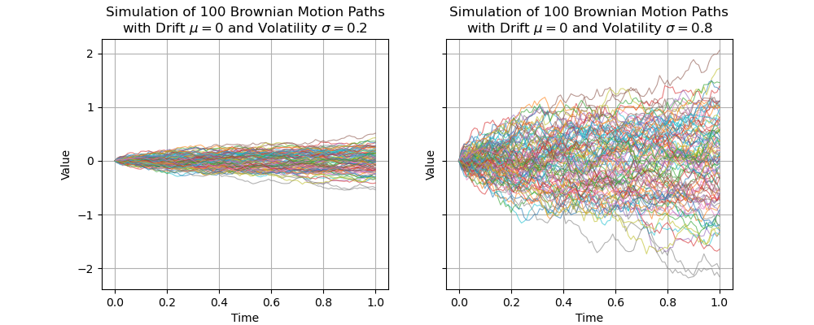

# Continuous-Time Finance
 

## Lecture notes
 

### *Fayçal Drissi*
[website](https://www.faycaldrissi.com/)

 

####  *Saïd Business School, University of Oxford*

#### Trinity Term 2025 

---

      

<h1>
Why Continuous-Time Finance ? </h1>

---

# Continuous-Time Finance

* Events in the real world happen in discrete-time

* Quickly changing chains of events may be described in term of a continuous mechanism (as in Physics)

* **Example**: stock prices evolve almost continuously. 
  * Think of limit order books where orders are sent at the milisecond frequency.

---

# Why Continuous-Time Finance ?

* **Definition** A derivative is a contract whose value is dependent upon one or more underlying assets

* Continuous-time models are significantly more tractable when it comes to describe the behaviour of risk and returns of complex financial derivatives

* Beyond tractability, continuous-time models models are sometimes essential for understanding the risks of complex financial instruments

---

# Why Continuous-Time Finance ?

* Continuous-time models are widely employed by trading desks at investment banks and hedge funds to price, hedge, and manage portfolios, in markets where trillions of dollars in derivatives are traded daily

{style="transform: translate(40%, 0%); width: 470px"}

---

# Some history

* Mathematical Finance is a (young) science at the frontier between probability theory,
economics, and computer science (Despite its short history, Quantitative Finance has Nobel Prize laureates (Merton, Scholes))
* $1900$: The real father of (modern) Quantitative Finance is a French man called Bachelier
* Mid-$1950$s: Savage (the famous statistician) introduced economists to Bachelier’s work
  * Samuelson read the PhD thesis of Bachelier. He did research to price warrants (with Sprenkle and Bones)
* $1970$: Merton was a PhD student of Samuelson in 1970 and he discussed warrants with Black and Scholes at MIT
  * Merton introduced **replication**

---

# Some history

* 1980s: Cox-Ross-Rubinstein, Vasicek, Cox-Ingersoll-Ross models.
* 1999: Harrison, Kreps, and Pliska showed the link between the absence of arbitrage opportunity and martingales. 
* 1990s and 2000s: quantitative finance is ruled by mathematicians and probabilists
* The $2007-2008$ crisis: credit derivatives cannot be managed as equity derivatives  or fixed income derivatives. The famous *copula model* to price and hedge Collateralized Debt Obligations (CDOs) has have been used so blindly
  * highlighted the danger of the risk-neutral pricing/hedging models when used in highly incomplete markets
  * the financial mathematics community has played a  part in the catastrophe
* After the crisis: risk management, super-hedging, market microstructure, optimal market making, etc..

---

# Goals of this course

* Introduce the mathematical tools used in continuous-time models in finance

* Introduce the main models used in the industry

* Applications for pricing derivatives on Equity and Interest rates

---

# How

* Foundations
  * (Basic) review of probabilioty theory
  * Introduction to stochastic calculus
 
* Introduction of the main pricing principles
  * Martingales, Ito processes, Risk-neutral pricing, etc.

* We start with simple models, and we add complexity

---

# Course outline
### Session 1: Binomial model for option pricing
### Session 2: Pricing Principles and the Absence of Arbitrage
### Session 3: Introduction to Stochastic Processes
### Session 4: The Black-Scholes Model
### Session 5: Risk-Neutral Pricing in Continuous-Time
### Session 6: Pricing in practice
### Session 7: ...
### Session 8: ...

---

# Format

* Each lecture will consist of a set of slides shared before the class

* Exercises will be solved during class: bring pen and paper (or iPad and pencil)

* Problem sets will be regularly distributed and selected problems solved in class

* Check Canvas for info, slides, exercises and solutions!

* Office hours on demand: faycal.drissi@gmail.com

---

# Assessment

* Final $2-$hours examination at the end of the term

* 4 questions

* Preparation: exercises during class, problem sets, and past exams

---
layout: intro
---
## Session $1$:  Binomial Model and Option Pricing
 
 

*Fayçal Drissi*

*Saïd Business School, University of Oxford*

--- 

# Risk and Return

* Assume there are two states of the world.

* Every day, there is either a sunny or a rainy day with probability $p=1/2$ and $1-p=1/2$.

* There is an ice-cream company (IC) whose stock price is trading at $50$ and an umbrella company (U) whose stock price is also trading at $50$.

* If it is a sunny day the IC company’s stock increases to $100$ otherwise it drops to zero. The U company has opposite dynamics.

{style="transform: translate(10%, -5%); width: 700px"}

--- 

# Risk and Return
   

* If you have $1$ GBP to invest, how much would you put on IC and/or U ?

{style="transform: translate(10%, -5%); width: 700px"}

--- 

# Risk and Return
   

* Suppose now that the probability of raining is p = 9/10. How would you change your strategy?

{style="transform: translate(10%, -5%); width: 700px"}

--- 

# Risk and Return
   

* Assume that there is a bond in this economy that pays an interest of $r$. 
* Risk premium: how much "above" $r$ would you expect to make on your investment strategy?

{style="transform: translate(10%, -5%); width: 700px"}

---

      

<h1>
Binomial Setup </h1>

---

## First example: a simple economy with three assets

* Two dates: $t$ and $t+1$

* Two assets are traded at prices $S^1(t)$ and $S^2(t)$ at time $t$

* At $t+1$, there are two states of nature that occur with probability $p$ and $1-p$

{style="transform: translate(10%, -0%); width: 700px"}

* Asset $1$ pays $S^1(t+1) = 1$ in state one and $S^1(t+1) = 1$ in state two. 
  * We denote the payoff (1, 1)

* Asset $2$ has payoff $(0, 3)$

---

## First example: a simple economy with three assets

* Assume we know $S^1(t)$ and $S^2(t)$
* **Problem**: There is a third asset with payoff $(2, 3)$. 
  * Calculate the price $S^3(t)$ at time $t$

{style="transform: translate(0%, 0%); width: 900px"}

---

## First example: a simple economy with three assets

{style="transform: translate(20%, -5%); width: 600px"}

* **Solution**: replication and no-arbitrage
  * We set a portfolio with value $\Pi(t)$ at time $t$ consisting of $\alpha_1$ units of Asset $1$ and $\alpha_2$ of Asset $2$
  * We set the portfolio weights  $\alpha_1$ and $\alpha_2$ such that the portfolio **replicates** Asset $3$ at time $t+1$
    $$\Pi(t+1) = \alpha_1\,S^1(t+1)+\alpha_2\,S^2(t+1)$$
  * By **no-arbitrage**, we should have
  $$\Pi(t) = S_3(t)$$
  * Why ?

---

## First example: a simple economy with three assets

* **Replication argument**
  * We set $\alpha_1$ and $\alpha_2$ such that 
  $$
  \begin{cases}
  \Pi(t+1) = 2 = \alpha_1 \times 1 + \alpha_2 \times 0 \quad \text{in state one}   \\
  \Pi(t+1) = 3 = \alpha_1 \times 1 + \alpha_2 \times 3 \quad \text{in state two}
  \end{cases}
  $$
  {style="transform: translate(30%, 0%); width: 500px"}
  * We find that 
  $$\alpha_1 = 2 \quad \text{and} \quad \alpha_2 = 1/3$$
  * By **no-abitrage**: 
  $$S_3(t) = 2\,S_1(t)+S_2(t)/3$$

---

      

<h1>
Pricing Options in a Binomial Setup </h1>

---

## The market

* One stock (say Microsoft)
* Starting time $t$, ending time $T$
* Two states of the world with probabilities $p$ and $1 − p$
* Starting value of the stock price: $S$
* In the *up state*, with probability $p$, the price becomes $u\,S$ where $u$ is a constant
* In the *down state*, with probability $1-p$, the price becomes $d\,S$ where $d$ is a constant
* There is a **bond** that pays a constant **interest rate $r$**.

{style="transform: translate(10%, 20%); width: 700px"}

---

## The call option

* **Definition**: A European Call option with strike price $K$ and maturity $T$ is the **right** to buy, at time $T$, the underlying stock for the price $K$. 
* What is the mathematical formula for the payoff of the option as a function of $S(T)$ ?

---

## The call option

* **Definition**: A European Call option with strike price $K$ and maturity $T$ is the **right** to buy, at time $T$, the underlying stock for the price $K$. 
* What is the mathematical formula for the payoff of the option as a function of $S(T)$ ?
* The payoff at time $T$ is $\max\{S(T) - K, 0 \}$. 
* In the *up state*, the payoff of the call is 
$$
C^u = \max\{u\, S - K, 0\}
$$
* In the *down state*, the payoff of the call is 
$$
C^d = \max\{d\, S - K, 0\}
$$

---

## The call option

* Let $C(t)$ be the price of the option at time $t$ 

* The payoff of a long position in a call option with strike $K=100$ and when $C(t)=10$

{style="transform: translate(40%, 0%); width: 500px"}

* When do we buy a call option ?

---

## The put option

* **Definition**: A European Put option with strike price $K$ and maturity $T$ is the right to sell, at time $T$, the underlying stock for the price $K$. What is the payoff of a put option at time $T$.

---

## The put option

* **Definition**: A European Put option with strike price $K$ and maturity $T$ is the right to sell, at time $T$, the underlying stock for the price $K$. What is the payoff of a put option ?
* The payoff at time $T$ is $\max\{K - S_T, 0\}$
* The payoff of a long position in a put option with strike $K=100$ (when do we buy a put ?)

{style="transform: translate(40%, 0%); width: 500px"}

---

## The call option

* How do we price the call in our binomial model, i.e., how do we find $C(t)$ ?

{style="transform: translate(10%, 0%); width: 700px"}

---

## The call option

* To price the call, we replicate its payoff with the bond and the underlying asset S

* At time $t$, we set a portfolio $\Pi(t)$ with $B$ pounds in the bond and $\Delta$ units of the asset $S$, such that 
$$
\Pi^u(t+1) = C^u \text{  and  } \Pi^d(t+1) = C^d
$$

{style="transform: translate(0%, 20%); width: 800px"}

---

## The call option

* The price of the portfolio at time $t$ is
$$
\Pi(t) = B + \Delta\,S.
$$

* We choose $\Delta$ and $B$ such that
$$
\begin{cases}
\Pi^u(t+1) = B\, (1+ r) + \Delta\,u\,S = C^u \\
\Pi^d(t+1) = B\, (1+ r) + \Delta\,d\,S = C^d
\end{cases}
$$

---

## The call option

* The price of the portfolio at time $t$ is
$$
\Pi(t) = B + \Delta\,S.
$$

* We choose $\Delta$ and $B$ such that
$$
\begin{cases}
\Pi^u(t+1) = B\, (1+ r) + \Delta\,u\,S = C^u \\
\Pi^d(t+1) = B\, (1+ r) + \Delta\,d\,S = C^d
\end{cases}
$$

* In matrix form we solve the system
$$
{\left[\begin{array}{ll}
u S & 1+r \\
d S & 1+r
\end{array}\right]\left[\begin{array}{c}
\Delta \\
B
\end{array}\right]=\left[\begin{array}{c}
C^u \\
C^d
\end{array}\right]}
$$

* Therefore
$$
{\left[\begin{array}{c}
\Delta \\
B
\end{array}\right]=\frac{1}{(1+r)(u S-d S)}\left[\begin{array}{cc}
1+r & -(1+r) \\
-d S & u S
\end{array}\right]\left[\begin{array}{c}
C^u \\
C^d
\end{array}\right]}
$$

---

## The call option

* We find
$$
\Delta=\frac{C^u-C^d}{u S-d S}, \quad \text { and } \quad B=\frac{-d C^u+u C^d}{(1+r)(u-d)}
$$

* By **no-abitrage**, the portfolio at time $t$ has the same value as the call and we write ($R=1+r$)
$$
C(t) = \Delta S+B  =\frac{C^u-C^d}{u S-d S} S+\frac{-d C^u+u C^d}{R(u-d)} =\frac{1}{R}\left[\frac{R-d}{u-d} C^u+\frac{u-R}{u-d} C^d\right] .
$$

---

## Example of option strategies: a covered call option

* In a covered call strategy, an investor buys the stock and sells a call option on the stock
* The payoff is
$$
- \max\{S_T - K\} + (S_T - S_0)
$$
{style="transform: translate(55%, 0%); width: 400px"}
* You are a banker and you want to buy a covered call option from your broker. Assume  that all payments are at time $T$, what's the price according to our binomial model ?

---

## Example of option strategies: a covered call option

* In the case of covered call, the payoffs in the up and down states are
$$ 
\begin{cases}
\tilde C^u = \max\{u\,S-K, 0\} + u\,S - S_0= C^u + u\,S - S_0 \\
\tilde C^d = \max\{d\,S-K, 0\} + d\,S - S_0= C^d + d\,S - S_0,
\end{cases}
$$

* The price is 
$$
\begin{split}
P(t)& =\frac{1}{R}\left[\frac{R-d}{u-d} \tilde C^u+\frac{u-R}{u-d}  \tilde C^d\right]\\
& =\frac{1}{R}\left[\frac{R-d}{u-d} C^u+\frac{u-R}{u-d}  C^d - \frac{R-d+u-R}{u-d}S_0 + \frac{(R-d)u+(u-R)d}{u-d}S \right]\\
& =  S - S_0/R +  \frac{1}{R}\left[\frac{R-d}{u-d} C^u+\frac{u-R}{u-d}  C^d \right]
\end{split}
$$
* We can price any strategy that combines stocks and call/puts in the binomial model: Straddle, Call spread, Put spread, Protective Collar ...

---

      

<h1>
Risk-Neutral Valuation </h1>

---

## Risk-Neutral Valuation - Call option

* We found that the call option price is
$$
C(t) =\frac{1}{R}\left[\frac{R-d}{u-d} C^u+\frac{u-R}{u-d} C^d\right] .
$$

* **Remark:** the price $C(t)$ of the option does not depend on the binomial probability $p.$ 

* Why?

---

## Risk-Neutral Valuation - Call option

* We found that the call option price is
$$
C(t) =\frac{1}{R}\left[\frac{R-d}{u-d} C^u+\frac{u-R}{u-d} C^d\right] .
$$

* **Remark:** the price $C(t)$ of the option does not depend on the binomial probability $p.$ 

* Why?

 intuitively: 
  * the option price is pinned down by replication — matching payoffs exactly across states — not by how likely  those states are
  * the option price then depends only on the cost of replicating its payoff using the underlying asset and the bond

---

## Risk-Neutral Valuation - Call option

* We found that the call option price is
$$
C(t) =\frac{1}{R}\left[\frac{R-d}{u-d} C^u+\frac{u-R}{u-d} C^d\right] .
$$

* Define a new probability measure $\tilde P$ that assigns $\tilde p$ to the *up state* and $1-\tilde p$ to the *down state*
$$
\tilde p = \frac{R-d}{u-d}
$$
* The price of the option is
$$
C(t) =\frac{1}{R}\left[\tilde p C^u+(1-\tilde p) C^d\right]
$$

{style="transform: translate(30%, 0%); width: 500px"}

---

## Risk-Neutral Valuation - Call option

{style="transform: translate(14%, 0%); width: 600px"}

* Necessary condition for absence of arbitrage is $\tilde p \in (0, 1)$, which implies 
$$d < 1 + r < u$$

* In this case, the price of the option is the **discounted expectation** under the new **risk-adjusted probability measure**

$$
C(t) =\frac{1}{R}\left[\tilde p C^u+(1-\tilde p) C^d\right] = \frac{1}{1+r}\tilde{\mathbb E}[C(t+1)]
$$

---

## Risk-Neutral Valuation: intuition

* Prices of assets depend on their risk
* Investors demand more profit for bearing more risk (risk-averse): think of utility
* Today's price of a claim realised in a future date, written on a risky asset, will generally differ from its expected value: investors ask for a premium.
* Using actual real-world probabilities, every security would require a different adjustment (as they differ in riskiness)

---

## Risk-Neutral Valuation: intuition

* There is another way to do this adjustment
  * Instead of calculating expectation and then adjusting for an investor's risk preference
  * We adjust, once and for all, the probabilities of future outcomes such that they incorporate all investors' risk premia
  * We take expectation under this new probability distribution, the risk-neutral measure
* Once the risk-neutral probability is found, assets can be priced by simply taking the present value of expected payoff

---

## Risk-Neutral Valuation: Exercise

* **Exercise 1**: Under the risk-neutral measure, calculate the discounted expected value of the stock price, i.e.,
$$
\frac{1}{1+r}\,\tilde{\mathbb E}[S(t+1)]
$$

* What is the price of a European call with strike $K=0$ ?

* Would the price change if the probability $p$ or $u,d$ change ?

---

## Risk-Neutral Valuation: Exercises

* Recall that the risk-neutral binomial probability is
$$
\tilde p = \frac{R-d}{u-d}
$$
* Then
$$
\frac{1}{1+r}\,\tilde{\mathbb E}[S(t+1)] = \frac{1}{1+r}(\tilde p\,u\,S + (1-\tilde p)\,d\,S ) = S
$$
* When $K=0$, $C^u = u\,S$ and $C^d = d\,S$, So
$$
C(t) =\frac{1}{R}\left[\frac{R-d}{u-d} C^u+\frac{u-R}{u-d} C^d\right] = S.
$$

---

## Risk-Neutral Valuation: Exercises

* Assume now that there are three dates ${0, 1, 2}$ and consider the following binomiam tree (where $u=1/d$)

{style="transform: translate(20%, 0%); width: 600px"}

* **Exercise $2$**: Compute recursively the price of the European call option with strike $K$ and maturity $T = 2$

---

## Risk-Neutral Valuation: Exercises

- At $t=2$, the call option payoff is:
$$
\text{Payoff} = (S_2 - K)^+ = \max(S_2 - K, 0)
$$
  
{style="transform: translate(20%, 0%); width: 600px"}

---

## Risk-Neutral Valuation: Exercises

- At $t=1$, the option value is the **discounted expected value** under risk-neutral probabilities. Define the risk-neutral probability:
$$
\tilde{p} = \frac{R - d}{u - d}
$$

{style="transform: translate(20%, 0%); width: 600px"}

---

## Risk-Neutral Valuation: Exercises

- At $t=0$, the option value is the **discounted expected value** under risk-neutral probabilities. 

     
{style="transform: translate(20%, 0%); width: 600px"}

---

      

<h1>
Probability basics </h1>

---

## Probability basics: random variables and sample space

{style="transform: translate(20%, 0%); width: 600px"}

* At time $0$, $S_1$ and $S_2$, the stock prices at times $1$ and $2$, are **random variables**.

* To describe the random behaviour of $S_2$, we use the **sample space**

$$
\Omega = \{\text{LL},\text{LH},\text{HL},\text{HH}\}
$$
of all outcomes $\omega\in\Omega$ that can be realised

---

## Probability basics: sigma algebra

<!--* Let $\mathcal F$ be the family of all subsets of $\Omega$-->
* A sigma-algebra formalises the idea of "what you can know" about uncertain outcomes, making sure that your knowledge is stable under logical combinations

* **Definition of sigma algebra**: a sigma algebra $\mathcal G$ <!-- \subset \mathcal F$--> is a family of subsets of $\Omega$ such that:
  * $\emptyset \subset \mathcal G$
  * If $A \in \mathcal G$ then $A^C \subset \mathcal G$
  * If $(A_i)_{i} \in \mathcal G$ is a countable sequence in $\mathcal G$, then $\bigcup_i A_i \in \mathcal G$

* Think of a sigma-algebra as the list of all questions you are allowed to ask about the outcome of some experiment, given your information

* To be coherent (mathematically nice), this list must be closed under basic operations: unions, intersections, and complements.

* The couple $(\Omega, \mathcal G)$ is called a measurable space.

---

## Probability basics: filtration

{style="transform: translate(30%, 0%); width: 500px"}

* The information available to the trader at time $0$ can be modeled by the information set 
$$\mathcal G_0 = \{\emptyset, \Omega\}$$

* At time $1$, we can observe the outcome of time $1$. The information set gets larger: it is a sigma algebra generated by the price movement
$$
\mathcal G_1 = \{\emptyset, \Omega, \{HL, HH\}, \{LL, LH\} \}
$$

* At time $2$, we can observe more outcomes in more detail 
$\mathcal G_2 =\mathcal P(\Omega)$ (power set), i.e., it is the set of all subsets of $\Omega$, including $\Omega$ and the empty set.

---

## Probability basics: filtration

{style="transform: translate(30%, 0%); width: 500px"}

* The trader's information set is growing over time

$$\mathcal G_0 \subset \mathcal G_1 \subset \mathcal G_2$$

* **Definition :** A filtration is a sequence $(\mathcal G_i)_i$ of sigma algebras over $\Omega$ such that for all $i$
  $$
  \mathcal G_i \subset \mathcal G_{i+1}
  $$

* A filtration formalises the flow of information over time — it captures what is knowable at each date, with knowledge only increasing

---

## Some probability basics: probability measure

* **Purpose**: assign probability to events in a consistent way
* **Definition**: a probability measure on $(\Omega, \mathcal G)$ is a function $\mathbb P: \mathcal G \mapsto [0, 1]$ such that 
  * $\mathbb P[\Omega] = 1$
  * (sigma additivity) For any disjoint sequence $(A_i)_i \subset \mathcal G$ such that $A_i \cap A_j = \emptyset$ :
  $$
  \mathbb P[\bigcup_i A_i] = \sum_i \mathbb P[ A_i]
  $$
* **Definition**: $(\Omega, \mathcal G, \mathbb P)$ is a probability space.

---

## Some probability basics: random variables

* **Definition**: Let $X : \Omega \mapsto R$ be a function. The sigma algebra 
$$\sigma(X) = \{X^{-1}(B) \text{ for all } B \subset \mathbb R  \}$$
is called the sigma algebra generated by $X$.

* The sigma-algebra generated by a random variable is the collection of events you can describe *if the only thing you know* is the value of that random variable

* **Definition**: $X$ is a random variable on $(\Omega, \mathcal G)$ if it is measurable with respect to $\mathcal G$, i.e., if 
$$\sigma(X) \subset \mathcal G$$

---

## Some probability basics: random variables

* **Example** 
  * $\sigma(S_1) = \mathcal G_1$
  * $S_1$ is $\mathcal G_1$ measurable
  * $S_2$ is not $\mathcal G_1$ measurable

{style="transform: translate(10%, 0%); width: 700px"}

---

      

<h1>
American/European options </h1>

---

## American options in the three-dates binomial model

* **Definition:** an *American* option can be exercised at any point in time during the life of the option

* **Definition:** a *Bermudean* option can be exercised at specific pre-arranged times

---

## American options in the three-dates binomial model

* **Definition:** an *American* option can be exercised at any point in time during the life of the option
* **Definition:** a *Bermudean* option can be exercised at specific pre-arranged times

* To decide whether to exercise, at each time $t$, the holder of an american option compares 
  * the value of exercising the option at time $t$
  * and the value of keeping the option 

---

## American options in the three-dates binomial model

* **Definition:** an *American* option can be exercised at any point in time during the life of the option
* **Definition:** a *Bermudean* option can be exercised at specific pre-arranged times

* To decide whether to exercise, at each time $t$, the holder of an american option compares 
  * the value of exercising the option at time $t$
  * and the value of keeping the option 

* So the price of the american option at each time $t$ is 
$$
\max\{\text{exercise value at t, option value between t and T}\}
$$

* We can price american options recursively

---

## American options in the three-dates binomial model

* Let $V(S_t)$ be the payoff of an option which is exercised at time $t$
  * For instance, for an american call option, $V(S_t) = \max\{S_t-K, 0\}$

* Assume a three-dates binomial model 

{style="transform: translate(0%, 0%); width: 800px"}

---

## American options in the three-dates binomial model

We work backward:
  * At time $t=2$, the payoff is simply $V(S_2)$ for both American and European options. We know the payoffs for each possible value of the stock at time $t=2$

{style="transform: translate(0%, 0%); width: 800px"}

---

## American options in the three-dates binomial model

We work backward:
  * At time $t=1$, the payoff of the American option is the maximum between the exercise value $V(S_1)$, and the discounted expected future payoff (at time $t=2$)

{style="transform: translate(0%, 0%); width: 800px"}

---

## American options in the three-dates binomial model

We work backward:
  * At time $t=0$, the payoff of the American option is the maximum between the exercise value $V(S_0)$, and the discounted expected future payoff (at time $t=1$)

{style="transform: translate(5%, 11%); width: 800px"}

---
layout: end
---
Thank you !

[faycaldrissi.com](https://www.faycaldrissi.com/)

---
layout: intro
---
## Session $2$:  Pricing Principles and the Absence of Arbitrage
 
 

*Fayçal Drissi*

*Saïd Business School, University of Oxford*

---

      

<h1>
American options </h1>

---

# Model independent properties

$$
C^A(t, S; K, T) \quad ? \quad  C^E(t, S; K, T)
$$

---

# Model independent properties

- If $K_1 < K_2$ 
$$
C(t, S; K_1, T) \quad ? \quad C(t, S; K_2, T)
$$

---

# Model independent properties

- If $K_1 < K_2$ 
$$
P(t, S; K_1, T) \quad ? \quad P(t, S; K_2, T)
$$

---

# Model independent properties

- If $T_1 < T_2$ 
$$
P(t, S; K, T_1) \quad ? \quad P(t, S; K, T_2)
$$
$$
C(t, S; K, T_1) \quad ? \quad C(t, S; K, T_2)
$$

---

# Model independent properties

$$
C(t, S; K, T) \quad ? \quad S
$$

---

# Early exercise

* **Proposition**:  Assume an $n-$dates binomial model. Let $S$ be an underlying stock that pays no divident. Then an American call written on $S$ is never exercised early.

---

## Early exercise

* **Proposition**:  Assume an $n-$dates binomial model. Let $S$ be an underlying stock that pays no divident. Then an American call written on $S$ is never exercised early.
* **Proof**: At time $t=n$, the options are worth the same. First we establish that, at time $t<n$, 
$$C^A(t, S_t) \ge S_t - \frac{1}{R^{n-t}}K$$

Consider a portfolio $C^A(t, S) - S + \frac{1}{R^{n-t}}K$, i.e., Long call, short stock, and bank deposit that pays $K$ at maturity $n$
 
If the american call is exercised early at time $t$, then the trader obtains now
$$
S_t - K - S_t + \frac{1}{R^{n-t}}K = K (1/R^{n-t} - 1) < 0
$$
If the trader waits until time maturity $n$, then the value of the portfolio is 
$$
\begin{cases}
S_n - K - S_n + K = 0 & \text{ if } S_n > K \\
 - S_n + K > 0  & \text{ if } S_n < K
\end{cases}
$$

---

# Early exercise

* **Proposition**:  Assume the three-dates binomial model. Let $S$ be an underlying stock that pays no divident. Then an American call written on $S$ is never exercised early.
* **Proof**: We have shown that it is better to wait when one holds the portfolio  at time $1$ because its future value is nonnegative, so for any time $t$
$$C^A(t, S_t) \ge S_t - \frac{1}{R}K$$ 

* We conclude by observing that a call yields $K-S_t$ if exercised at time $t$, however
$$
K - S_t \le K - S_t/R^{n-t} \le C^A(t, S_t)
$$

---

      

<h1>
More probability basics </h1>

---

## A more general binomial model

* Transaction dates $\mathcal T=\{0, 1, 2, \dots, n\}$

* Sample space $\Omega =$ $\{$Sequences of $H$ and $L$ of length $n+1\}$

* $\mathcal F$ is the sigma algebra of all subsets of $\Omega$

* Dynamics of the stock price and the money account
$$
S_{t+1} = \begin{cases}
u\,S_t \text{ with probability p} \\
d\,S_t \text{ with probability 1-p} \\
\end{cases}
\quad\qquad 
B_{t+1} = (1+r)\,B_t 
$$

{style="transform: translate(10%, 0%); width: 700px"}

---

## Expectations and conditional expectations
{style="transform: translate(10%, 0%); width: 700px"}

* Assume $n=1$ and we are at time $0$. What is the expectation of $S_{1}$ under the physical measure ? 

---

## Expectations and conditional expectations
{style="transform: translate(10%, 0%); width: 700px"}

* Assume $n=1$ and we are at time $0$. What is the expectation of $S_{1}$ under the physical measure ? 
* Assume $n=1$ and we are at time $0$. Assume we change probability measures to the risk-neutral $\tilde p$. What is the expectation of $S_{1}$ under the risk-neutral measure ?

---

## Expectations and conditional expectations
{style="transform: translate(10%, 0%); width: 700px"}

* Assume $n=1$ and we are at time $0$. What is the expectation of $S_{1}$ under the physical measure ? 
* Assume $n=1$ and we are at time $0$. Assume we change probability measures to the risk-neutral $\tilde p$. What is the expectation of $S_{1}$ under the risk-neutral measure ?
* Assume $n=2$ and we are at time $0$. What is the expectation of $S_{2}$ under the physical measure ? under the risk-neutral measure ?

---

## Expectations and conditional expectations
{style="transform: translate(10%, 0%); width: 700px"}

* Assume $n=1$ and we are at time $0$. What is the expectation of $S_{1}$ under the physical measure ? 
* Assume $n=1$ and we are at time $0$. Assume we change probability measures to the risk-neutral $\tilde p$. What is the expectation of $S_{1}$ under the risk-neutral measure ?
* Assume $n=2$ and we are at time $0$. What is the expectation of $S_{2}$ under the physical measure ? under the risk-neutral measure ?
* Assume $n=2$ and we are at time $0$. What is the expectation of $S_2$ conditional on $S_1 = 1$ ?

---

## Some definitions

* **Definition**: $(S_t)_{t=0,\dots,n}$ is a sequence of random variables on a probability space $(\Omega, \mathcal F, \mathbb P)$. We call $(S_t)_t$ a *stochastic process*
* We define $\mathcal G_t$ as the sigma algebra (information set) generated by $S$ up to time $t.$
* We call the sequence $(\mathcal G_t)_t$ the *filtration* generated by $S_t$

---

## Some definitions

* **Definition**: $(S_t)_{t=0,\dots,n}$ is a sequence of random variables on a probability space $(\Omega, \mathcal F, \mathbb P)$. We call $(S_t)_t$ a *stochastic process*
* We define $\mathcal G_t$ as the sigma algebra (information set) generated by $S$ up to time $t.$
* We call the sequence $(\mathcal G_t)_t$ the *filtration* generated by $S_t$
* Conditional on $\mathcal G_t$, we know the value of $X_t$
* Conditional on $\mathcal G_t$, we don't know the value of $X_{t+1}.$

---

## Some definitions

* **Definition**: $(S_t)_{t=0,\dots,n}$ is a sequence of random variables on a probability space $(\Omega, \mathcal F, \mathbb P)$. We call $(S_t)_t$ a *stochastic process*
* We define $\mathcal G_t$ as the sigma algebra (information set) generated by $S$ up to time $t.$
* We call the sequence $(\mathcal G_t)_t$ the *filtration* generated by $S_t$
* Conditional on $\mathcal G_t$, we know the value of $X_t$
* Conditional on $\mathcal G_t$, we don't know the value of $X_{t+1}.$
* But we can estimate $\mathbb E[X_{t+1} \mid \mathcal G_t]$ which is the expectation of $X_{t+1}$ conditional on the information we have up to time $t$

---

## Some definitions

* **Definition**: Let $\mathcal G'_t \subset \mathcal G_t$ be a *coarser* information set.  
We call $\mathbb E[X_t \mid \mathcal G'_t]$ the *conditional expectation* of $X_t$ condition on $\mathcal G'_t$
* **Remark**: $\mathbb E[X_{t+1} \mid \mathcal G'_t]$ is $\mathcal G'_t$-measurable

---

## Some definitions

* **Definition**: Two stochastic processes are **independent** if they generate different information sets

* If two stochastic processes $X$ and $Y$ are independent, then 
$$
\mathbb E[X \times Y] = \mathbb E[X] \times \mathbb E[ Y]
$$

---

## Some definitions

* **Exercise**: Assume $n > 2$ in the binomial model.  Prove that 
$$
\mathbb E[S_2 \mid \sigma(S_1)] = S_1 \, (p\, u + (1-p)\,d)
$$
where $\sigma(S_1) = \mathcal G_1$. (Use that $S2/S1$ is indepent from $S_1$)

---

## Some definitions

* **Tower Property** For any $\mathcal H \in \mathcal G$, we have
$$
\mathbb E[\mathbb E [X \mid \mathcal G] \mid \mathcal H]= \mathbb E[X \mid \mathcal H] 
$$
The conditional expectation of a conditional expectation is the expectation conditioned on the smallest information set

* **Exercise**: Compute $E[S_{t+k} \mid \mathcal G_{t}]$ 

---

## Adapted process and martingales

* **Definition**: A filtered probability space $(\Omega, \mathcal G, (\mathcal G_i)_i, \mathbb P)$ is a probability space $(\Omega, \mathcal G, \mathbb P)$ with a filtration.
* **Definition**: A stochastic process $X$ on a filtered probability space is **adapted** if every $X_t$ is $G_t$-measurable for any $t\in\mathcal T$

---

## Adapted process and martingales

* **Definition**: An adapted process $X$ is **martingale** if for any $t \in\mathcal T$, we have
$$
\mathbb E[X_{t+1} \mid \mathcal G_t] = X_t
$$
or more generally, for any $s>t$, we have
$
\mathbb E[X_{s} \mid \mathcal G_t] = X_t
$
  * This means the best estimate of the future value of $X$ is the current value of $X$.

---

## Adapted process and martingales

* **Definition**: An adapted process $X$ is **martingale** if for any $t \in\mathcal T$, we have
$$
\mathbb E[X_{t+1} \mid \mathcal G_t] = X_t
$$
or more generally, for any $s>t$, we have
$
\mathbb E[X_{s} \mid \mathcal G_t] = X_t
$
  * This means the best estimate of the future value of $X$ is the current value of $X$.

* **Remark**: the filtration $\mathcal G$ and the probability measure $\mathbb P$ are crucial to determine the validity of the martingale condition. Different probability measures and filtrations can imply matingality of a process or not !

---

## Adapted process and martingales

* In the $n-$period binomial model, using the filtration generated by $S$, we found
$$
\mathbb E[S_t \mid \mathcal G_{t-1}] = S_{t-1} (p\,u + (1-p)\,d)
$$

Therefore, the stock price is a martingale if and only if
$$
p = \frac{1-d}{u-d}
$$

---

## Adapted process and martingales
* **Exercise**: if $X$ and $Y$ are two martingales on $\mathcal T$ such that $X_n = Y_n$; Show that $X_t = Y_t$ for each $t \in \{0,1,\dots,n\}$
(by recursion)

---

##  Risk Neutral Probability Measure and Martingales

* **Reminder session 1**:
{style="transform: translate(30%, 0%); width: 500px"}
* We defined a new probability measure $\tilde P$ that assigns a probability 
$$
\tilde p = \frac{R-d}{u-d}
$$
to the *up state* and $1-\tilde p$ to the *down state*, and where the price of the option was the discounted expected payoff.

$$
C(t) =\frac{1}{1+r}\left[\tilde p C^u+(1-\tilde p) C^d\right] = \mathbb E[ \frac{1}{1+r} C(t+1)].
$$

* $B(t+1) = 1+r$ is the $t+1$-price of a bond, whose price at $t$ is $B(t) = 1$.

* We also showed that the $S(t)/B(t) = \mathbb E[ S(t+1)/B(t+1) ].$

* Basically, we showed that, **under the risk-neutral measure**, the discounted prices of the option and the stock are martingales. 

---

##  Risk Neutral Probability Measure and Martingales

* More generally, in our binomial model with $t\in\{1,\dots,n\}$, we consider the stochastic process $(S_t/B_t)_t$:
$$
S_t / B_t = S_t / (1+r)^t
$$

* We can show that a binomial risk-neutral probability measure $\tilde P$ is obtained by defining the binomial probability
$$
\tilde p = \frac{1+r-d}{u-d}
$$

---

##  Risk Neutral Probability Measure and Martingales

* **Exercise**: prove that $S_t / B_t$ is a martingale under $\tilde P$.

---

##  Risk Neutral Probability Measure and Martingales

* **Exercise**: prove that $S_t / B_t$ is a martingale under $\tilde P$.
* We need to show 
$$
\tilde{\mathbb E}\left[S_{t+1}/B_{t+1} \mid \mathcal G_t \right] = S_{t}/B_{t}
$$
* First, $B_t = (1+r)^t$ is deterministic, thus
$$
\begin{split}
\tilde{\mathbb E}\left[S_{t+1}/B_{t+1} \mid \mathcal G_t \right] = \tilde{\mathbb E}\left[\frac{S_{t+1}}{S_t} \frac{S_t}{B_{t+1}}  \mid \mathcal G_t \right]=\frac{S_t}{B_{t+1}} \,\tilde{\mathbb E}\left[\frac{S_{t+1}}{S_t}   \mid \mathcal G_t \right]
\\
\end{split}
$$
* continue..

---

## Self-financing Strategies, Risk Neutral Probability Measure and Martingales

* **Definition** Self-financed portfolio $\Pi$: rebalanced at any time using only past capital gains

---

## Self-financing Strategies, Risk Neutral Probability Measure and Martingales

* **Definition** Self-financed portfolio $\Pi$: rebalanced at any time using only past capital gains
* Let $\Delta_t$ be the amount invested at time $t$ in a stock $S$
* A self-financed portfolio invests the remainder $\Pi_t - \Delta_t\,S_t$ in the bank account at time $t$
* The value of the portfolio $\Pi$ at $t+1$ is
$$
\Pi_{t+1} = \Delta_t S_{t+1} + (\Pi_t - \Delta_t\,S_t)\,(1+r)
$$
* What's the value of the portfolio at time $t+2$ given $\Delta_{t+1}$

---

## Self-financing Strategies, Risk Neutral Probability Measure and Martingales

* **Exercise**: show that the discounted self-financed portfolio value process $(\Pi_t/B_t)$ is a martingale under $\tilde P$.

---

## Self-financing, Martingales, and Pricing

* Self-financed portfolios can be used to **hedge** derivatives.
  * If we can fully replicate a contingent claim by means of a self-financed
portfolio, then we can fully eliminate the risk related to the random payoff

---

## Self-financing, Martingales, and Pricing

* Self-financed portfolios can be used to **hedge** derivatives.
  * If we can fully replicate a contingent claim by means of a self-financed
portfolio, then we can fully eliminate the risk related to the random payoff
* Consider a *European derivative* with maturity $T$ and payoff $V_T$.
  * It is headgeable is there exists a self-financed portfolio process such that $\Pi_T = V_T$
  * We just need to be able to replicate the payoff !
  * That's what we did in Session $1$
* If the derivative is **hedgeable**, absence of arbitrage 
implies that its price is the value of the hedging portfolio

---

## Risk-neutral valuation formula

* Let $V_T$ be the payoff of a European derivative.
* The risk-neutral valuation formula is
$$
V_t = \frac{B_t}{B_T}\,\tilde{\mathbb E}[V_T \mid \mathcal G_t] = \frac{1}{(1+r)^{T-t}}\,\tilde{\mathbb E}[V_T \mid \mathcal G_t]
$$
* Can we always  use the formula ? Does a risk-neutral probability always exist ?

---

## Risk-neutral valuation formula

* Let $V_T$ be the payoff of a European derivative.
* The risk-neutral valuation formula is
$$
V_t = \frac{B_t}{B_T}\,\tilde{\mathbb E}[V_T \mid \mathcal G_t] = \frac{1}{(1+r)^{T-t}}\,\tilde{\mathbb E}[V_T \mid \mathcal G_t]
$$
* Can we always  use the formula ? Does a risk-neutral probability always exist ?
* **Theorem**: A risk-neutral probability measure  exists *if and only if* there are no arbitrage opportunities
* **Definition**: The market is **complete** if every contingent claim is hedgeable
<!---
layout: end

Thank you !
[faycaldrissi.com](https://www.faycaldrissi.com/)

layout: intro

## Session $3$: Introduction to Stochastic Processes
 
 
*Fayçal Drissi*
*Saïd Business School, University of Oxford*
-->

---

      

<h1>
Stochastic Processes </h1>

---
layout: two-cols 
---

## Stochastic Processes: from discrete to continuous

 

* In discrete-time, we have dates $t\in\{0,\dots,T\}$ 
  * A stochastic process $X$ at time $t$ is $X_t$
  * The change in value of $X$ between $t$ and $t-1$ is 
  $$\Delta X_t = X_t - X_{t-1}$$
  * The change in value of $X$ between $0$ and $t$ is the sum of changes through the path:
  $$
  X_t - X_0 = \sum_{s=1}^t \Delta X_s
  $$

::right::

---
layout: two-cols 
---

## Stochastic Processes: from discrete to continuous

 

* In discrete-time, we have dates $t\in\{0,\dots,T\}$ 
  * A stochastic process $X$ at time $t$ is $X_t$
  * The change in value of $X$ between $t$ and $t-1$ is 
  $$\Delta X_t = X_t - X_{t-1}$$
  * The change in value of $X$ between $0$ and $t$ is the sum of changes through the path:
  $$
  X_t - X_0 = \sum_{s=1}^t \Delta X_s
  $$

::right::
   

* In continuous-time, time lives in an interval $[0, T]$
  * A stochastic process at time $t$ is $X_t$
  * $dX_s$ is the infinitesimal change at time $s$
  * The change in value of $X$ between $t$ and $t-1$ is 
  $$X_t - X_0 = \int_{t-1}^{t} dX_s$$
  * In particular, $X_t = \int_0^t dX_s$

---

## Expectation in continuous time

* Assume a random variable $Z$ has a continous distribution $f$ over $(-\infty, \infty)$, what is the expectation of $Z$?

* What is the expectation of $Z$ conditionally on $Z>a$ for a known constant $a$

---

## Expectation in continuous time

* Assume a random variable $Z$ has a continous distribution $f$ over $(-\infty, \infty)$, what is the expectation of $Z$?

* What is the expectation of $Z$ conditionally on $Z>a$ for a known constant $a$

* Prove that 
$$
\text{Var}(Z) = \int_{-\infty}^\infty (x - \mu)^2\,f(x)\,dx 
$$

---

## Filtration, adapted processes, and martingales

* The concepts of filtration, adapted processes, and martingales extend in a natural way to continuous-time stochastic processes.

  * $(\mathcal G_{t})_{t\in[0, T]}$ is a filtration if for all $t<s$, we have $\mathcal G_{t}\subset\mathcal G_{s}$

  * A stochasic process is adapted to a filtration if at $t\in[0, T]$, the random variable $X_t$ is $\mathcal G_t$-measurable.

  * An adapted process is a martingale if for any $t,s\in[0, T]$ such that $s>t$, the martingale condition is satisfied :
  $$
  X_t = \mathbb E[X_s \mid \mathcal G_t] 
  $$

---

      

<h1>
Brownian Motion </h1>

---
layout: two-cols
---

## Brownian motions (Wiener processes): definition

 

* Discrete-time
  * Assume $(Y_t)_{t\in\{0,\dots,T\}}$ is a sequence iid normal variables $\mathcal N(0, 1)$
  * The stochastic process $W_t$ is a discrete-time Brownian motion if
    * $W_0 = 0$
    * $W_t = \sum_{i=1}^t Y_i$
  * **Remark**: $Z_t \sim \mathcal N(0, t)$ (prove it)
::right::

---
layout: two-cols
---

## Brownian motions (Wiener processes): definition

 

* Discrete-time
  * Assume $(Y_t)_{t\in\{0,\dots,T\}}$ is a sequence iid normal variables $\mathcal N(0, 1)$
  * The stochastic process $W_t$ is a discrete-time Brownian motion if
    * $W_0 = 0$
    * $W_t = \sum_{i=1}^t Y_i$
  * **Remark**: $Z_t \sim \mathcal N(0, t)$

::right::
   

* Continuous-time:
  * The stochastic process $W_t$ is a discrete-time Brownian motion if
    * $W_0 = 0$
    * Increments are independent, i.e., for  $r<s\le t<u$:
    $$
    W(u)-W(t) \quad\text{and}\quad W(s)-W(t)
    $$
    are independent random variables
    * Increments are normally distributed: 
    for an $s>t$
    $$
    W_s - W_t \sim \mathcal N(0, s-t)
    $$
  
---

## Brownian motions (Wiener processes): properties

* Distriution of $W_t$ is $\mathcal N(0,t)$

* **Exercise**: Show that $W$ is a **martingale**. 

---

## Brownian motions (Wiener processes): properties

* Distriution of $W_t$ is $\mathcal N(0,t)$

* **Exercise**: Show that $W$ is a **martingale**. 
  * Let $s>t$, we want to show $\mathbb E[W_s \mid \mathcal G_t] =  W_t$
  $$
    \mathbb E[W_s \mid \mathcal G_t] = \mathbb E[W_s - W_t + W_t \mid \mathcal G_t] = \mathbb E[W_s - W_t \mid \mathcal G_t] + W_t = W_t
  $$

---

## Brownian motions (Wiener processes): properties

* Distriution of $W_t$ is $\mathcal N(0,t)$

* **Exercise**: Show that $W$ is a **martingale**. 
  * Let $s>t$, we want to show $\mathbb E[W_s \mid \mathcal G_t] =  W_t$
  $$
    \mathbb E[W_s \mid \mathcal G_t] = \mathbb E[W_s - W_t + W_t \mid \mathcal G_t] = \mathbb E[W_s - W_t \mid \mathcal G_t] + W_t = W_t
  $$

* **Exercise**: Show that $W_t^2 - t$ is a martingale

---

## Brownian motions (Wiener processes): properties

* **Exercise**: show that $\exp\left(\sigma W_t - \sigma^2 t/2\right)$ is a martingale. 

**Hint**: for a Gassian random variable $X$ with mean zero and variance $\xi^2$, the moment generating function is

---

## Brownian motions (Wiener processes): properties

* **Exercise**: show that $\exp\left(\sigma W_t - \sigma^2 t/2\right)$ is a martingale
  * We want to show, for $s>t$, that
  $$E[\mathbb \exp\left(\sigma W_s - \sigma^2 s/2\right) \mid \mathcal G_t] = \exp\left(\sigma W_t - \sigma^2 t/2\right)$$ 
  * We show this with the usual trick: break down the path of $W$, and use the properties of the Brownian motion
  $$
  \begin{split}
  \mathbb E[\mathbb \exp\left(\sigma W_s - \sigma^2 s/2\right) \mid \mathcal G_t] =  
  & \mathbb E[\exp\left(\sigma (W_s-W_t+W_t) - \sigma^2 s/2\right) \mid \mathcal G_t] \\
   =& ....
  \end{split}
  $$

---

## Brownian motions (Wiener processes): properties

* **Exercise**:  For $s>t$, compute $Cov(Z_t, Z_s)$

---

## Brownian motions (Wiener processes): properties

* **Exercise**:  For $s>t$, compute $Cov(Z_t, Z_s)$

---

## History of Brownian motions

* **1827**: named after the Scottish botanist Robert Brown, who described the phenomenon  while looking through a microscope at pollen in water
* **1900**: French mathematician Louis Bachelier modeled the stochastic process now called Brownian motion in his doctoral thesis: The Theory of Speculation (under Henri Poincaré)
* **1905**:  theoretical physicist Albert Einstein published a paper where he modeled the motion of the pollen particles as being moved by individual water molecules
* **Recently**: it is at the core of most financial models, whether we consider
stocks, interest rates or currencies

---

      

<h1>
Ito Process </h1>

---

## Stock prices in continuous-time: the Ito process
* Let $W_t$ be a Brownian motion over $[0, T]$, and let $\mathcal G_t$ be the filtration generated by $W_t$
* Let $S_t$ denote the stock price. The **dynamics** of the price are
  $$
  dS_t = \mu\,dt + \sigma\,dW_t
  $$
  * $\mu\in\mathbb R$ is the **drift**
  * $\sigma>0$ is the **volatility**
* Let $B_t$ denote the bond price. The **dynamics** are
  $$
  dB_t = r\,dt
  $$
  * $r>0$ is the **risk-free rate**

---

## Stock prices in continuous-time: the Ito process

* We can simulate Brownian motions ...
  * We **discretise** the dynamics
$$
  dS_t = \mu\,dt + \sigma\,dW_t
$$

to 
$$
  \Delta S_t = \mu\,\Delta t + \sigma\,\mathcal N(0, \Delta t)
$$

---

## Stock prices in continuous-time: the Ito process

* We can simulate Brownian motions. Consider the dynamics
$$
  dS_t = \mu\,dt + \sigma\,dW_t
$$

* With/without drift 
{style="transform: translate(20%, 0%); width: 600px"}

---

## Stock prices in continuous-time: the Ito process

* We can simulate Brownian motions. Consider the dynamics
$$
  dS_t = \mu\,dt + \sigma\,dW_t
$$

* with more/less volatility
{style="transform: translate(20%, 0%); width: 600px"}

---

## Stock prices in continuous-time: the Ito process

* We can estimate from real data with a simple OLS regression
  * We **discretise** the dynamics
$$
  \Delta S_t / \Delta t = \mu + \epsilon_t
$$
* $\epsilon_t$ is regression noise with variance $\sigma^2$

{style="transform: translate(30%, 0%); width: 500px"}

* This is the physical measure

---

## Geometric Brownian Motion and Ito Process

* We also use the Geometric Brownian Motion (GBM) with dynamics (SDE)
  $$
    dS_t = \mu\,S_t\,dt + \sigma\,S_t\,dW_t
  $$
  or
    $$
    dS_t/S_t = \mu\,dt + \sigma\,dW_t
  $$
  * $\mu$ is a *percentage* drift
  * $\sigma$ is a *percentage* volatility
* The geometric bank account: 
$$dB_t =r \, B_t \,dt \implies B_t =\exp(r\,t)$$

---

## Geometric Brownian Motion and Ito Process

* The GBM is a special case of an Ito process whose dynamics are given by the SDE
$$
dX_t = \mu(t,X_t)\,dt + \sigma(t,X_t)\,dW_t
$$
for well-behaved functions $\mu$ and $\sigma$ (we will see later what this means) 
* Integrating, we get an equivalent representation of the SDE
$$
S_t = S_0 + \int_0^t \mu(u,X_u)\,du + \int_0^t \sigma(u,X_u)\,S_u\,dW_u
$$

---

## Ito Process

* Ito processes and Ito calculus: named after Kiyoshi Itô (1915 - 2008, University of Kyoto)
* Ito extended the methods of calculus to stochastic processes such as Brownian motion
* Ito calculus has important applications in mathematical finance and stochastic differential equations

---

      

<h1>
Stochastic Integral </h1>

---

## Stochastic integrals: motivation

* The Geometric Brownian Motion (GBM) follows the SDE
$$
  dS_t = \mu\,S_t\,dt + \sigma\,S_t\,dW_t
$$
* Naive solution: 
  * notice that 
  $$d\log(S_t) = \mu\,dt + \sigma\,dW_t$$ 
  * so
  $$
  \log(S_t) = \log(S_0) + \mu\,t + \sigma\,W_t \implies S_t = S_0\,\exp(\mu\,t + \sigma\,W_t)
  $$

---

## Stochastic integrals: motivation

* The Geometric Brownian Motion (GBM) follows the SDE
$$
  dS_t = \mu\,S_t\,dt + \sigma\,S_t\,dW_t
$$

* Naive solution: 
  * notice that 
  $$d\log(S_t) = \mu\,dt + \sigma\,dW_t$$ 
  * so
  $$
  \log(S_t) = \log(S_0) + \mu\,t + \sigma\,W_t \implies S_t = S_0\,\exp(\mu\,t + \sigma\,W_t)
  $$
* That is **wrong** !! The true solution to the SDE is 
$$
S_t = S_0 \, \exp\left(\left(\mu-\sigma^2/2\right)\,t + \sigma\,W_t\right)
$$
* Where does the extra term comes from ? Ito's lemma.

---

## Stochastic integrals: motivation

* Let $\Pi$ be a self-financed portfolio that invests $\Delta_t$ units in the stock at time $t$.

* The dynamics of $\Pi$ are ?

---

## Stochastic integrals: motivation

* Let $\Pi$ be a self-financed portfolio that invests $\Delta_t$ units in the stock at time $t$.

* The dynamics of $\Pi$ are
$$
\begin{split}
d\Pi_t &= \Delta_t\, dS_t + (\Pi_t - \Delta_t S_t)\, dB_t
\end{split}
$$

* When the stock dynamics are GBM
$$
dS_t/S_t = \mu\,dt + \sigma\,dW_t
$$
then the self-financed portfolio has dynamics modelled by the SDE
$$
\begin{split}
d\Pi_t &=\Delta_t\, (\mu - r)\,S_t\,dt+\sigma\,\Delta_t\,S_t\,dW_t  +r\,\Pi_t\, dt
\end{split}
$$

* To compute the variation $\Pi_T - \Pi_0$ of the portfolio value, we need the stochastic integral
$$
\begin{split}
\Pi_T - \Pi_0 &=\int_0^T \Delta_t\, (\mu - r)\,S_t\,dt+\sigma\,\int_0^T\Delta_t\,S_t\,dW_t  +r\,\int_0^T\Pi_t\, dt
\end{split}
$$

---

# The stochastic integral

* We need to study the *stochastic integral*
$$
\int_0^t S_u\,dW_u
$$
* When a function $F$ is differentiable, we can define the Lebesgue integral 
$$
\int_0^t \Delta_s\,dF(s) = \int_0^t \Delta_s\,F'(s) ds
$$
* This does not apply to Brownian motions: Brownian paths are *not differentiable* at any point.
* To see this: imagine a particle moving around on some trajectory
  * Its trajectory being continuous means that as you slow time down, the particle stays closer and closer to where it was (no big jumps)
  * Its trajectory being differentiable means that as you slow time down, the particle doesn't just stay near where it was, it moves more & more in a straight line: not the case for a Brownian

---

# The stochastic integral

* We need to define integrals with respect to Brownian motions

* Let $\mathcal T = \{t_0, t_1, \dots, t_n\}$ be a partition of the time interval $[0, T]$, i.e.,
$$
0=t_0<t_1<\dots<t_n=T
$$

* Assume $\Delta_t$ is a *simple process*, i.e., a piecewise constant process over each subinterval $[t_i, t_{i+1})$     
{style="transform: translate(60%, 0%); width: 400px"}

---

# The stochastic integral

{style="transform: translate(120%, 0%); width: 250px"}

* Think of the Brownian $W_t$ as the price of an asset. 
* Think of the dates  $\mathcal T = \{t_0, t_1, \dots, t_n\}$ as trading or rebalancing dates.
* Think of $\{\Delta(t_0),\Delta(t_1),\dots,\Delta(t_n)\}$ as the position in the asset at each date.
  * At time $t\in[t_0, t_1)$, the gain from trading the strategy $\Delta$ is $I_t = \Delta_{t_0} (W_t - W_{t_0})$
  * at time $t\in[t_1, t_2)$:   $\quad \quad\quad  I_t = \Delta_{t_0} (W_t - W_{t_0})+\Delta(t_1) (W_t - W_{t_1})$
  * at time $t\in[t_{k}, t_{k+1})$: $\quad \quad I_t =\sum_{j=0}^{k-1} \Delta_{t_j} (W_{t_{j+1}} - W_{t_j})+\Delta_{t_{k}} (W_t - W_{t_{k+1}})$

---

# The stochastic integral

{style="transform: translate(120%, 0%); width: 250px"}

* Think of the Brownian $W_t$ as the price of an asset. 
* Think of the dates  $\mathcal T = \{t_0, t_1, \dots, t_n\}$ as trading or rebalancing dates.
* Think of $\{\Delta(t_0),\Delta(t_1),\dots,\Delta(t_n)\}$ as the position in the asset at each date.
  * at time $t\in[t_{k}, t_{k+1})$: $\quad \quad I_t =\sum_{j=0}^{k-1} \Delta_{t_j} (W_{t_{j+1}} - W_{t_j})+\Delta_{t_{k}} (W_t - W_{t_{k+1}})$
* The stochastic integral can be seen as the gain from holding the positions $\Delta_t$ in the stock 
$$I_t = \int_0^t \Delta_s \, dW_s = \sum_{j=0}^{k-1} \Delta_{t_j} (W_{t_{j+1}} - W_{t_j})$$

---

# The stochastic integral is a martingale

* **Theorem 1: The stochastic integral $I_t$ is a martingale**
  * **Exercise**: prove it when $I_{t_k} = \sum_{j=0}^{k-1} \Delta_{t_j} (W_{t_{j+1}} - W_{t_j})$

---

# The stochastic integral is a martingale

* **Theorem 1: The stochastic integral $I_t$ is a martingale**
  * **Exercise**: prove it when $I_{t_k} = \sum_{j=0}^{k-1} \Delta_{t_j} (W_{t_{j+1}} - W_{t_j})$
  $$
  \begin{split}
  \mathbb E[I_{t_{k+1}}\mid \mathcal G_{t_{k}}] = \mathbb E[I_{t_{k}} + \Delta_{t_k} (W_{t_{k+1}} - W_{t_k}) \mid \mathcal G_{t_{k}}] = I_{t_{k}}.
  \end{split}
  $$
  * Since $I_t$ is a martingale, and $I_0=0$, then $\mathbb E_0[I_t] = 0$

---

# Ito's isometry

* **Theorem 2: Ito's isometry:**
$$
\mathbb E[I_t^2] = \mathbb E\left[\int_0^t \Delta_u^2 \, du\right]= \int_0^t \mathbb E\left[\Delta_u^2\right] \, du
$$

* **Exercise**: prove it in the case of the simple piecewise-constant process

---

# Ito's isometry
* To prove it, we write
$$
\begin{split}
\mathbb E[I_{t_k}^2] = & \mathbb E\left[\left(\sum_{j=0}^{k-1} \Delta_{t_j} (W_{t_{j+1}} - W_{t_j}) \right)^2\right]\\ 
\end{split}
$$
* By definition, if $k\ne \kappa$, then $(W_{t_{k+1}} - W_{t_k})$ and $(W_{t_{\kappa+1}} - W_{t_\kappa})$ are independent with mean zero
* Thus 
$\qquad\qquad\qquad\qquad\qquad \mathbb E[(W_{t_{k+1}} - W_{t_k})(W_{t_{\kappa+1}} - W_{t_\kappa})] = 0$
* Moreover, we know that for all $k$, 
$$\mathbb E\left[(W_{t_{k+1}} - W_{t_k})^2\right] = t_{k+1}-t_k$$  
* We conclude 
$$
\begin{split}
\mathbb E[I_{t_k}^2] = & \mathbb E\left[\sum_{j=0}^{k-1} \Delta_{t_j}^2 (W_{t_{j+1}} - W_{t_j})^2 \right]\\ 
\end{split}
$$

---

# The stochastic integral in the general case

* We can define the stochastic integral $\int_0^t \Delta_t dW_t$ for any general integrand $\Delta_t$
* $\Delta_t$ can have vary continuously and also jump..
* In order to guarantee the existence of the stochastic integral, we only require the process $\Delta_t$ to be square integrable, i.e., we require that 
$$
\mathbb E\left[\int_0^t \Delta_s^2\, ds\right] < \infty
$$
* The class of square integrable processes is denoted $\mathcal L^2$ and is almost always used in CTF
* To prove the theorems above for any process $\Delta_t$
  * First, we approximate $\Delta_t$ with a simple process $\Delta_t^n$, i.e., $\lim_{n\rightarrow\infty}\left|\Delta_t^n-\Delta_t\right|=0$
  * The stochastic integral for $\Delta_t$ is 
  $$\int_0^t\Delta_s\,dW_s = \lim_{n\rightarrow\infty}\int_0^t\Delta^n_s\,dW_s$$

---

# The stochastic integral: properties

* **Continuity**: the paths of the stochastic integral $\int_0^t\Delta_s\,dW_s$ are continuous in $t$

* **Adaptivity**: $I_t$ is $\mathcal G_t$-measurable

* **Linearity**: 
$$
\int_0^t(\Delta_s+\Gamma_s)\,dW_s = \int_0^t\Delta_s\,dW_s+\int_0^t\Gamma_s\,dW_s
$$

* **Martingality**
$$
\mathbb E[I_t] = 0
$$

* **Ito Isometry**
$$
\mathbb E[I_t^2] = \int_0^t \Delta_t^2\,dt
$$

---

      

<h1>
Ito's Lemma </h1>

---

# Ito's Lemma

* We introduce a differential calculus for differentiable functions of
stochastic integrals
* The main tool of Ito's calculus is **Ito's lemma**
* We need to differentiate functions of the type:
$
t \mapsto f(W_t)
$
for some twice continuous differentiable function $f$. 
* For instance $f(t, x) = x^2$. What are the dynamics of $f(t, W_t)$, or $W_t^2$ ?
* If we use the chain rule from ordinary calculus we write 
$$
dW_t^2 / dt = 2\,W_t\,dW_t/dt \implies dW_t^2 = 2 \, W_t \,dW_t
$$
or in integral form: $W_t^2 = 2\,\int_0^t W_t dW_t$
* There are inconsistencies
  * This implies that $W_t^2$ is differentiable: we know it's not
  * The RHS is a martingale, and $W_t^2$ is not ($W_t^2 - t$ is a martingale)
* There is an extra term due to **nonzero quadratic variation** of the Brownian motion !!

---

# Ito's Lemma: derivation

* Before deriving Ito's lemma, let's recall some properties 
$$
\begin{split}
\mathbb E[\Delta W] =&  0\\ 
\mathbb E[(\Delta W)^2] =&  \Delta t \\ 
\end{split}
$$

* Intuition: $(\Delta W)^2$ goes to zero as fast as $\Delta t$ when $\Delta t \rightarrow 0$ 

* Now, assume $f$ is twice differentiable scalar function, its Taylor expansion in $t$ is
$$
\begin{split}
\frac{\Delta f(t)}{dt}dt
&= f(t+dt, x) - f(t,x) = \frac{\partial f}{\partial t}\,dt + \frac{1}{2}\frac{\partial^2 f}{\partial t^2}\,(dt)^2 + \cdots \\
\frac{\Delta f(x)}{dx}dx
&= f(t, x+dx) - f(t,x) = \frac{\partial f}{\partial x}\,dx + \frac{1}{2}\frac{\partial^2 f}{\partial x^2}\,(dx)^2 + \cdots
\end{split}
$$

---

## Ito's Lemma: derivation

* By definition of partial derivative:
$$
f_t(t, x) = \lim_{dt\rightarrow 0} \frac{f(t+dt, x) - f(t,x)}{dt}, \quad f_x(t, x) = \lim_{dx\rightarrow 0} \frac{f(t, x+dx) - f(t,x)}{dx}
$$

* By definition (total derivative)
$$
df(t, x) = f_t(t, x) dt + f_x(t, x) dx
$$

* Substituting $x=B_t$, we have 
$$
\begin{split}
df = \lim_{dB_t \to 0 \atop dt \to 0} \;
&  \frac{\partial f}{\partial t}\,dt
 + \frac{\partial f}{\partial x} dB_t + \frac{1}{2} \left[
       \frac{\partial^2 f}{\partial t^2}\,{\left(dt\right)}^2
     + \frac{\partial^2 f}{\partial x^2} {\left(dB_t\right)}^2 
\right] + \cdots.
\end{split}
$$

* In the limit, the terms $dt^2$ and $dt\,dB_t$ go to zero faster than $dt$. However, the term $dB_t^2$ goes to zero as fast as $dt$ (quadratic variation)
$$
\begin{split}
df = \frac{\partial f}{\partial t}\,dt
 + \frac{\partial f}{\partial x} dB_t + \frac{1}{2} \left[\frac{\partial^2 f}{\partial x^2} dt 
\right] + O(dt^2).
\end{split}
$$

---

# Ito's Lemma

Let $f(t, x)$ be a function for which the partial derivatives $f_t(t,x)$, $f_x(t,x)$, and  $f_{xx}(t,x)$ are defined and continuous, and let $W_t$ be a Brownian motion. Then, the dynamics of $f(t, W_t)$ are defined by the SDE
$$
df(t, W_t) = \left(f_t(t, W_t)+ \frac12 f_{xx}(t, W_t) \right)\,dt + f_x(t, W_t)\,dW_t 
$$

* In integral form:
$$
f(t, W_t) = f(0, W_0) + \int_0^t (f_t(s, W_s)+\frac12 f_{xx}(s, W_s))\,ds + \int_0^t f_x(s, W_s)\,dW_s
$$

---

# Ito's Lemma: mnemonic device

We can use simple mnemonic device to Ito's lemma

1. For a function $f(t, W_t)$, we first use the rules of calculus to write the Taylor differential 
$$
df(t, W_t) = f_t(t, W_t) dt + f_x(t, W_t) dW_t + \frac12 f_{tt}(t, W_t) (dt)^2 + \frac12 f_{xx}(t, W_t) (dW_t)^2 + f_{tx}(t, W_t)\, dt\, dW_t
$$

2. Use the multiplication rule

{style="transform: translate(180%, 0%); width: 200px"}

$$
df(t, W_t) = f_t(t, W_t) dt + f_x(t, W_t) dW_t + \frac12 f_{xx}(t, W_t) dt
$$

---

## Ito's Lemma

* We can extent Ito's formula to Ito processes of the form
$$
dX_t = \mu(t,X_t)\,dt + \sigma(t,X_t)\,dW_t
$$

* We use the same mnemonic device :
  1. We use normal calculus
  $$
  df(t, X_t) = f_t(t, X_t) dt + f_x(t, X_t) dX_t + \frac12 f_{tt}(t, X_t) (dt)^2 + \frac12 f_{xx}(t, X_t) (dX_t)^2 + f_{tx}(t, W_t)\, dt\, dX_t
  $$

  2. All the terms but $(dX_t)^2$ are zero. The term $(dX_t)^2$ can be written as  (using the multiplication table above)
  $$\mu(t,X_t)^2\,dt^2 + \sigma(t,X_t)^2\,dW_t^2 + 2\,\mu(t,X_t)\,\sigma(t,X_t)\,dt \,dW_t = \sigma(t,X_t)^2\,dt$$

  3. We obtain 
  $$
  df(t, X_t) = \left(f_t(t, X_t) + f_x(t, X_t)\, \mu(t,X_t) + \frac12 f_{xx}(t, X_t) \sigma(t,X_t)^2 \right)dt + f_x(t, X_t) dW_t 
  $$

---

# Ito's Lemma for Geometric Brownian Motion

* Recall the GBM
$$
  dS_t = \mu\,S_t\,dt + \sigma\,S_t\,dW_t
$$

* Consider the function 
$$ 
f(S_t) = \log(S_t)
$$

* Using Ito's Lemma, prove that
$$
S_t = S_0 \, \exp\left(\left(\mu-\sigma^2/2\right)\,t + \sigma\,W_t\right)
$$

---

# Ito's Lemma: exercise

* Recall the GBM
$$
  dS_t = \mu\,S_t\,dt + \sigma\,S_t\,dW_t
$$

* Consider the function 
$$ 
X_t = f(S_t) = S_t^2
$$

* Write the dynamics of $X_t$

---

# Ito's Lemma: exercise

* Let $Y_t$ be the GBPUSD exchange rate (number of USD per GBP)

* We assume the dynamics
$$
dY_t = \mu^Y \, Y_t \, dt + \sigma^Y\,Y_t\,dW_t
$$

* Let $U_t = 1/Y_t$ be the USDGBP exchange rate. Write the dynamics of $U$.

* Express $U_t$ as a function of $U_0$, $t$, and $W_t$. 

* Compute the expectation of $U_t$.