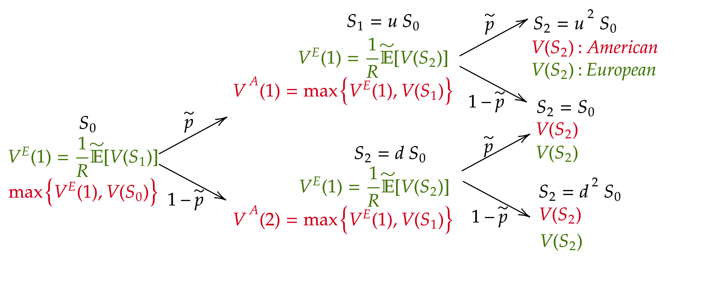

# Continuous-Time Finance
 

## Lecture notes
 

### *Fayçal Drissi*
[website](https://www.faycaldrissi.com/)

 

####  *Saïd Business School, University of Oxford*

#### Trinity Term 2025 

---

      

<h1>
Why Continuous-Time Finance ? </h1>

---

# Continuous-Time Finance

* Events in the real world happen in discrete-time

* Quickly changing chains of events may be described in term of a continuous mechanism (as in Physics)

* **Example**: stock prices evolve almost continuously. 
  * Think of limit order books where orders are sent at the milisecond frequency.

---

# Why Continuous-Time Finance ?

* **Definition** A derivative is a contract whose value is dependent upon one or more underlying assets

* Continuous-time models are significantly more tractable when it comes to describe the behaviour of risk and returns of complex financial derivatives

* Beyond tractability, continuous-time models models are sometimes essential for understanding the risks of complex financial instruments

---

# Why Continuous-Time Finance ?

* Continuous-time models are widely employed by trading desks at investment banks and hedge funds to price, hedge, and manage portfolios, in markets where trillions of dollars in derivatives are traded daily

{style="transform: translate(40%, 0%); width: 470px"}

---

# Some history

* Mathematical Finance is a (young) science at the frontier between probability theory,
economics, and computer science (Despite its short history, Quantitative Finance has Nobel Prize laureates (Merton, Scholes))
* $1900$: The real father of (modern) Quantitative Finance is a French man called Bachelier
* Mid-$1950$s: Savage (the famous statistician) introduced economists to Bachelier’s work
  * Samuelson read the PhD thesis of Bachelier. He did research to price warrants (with Sprenkle and Bones)
* $1970$: Merton was a PhD student of Samuelson in 1970 and he discussed warrants with Black and Scholes at MIT
  * Merton introduced **replication**

---

# Some history

* 1980s: Cox-Ross-Rubinstein, Vasicek, Cox-Ingersoll-Ross models.
* 1999: Harrison, Kreps, and Pliska showed the link between the absence of arbitrage opportunity and martingales. 
* 1990s and 2000s: quantitative finance is ruled by mathematicians and probabilists
* The $2007-2008$ crisis: credit derivatives cannot be managed as equity derivatives  or fixed income derivatives. The famous *copula model* to price and hedge Collateralized Debt Obligations (CDOs) has have been used so blindly
  * highlighted the danger of the risk-neutral pricing/hedging models when used in highly incomplete markets
  * the financial mathematics community has played a  part in the catastrophe
* After the crisis: risk management, super-hedging, market microstructure, optimal market making, etc..

---

# Goals of this course

* Introduce the mathematical tools used in continuous-time models in finance

* Introduce the main models used in the industry

* Applications for pricing derivatives on Equity and Interest rates

---

# How

* Foundations
  * (Basic) review of probabilioty theory
  * Introduction to stochastic calculus
 
* Introduction of the main pricing principles
  * Martingales, Ito processes, Risk-neutral pricing, etc.

* We start with simple models, and we add complexity

---

# Course outline
### Session 1: Binomial model for option pricing
### Session 2: Pricing Principles and the Absence of Arbitrage
### Session 3: Introduction to Stochastic Processes
### Session 4: The Black-Scholes Model
### Session 5: Risk-Neutral Pricing in Continuous-Time
### Session 6: Pricing in practice
### Session 7: ...
### Session 8: ...

---

# Format

* Each lecture will consist of a set of slides shared before the class

* Exercises will be solved during class: bring pen and paper (or iPad and pencil)

* Problem sets will be regularly distributed and selected problems solved in class

* Check Canvas for info, slides, exercises and solutions!

* Office hours on demand: faycal.drissi@gmail.com

---

# Assessment

* Final $2-$hours examination at the end of the term

* 4 questions

* Preparation: exercises during class, problem sets, and past exams

---
layout: intro
---
## Session $1$:  Binomial Model and Option Pricing
 
 

*Fayçal Drissi*

*Saïd Business School, University of Oxford*

--- 

# Risk and Return

* Assume there are two states of the world.

* Every day, there is either a sunny or a rainy day with probability $p=1/2$ and $1-p=1/2$.

* There is an ice-cream company (IC) whose stock price is trading at $50$ and an umbrella company (U) whose stock price is also trading at $50$.

* If it is a sunny day the IC company’s stock increases to $100$ otherwise it drops to zero. The U company has opposite dynamics.

{style="transform: translate(10%, -5%); width: 700px"}

--- 

# Risk and Return
   

* If you have $1$ GBP to invest, how much would you put on IC and/or U ?

{style="transform: translate(10%, -5%); width: 700px"}

--- 

# Risk and Return
   

* Suppose now that the probability of raining is p = 9/10. How would you change your strategy?

{style="transform: translate(10%, -5%); width: 700px"}

--- 

# Risk and Return
   

* Assume that there is a bond in this economy that pays an interest of $r$. 
* Risk premium: how much "above" $r$ would you expect to make on your investment strategy?

{style="transform: translate(10%, -5%); width: 700px"}

---

      

<h1>
Binomial Setup </h1>

---

## First example: a simple economy with three assets

* Two dates: $t$ and $t+1$

* Two assets are traded at prices $S^1(t)$ and $S^2(t)$ at time $t$

* At $t+1$, there are two states of nature that occur with probability $p$ and $1-p$

{style="transform: translate(10%, -0%); width: 700px"}

* Asset $1$ pays $S^1(t+1) = 1$ in state one and $S^1(t+1) = 1$ in state two. 
  * We denote the payoff (1, 1)

* Asset $2$ has payoff $(0, 3)$

---

## First example: a simple economy with three assets

* Assume we know $S^1(t)$ and $S^2(t)$
* **Problem**: There is a third asset with payoff $(2, 3)$. 
  * Calculate the price $S^3(t)$ at time $t$

{style="transform: translate(0%, 0%); width: 900px"}

---

## First example: a simple economy with three assets

{style="transform: translate(20%, -5%); width: 600px"}

* **Solution**: replication and no-arbitrage
  * We set a portfolio with value $\Pi(t)$ at time $t$ consisting of $\alpha_1$ units of Asset $1$ and $\alpha_2$ of Asset $2$
  * We set the portfolio weights  $\alpha_1$ and $\alpha_2$ such that the portfolio **replicates** Asset $3$ at time $t+1$
    $$\Pi(t+1) = \alpha_1\,S^1(t+1)+\alpha_2\,S^2(t+1)$$
  * By **no-arbitrage**, we should have
  $$\Pi(t) = S_3(t)$$
  * Why ?

---

## First example: a simple economy with three assets

* **Replication argument**
  * We set $\alpha_1$ and $\alpha_2$ such that 
  $$
  \begin{cases}
  \Pi(t+1) = 2 = \alpha_1 \times 1 + \alpha_2 \times 0 \quad \text{in state one}   \\
  \Pi(t+1) = 3 = \alpha_1 \times 1 + \alpha_2 \times 3 \quad \text{in state two}
  \end{cases}
  $$
  {style="transform: translate(30%, 0%); width: 500px"}
  * We find that 
  $$\alpha_1 = 2 \quad \text{and} \quad \alpha_2 = 1/3$$
  * By **no-abitrage**: 
  $$S_3(t) = 2\,S_1(t)+S_2(t)/3$$

---

      

<h1>
Pricing Options in a Binomial Setup </h1>

---

## The market

* One stock (say Microsoft)
* Starting time $t$, ending time $T$
* Two states of the world with probabilities $p$ and $1 − p$
* Starting value of the stock price: $S$
* In the *up state*, with probability $p$, the price becomes $u\,S$ where $u$ is a constant
* In the *down state*, with probability $1-p$, the price becomes $d\,S$ where $d$ is a constant
* There is a **bond** that pays a constant **interest rate $r$**.

{style="transform: translate(10%, 20%); width: 700px"}

---

## The call option

* **Definition**: A European Call option with strike price $K$ and maturity $T$ is the **right** to buy, at time $T$, the underlying stock for the price $K$. 
* What is the mathematical formula for the payoff of the option as a function of $S(T)$ ?

---

## The call option

* **Definition**: A European Call option with strike price $K$ and maturity $T$ is the **right** to buy, at time $T$, the underlying stock for the price $K$. 
* What is the mathematical formula for the payoff of the option as a function of $S(T)$ ?
* The payoff at time $T$ is $\max\{S(T) - K, 0 \}$. 
* In the *up state*, the payoff of the call is 
$$
C^u = \max\{u\, S - K, 0\}
$$
* In the *down state*, the payoff of the call is 
$$
C^d = \max\{d\, S - K, 0\}
$$

---

## The call option

* Let $C(t)$ be the price of the option at time $t$ 

* The payoff of a long position in a call option with strike $K=100$ and when $C(t)=10$

{style="transform: translate(40%, 0%); width: 500px"}

* When do we buy a call option ?

---

## The put option

* **Definition**: A European Put option with strike price $K$ and maturity $T$ is the right to sell, at time $T$, the underlying stock for the price $K$. What is the payoff of a put option at time $T$.

---

## The put option

* **Definition**: A European Put option with strike price $K$ and maturity $T$ is the right to sell, at time $T$, the underlying stock for the price $K$. What is the payoff of a put option ?
* The payoff at time $T$ is $\max\{K - S_T, 0\}$
* The payoff of a long position in a put option with strike $K=100$ (when do we buy a put ?)

{style="transform: translate(40%, 0%); width: 500px"}

---

## The call option

* How do we price the call in our binomial model, i.e., how do we find $C(t)$ ?

{style="transform: translate(10%, 0%); width: 700px"}

---

## The call option

* To price the call, we replicate its payoff with the bond and the underlying asset S

* At time $t$, we set a portfolio $\Pi(t)$ with $B$ pounds in the bond and $\Delta$ units of the asset $S$, such that 
$$
\Pi^u(t+1) = C^u \text{  and  } \Pi^d(t+1) = C^d
$$

{style="transform: translate(0%, 20%); width: 800px"}

---

## The call option

* The price of the portfolio at time $t$ is
$$
\Pi(t) = B + \Delta\,S.
$$

* We choose $\Delta$ and $B$ such that
$$
\begin{cases}
\Pi^u(t+1) = B\, (1+ r) + \Delta\,u\,S = C^u \\
\Pi^d(t+1) = B\, (1+ r) + \Delta\,d\,S = C^d
\end{cases}
$$

---

## The call option

* The price of the portfolio at time $t$ is
$$
\Pi(t) = B + \Delta\,S.
$$

* We choose $\Delta$ and $B$ such that
$$
\begin{cases}
\Pi^u(t+1) = B\, (1+ r) + \Delta\,u\,S = C^u \\
\Pi^d(t+1) = B\, (1+ r) + \Delta\,d\,S = C^d
\end{cases}
$$

* In matrix form we solve the system
$$
{\left[\begin{array}{ll}
u S & 1+r \\
d S & 1+r
\end{array}\right]\left[\begin{array}{c}
\Delta \\
B
\end{array}\right]=\left[\begin{array}{c}
C^u \\
C^d
\end{array}\right]}
$$

* Therefore
$$
{\left[\begin{array}{c}
\Delta \\
B
\end{array}\right]=\frac{1}{(1+r)(u S-d S)}\left[\begin{array}{cc}
1+r & -(1+r) \\
-d S & u S
\end{array}\right]\left[\begin{array}{c}
C^u \\
C^d
\end{array}\right]}
$$

---

## The call option

* We find
$$
\Delta=\frac{C^u-C^d}{u S-d S}, \quad \text { and } \quad B=\frac{-d C^u+u C^d}{(1+r)(u-d)}
$$

* By **no-abitrage**, the portfolio at time $t$ has the same value as the call and we write ($R=1+r$)
$$
C(t) = \Delta S+B  =\frac{C^u-C^d}{u S-d S} S+\frac{-d C^u+u C^d}{R(u-d)} =\frac{1}{R}\left[\frac{R-d}{u-d} C^u+\frac{u-R}{u-d} C^d\right] .
$$

---

## Example of option strategies: a covered call option

* In a covered call strategy, an investor buys the stock and sells a call option on the stock
* The payoff is
$$
- \max\{S_T - K\} + (S_T - S_0)
$$
{style="transform: translate(55%, 0%); width: 400px"}
* You are a banker and you want to buy a covered call option from your broker. Assume  that all payments are at time $T$, what's the price according to our binomial model ?

---

      

<h1>
Risk-Neutral Valuation </h1>

---

## Risk-Neutral Valuation - Call option

* We found that the call option price is
$$
C(t) =\frac{1}{R}\left[\frac{R-d}{u-d} C^u+\frac{u-R}{u-d} C^d\right] .
$$

* **Remark:** the price $C(t)$ of the option does not depend on the binomial probability $p.$ 

* Why?

---

## Risk-Neutral Valuation - Call option

* We found that the call option price is
$$
C(t) =\frac{1}{R}\left[\frac{R-d}{u-d} C^u+\frac{u-R}{u-d} C^d\right] .
$$

* Define a new probability measure $\tilde P$ that assigns $\tilde p$ to the *up state* and $1-\tilde p$ to the *down state*
$$
\tilde p = \frac{R-d}{u-d}
$$
* The price of the option is
$$
C(t) =\frac{1}{R}\left[\tilde p C^u+(1-\tilde p) C^d\right]
$$

{style="transform: translate(30%, 0%); width: 500px"}

---

## Risk-Neutral Valuation - Call option

{style="transform: translate(14%, 0%); width: 600px"}

* Necessary condition for absence of arbitrage is $\tilde p \in (0, 1)$, which implies 
$$d < 1 + r < u$$

* In this case, the price of the option is the **discounted expectation** under the new **risk-adjusted probability measure**

$$
C(t) =\frac{1}{R}\left[\tilde p C^u+(1-\tilde p) C^d\right] = \frac{1}{1+r}\tilde{\mathbb E}[C(t+1)]
$$

---

## Risk-Neutral Valuation: intuition

* Prices of assets depend on their risk
* Investors demand more profit for bearing more risk (risk-averse): think of utility
* Today's price of a claim realised in a future date, written on a risky asset, will generally differ from its expected value: investors ask for a premium.
* Using actual real-world probabilities, every security would require a different adjustment (as they differ in riskiness)

---

## Risk-Neutral Valuation: intuition

* There is another way to do this adjustment
  * Instead of calculating expectation and then adjusting for an investor's risk preference
  * We adjust, once and for all, the probabilities of future outcomes such that they incorporate all investors' risk premia
  * We take expectation under this new probability distribution, the risk-neutral measure
* Once the risk-neutral probability is found, assets can be priced by simply taking the present value of expected payoff

---

## Risk-Neutral Valuation: Exercise

* **Exercise 1**: Under the risk-neutral measure, calculate the discounted expected value of the stock price, i.e.,
$$
\frac{1}{1+r}\,\tilde{\mathbb E}[S(t+1)]
$$

* What is the price of a European call with strike $K=0$ ?

* Would the price change if the probability $p$ or $u,d$ change ?

---

## Risk-Neutral Valuation: Exercise

* Assume now that there are three dates ${0, 1, 2}$ and consider the following binomiam tree (where $u=1/d$)

{style="transform: translate(20%, 0%); width: 600px"}

* **Exercise $2$**: Compute recursively the price of the European call option with strike $K$ and maturity $T = 2$

---

## Probability jargon: random variables and sample space

{style="transform: translate(20%, 0%); width: 600px"}

* At time $0$, $S_1$ and $S_2$, the stock prices at times $1$ and $2$, are **random variables**.

* To describe the random behaviour of $S_1$ and $S_2$, we use the **sample space**

$$
\Omega = \{\text{LL},\text{LH},\text{HL},\text{HH}\}
$$
of all outcomes $\omega\in\Omega$ that can be realised

---

## Probability jargon: sigma algebra

* Let $\mathcal F$ be the family of all subsets of $\Omega$

* **Definition of sigma algebra**: a sigma algebra $\mathcal G \subset \mathcal F$ is a family of subsets of $\Omega$ such that:
  * $\emptyset \subset \mathcal G$
  * If $A \in \mathcal G$ then $A^C \subset \mathcal G$
  * If $(A_i)_{i} \in \mathcal G$ is a countable sequence in $\mathcal G$, then $\bigcup_i A_i \in \mathcal G$

* The couple $(\Omega, \mathcal G)$ is called a measurable space.

---

## Probability jargon: filtration

{style="transform: translate(30%, 0%); width: 500px"}

* The information available to the trader at time $0$ can be modeled by the information set 
$$\mathcal G_0 = \{\emptyset, \Omega\}$$

* At time $1$, we can observe the outcome of time $1$. The information set gets larger: it is a sigma algebra generated by the price movement
$$
\mathcal G_1 = \{\emptyset, \Omega, \{HL, HH\}, \{LL, LH\} \}
$$

* At time $2$, we can observe more outcomes in more detail 
$\mathcal G_2 =\mathcal P(\Omega)$ (power set), i.e., it is the set of all subsets of $\Omega$, including $\Omega$ and the empty set.

---

## Probability jargon: filtration

{style="transform: translate(30%, 0%); width: 500px"}

* The trader's information set is growing over time

$$\mathcal G_0 \subset \mathcal G_1 \subset \mathcal G_2$$

* **Definition : Filtration**
  * A filtration is a sequence $(\mathcal G_i)_i$ of sigma algebras over $\Omega$ such that for all $i$
  $$
  \mathcal G_i \subset \mathcal G_{i+1}
  $$

---

## Some probability jargon: probability measure

* **Purpose**: assign probability to events in a consistent way
* **Definition**: a probability measure on $(\Omega, \mathcal G)$ is a function $\mathbb P: \mathcal G \mapsto [0, 1]$ such that 
  * $\mathbb P[\Omega] = 1$
  * (sigma additivity) For any disjoint sequence $(A_i)_i \subset \mathcal G$ such that $A_i \cap A_j = \emptyset$ :
  $$
  \mathbb P[\bigcup_i A_i] = \sum_i \mathbb P[ A_i]
  $$
* **Definition**: $(\Omega, \mathcal G, \mathbb P)$ is a probability space.

---

## Some probability jargon: random variables

* **Definition**: Let $X : \Omega \mapsto R$ be a measurable function. The sigma algebra 
$$\sigma(X) = \{X^{-1}(B) \text{ for all } B \subset \mathbb R  \}$$
is called the sigma algebra generated by $X$.

* **Definition**: $X$ is a random variable on $(\Omega, \mathcal G)$ if it is measurable with respect to $\mathcal G$, i.e., if $\sigma(X) \subset \mathcal G$

---

## Some probability jargon: random variables

* **Definition**: Let $X : \Omega \mapsto R$ be a measurable function. The sigma algebra 
$$\sigma(X) = \{X^{-1}(B) \text{ for all } B \subset \mathbb R  \}$$
is called the sigma algebra generated by $X$.

* **Definition**: $X$ is a random variable on $(\Omega, \mathcal G)$ if it is measurable with respect to $\mathcal G$, i.e., if $\sigma(X) \subset \mathcal G$

* **Example** 
  * $\sigma(S_1) = \mathcal G_1$
  * $S_1$ is $\mathcal G_1$ measurable
  * $S_2$ is not $\mathcal G_1$ measurable

{style="transform: translate(60%, -90%); width: 500px"}

---

      

<h1>
American options </h1>

---

## American options in the three-dates binomial model

* **Definition:** an *American* option can be exercised at any point in time during the life of the option
* **Definition:** a *Bermudean* option can be exercised at specific pre-arranged times

* To decide whether to exercise, at each time $t$, the holder of an american option compares 
  * the value of exercising the option at time $t$
  * and the value of keeping the option 

* So the price of the american option at each time $t$ is 
$$
\max\{\text{exercise value at t, option value between t and T}\}
$$

* We can price american options recursively

---

## American options in the three-dates binomial model

* Let $V(S_t)$ be the payoff of an option which is exercised at time $t$
  * For instance, for an american call option, $V(S_t) = \max\{S_t-K, 0\}$

* Assume a three-dates binomial model 

{style="transform: translate(0%, 0%); width: 800px"}

---

## American options in the three-dates binomial model

We work backward:
  * At time $t=2$, the payoff is simply $V(S_2)$ for both American and European options. We know the payoffs for each possible value of the stock at time $t=2$

{style="transform: translate(0%, 0%); width: 800px"}

---

## American options in the three-dates binomial model

We work backward:
  * At time $t=1$, the payoff of the American option is the maximum between the exercise value $V(S_1)$, and the discounted expected future payoff (at time $t=2$)

{style="transform: translate(0%, 0%); width: 800px"}

---

## American options in the three-dates binomial model

We work backward:
  * At time $t=0$, the payoff of the American option is the maximum between the exercise value $V(S_0)$, and the discounted expected future payoff (at time $t=1$)

{style="transform: translate(0%, 0%); width: 800px"}
